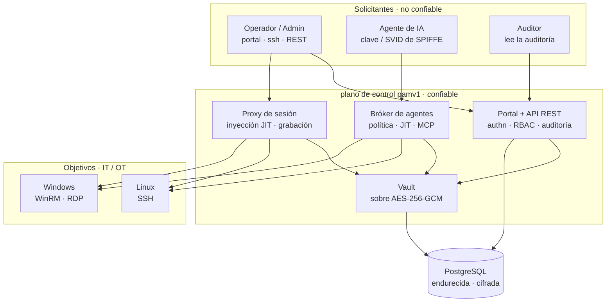
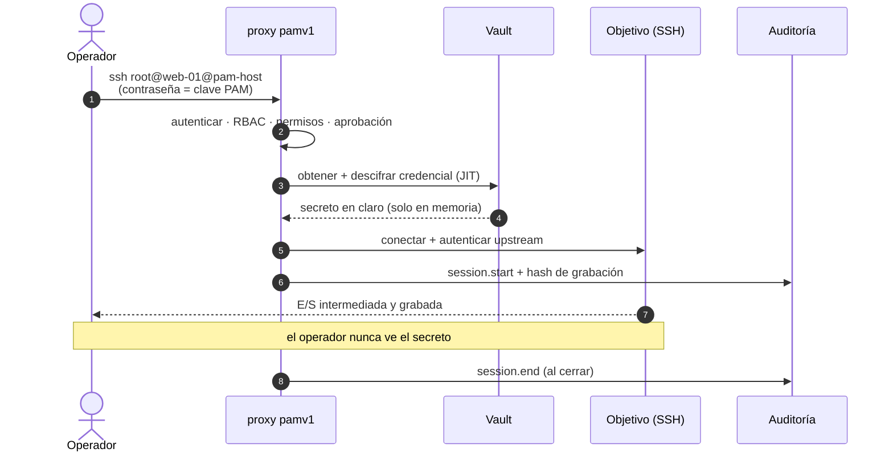

# pamv1

> ⚠️ **Alpha · con fines educativos.** Este es un proyecto educativo en fase temprana
> (**alpha**) creado para explorar cómo funciona de principio a fin un sistema de Gestión de
> Acceso Privilegiado (PAM). **No** ha sido auditado en seguridad y **no** está listo para
> producción — no lo uses para custodiar credenciales privilegiadas reales. Úsalo para
> aprender, experimentar y contribuir.

[](https://github.com/morandeirachema/pamv1/actions/workflows/ci.yml)
[](LICENSE)
[](https://go.dev/)
[](https://www.postgresql.org/)

**Gestión de Acceso Privilegiado** (PAM) de código abierto en Go. pamv1 guarda las
credenciales privilegiadas en un vault endurecido y luego coloca un **intermediario** entre
el solicitante y la máquina: lo autentica, descifra el secreto **just-in-time**, lo inyecta
en la propia conexión y lo graba todo. La contraseña llega al objetivo — nunca llega a la
persona (ni, ahora, al **agente de IA**) que la pidió. Encima, un **portal AS/400 / IBM 5250
de fósforo verde** sin concesiones, porque tocar un PAM debe *sentirse* serio.

> **La única idea.** *Confía en el punto de estrangulamiento, no en el solicitante.* Cada
> acción privilegiada — una sesión SSH humana, un comando Windows, la llamada a herramienta de
> un agente de IA — pasa por un único plano de control auditado que custodia el secreto y solo
> devuelve el resultado. Quítale la credencial al solicitante y con ella se va casi toda la
> superficie de ataque.

Construido fase a fase con una regla: **cada fase es funcional de principio a fin** — arranca,
pasa los tests y se despliega como Infraestructura-como-Código. El **[roadmap](ROADMAP.md)**
abarca de la 0 a la 14 y **se han entregado las quince fases** — desde el proxy SSH JIT y el
RBAC, pasando por el login AD/Entra/OIDC, los objetivos Windows, el quórum de break-glass, la
adaptación OT/industrial, las herramientas NIS2, escala/HA y la consola 5250 completa, hasta un
subsistema de configuración con hot-swap y RBAC de perfiles personalizados, un **bróker de
acceso para agentes de IA** (motor de políticas, ejecución JIT de herramientas, auditoría
verificable, transporte MCP e identidad SPIFFE) y **secretos de Kubernetes cifrados con SOPS**.
Sigue siendo un proyecto **alpha y educativo** — léelo, ejecútalo, aprende de él, pero no le
confíes secretos reales.

🔎 **Resumen interactivo:** [página del proyecto](https://claude.ai/code/artifact/b9f19443-5ad1-42d2-955f-e43ca17ac542) — qué funciona, arquitectura y hoja de ruta de un vistazo &nbsp;·&nbsp; 📖 **[Read it in English →](README.md)**

**Documentación** — documentos vivos, mantenidos en sincronía con el código:

- **[Guía de usuario](docs/USER-GUIDE.md)** — para operadores / auditores / aprobadores: iniciar sesión, conectar por el proxy, capacidades por rol.
- **[Guía de administración](docs/ADMIN-GUIDE.md)** — desplegar, configurar, gestionar objetivos / credenciales / usuarios / roles, break-glass, registro y auditoría.
- **[Arquitectura — alto nivel](docs/ARCHITECTURE-HIGH-LEVEL.md)** y **[bajo nivel](docs/ARCHITECTURE-LOW-LEVEL.md)** (el mapa más completo — léelo primero), más **[diagramas derivados del código](docs/ARCHITECTURE-DIAGRAMS.md)** (grafo de paquetes, modelo de datos, superficie REST — generados desde el código y verificados por CI).
- **[Matriz de puertos y flujos](docs/PORTS-AND-FLOWS.md)** · **[runbook de copia y restauración](docs/BACKUP-AND-RESTORE.md)** · **[guía de despliegue OT](docs/OT-DEPLOYMENT.md)** · **[pack de cumplimiento NIS2](docs/NIS2-COMPLIANCE.md)**.

## Arquitectura

Los solicitantes — humanos o máquinas — nunca tocan la zona de datos ni los objetivos
directamente. El plano de control lo intermedia todo; el vault es lo único capaz de convertir
el texto cifrado en un secreto usable, y solo durante lo que dura una conexión.



## Cómo funciona la inyección just-in-time

Cuatro movimientos, una garantía: el solicitante queda autenticado pero nunca conoce la
credencial del objetivo. El secreto existe en claro solo dentro del plano de control, solo
después de superar todas las comprobaciones de autorización, y solo para la conexión saliente.



El bróker de agentes de IA hace el mismo movimiento con una llamada a herramienta: la política
decide `permitir / denegar / requerir-aprobación` sobre la herramienta **y sus argumentos**, una
llamada aprobada se ejecuta en el servidor con una credencial JIT, y el agente recibe solo el
resultado.

## Qué funciona hoy

Fases 0–14, agrupadas por área. Cada capacidad está cubierta por tests y se despliega como código.

### Identidad y acceso

- **Control de acceso por roles + perfiles personalizados** — cuatro roles integrados (`admin`, `user`, `auditor`, `approver`) más **perfiles de permisos personalizados**: nombra cualquier conjunto de capacidades (`read_inventory`, `manage_credentials`, `connect`, `reveal_secret`, `read_audit`, `approve`, …) y asígnalo a un usuario como un rol. Una única matriz rol/perfil→capacidad aplicada por la API **y** el proxy; los admins emiten tokens por usuario (guardados como SHA-256); cada denegación se audita con el usuario real.
- **SSO con AD, Entra ID y OIDC** — autentícate con un usuario+contraseña de AD por **LDAPS**, con **Microsoft Entra ID** o por **SSO OIDC Authorization Code + PKCE** (el IdP hace el login y su MFA; pamv1 valida la firma RS256 del ID token contra el [JWKS](https://datatracker.ietf.org/doc/html/rfc7517) del IdP). Los grupos / app roles se mapean a los roles, y el login emite un token de sesión de corta duración que sirve en el portal y el proxy. Las fuentes se combinan; los tokens locales y el break-glass quedan como vía de emergencia.
- **Doble factor TOTP** — alta autoservicio ([RFC 6238](https://datatracker.ietf.org/doc/html/rfc6238), cualquier app de autenticación); el secreto se guarda cifrado en el vault y el login exige el código de 6 dígitos una vez dado de alta. Códigos de recuperación de un solo uso y una política opcional de MFA obligatoria (con primer inicio solo para alta).

### Sesiones y el proxy JIT

- **Proxy de sesión con inyección JIT** — los operadores conectan por una pasarela SSH; el proxy los autentica, obtiene la credencial del vault, **la descifra solo al conectar** (y solo tras superar toda la autorización), la inyecta en la sesión con el objetivo y lo graba todo. Demostrado de extremo a extremo por un test de integración donde el upstream acepta *solo* la contraseña del vault que el cliente nunca tuvo. Las host keys upstream pueden fijarse (`PAM_SSH_KNOWN_HOSTS`); hay soporte de host de salto (bastión) y sesiones de **observador** de solo lectura.
- **Objetivos Windows (WinRM + RDP)** — ejecuta comandos en hosts Windows con `POST /api/targets/{id}/winrm` (auth básica o NTLM) o un bucle WinRM interactivo por el proxy, o intermedia un escritorio **RDP** completo con [Apache Guacamole](https://guacamole.apache.org/) (túnel WebSocket `GET /api/targets/{id}/rdp`, con verificación de certificado por defecto). En ambos casos la credencial se inyecta just-in-time (funcionan las cuentas de dominio), las sesiones se auditan y el operador nunca ve el secreto.
- **Grabación de sesiones** — cada sesión (stdout **y** stderr) capturada en [asciicast v2](https://docs.asciinema.org/manual/asciicast/v2/), encadenada por hash SHA-256 a prueba de manipulación, y el hash escrito en la auditoría. Los fallos de grabación se auditan y `PAM_REQUIRE_RECORDING` puede rechazar de plano una sesión no grabable.

### Vault y ciclo de vida de credenciales

- **Vault endurecido (cifrado en sobre)** — cada secreto se sella con una clave de datos [AES-256-GCM](https://pkg.go.dev/crypto/cipher) por secreto, envuelta por una **KEK intercambiable**: una clave local para desarrollo, o en producción **[HashiCorp Vault Transit](https://developer.hashicorp.com/vault/docs/secrets/transit)**, **[AWS KMS](https://aws.amazon.com/kms/)** o un **HSM por [PKCS#11](https://en.wikipedia.org/wiki/PKCS_11)** (build con tag `pkcs11`) — la clave raíz nunca sale del KMS/HSM. El AAD liga cada texto cifrado a su objetivo (un token copiado no descifra); los tokens versionados `v2:` permiten rotar la KEK en caliente.
- **Inventario de objetivos y API de credenciales** — máquinas Linux/Windows con endpoints ssh/winrm/rdp; las credenciales se guardan en el vault, se listan (sin devolver material secreto), se revelan bajo demanda (auditado) y se borran. El modelo JSON *no puede* serializar el texto cifrado (`json:"-"`).
- **Ciclo de vida (rotación · reconciliación · préstamo · descubrimiento)** — `POST /api/credentials/{id}/rotate` genera un secreto fuerte, lo fija **en el objetivo** (SSH `chpasswd` / WinRM `net user` / nueva `ssh_key`) y lo re-cifra — la nueva contraseña nunca se muestra. `/reconcile` verifica que el secreto del vault sigue autenticando y detecta **desincronización** (`?remediate=true` la corrige). El **préstamo (checkout)** concede una reserva exclusiva y temporal y rota el secreto al devolverlo. El **descubrimiento** (`/api/discovery/scan`) sondea hosts en busca de puertos SSH/WinRM/RDP y puede dar de alta objetivos. Un worker en segundo plano rota secretos antiguos y reconcilia según un calendario; los secretos pueden rotarse en cuanto termina una sesión proxied.

### Auditoría, break-glass y alertas

- **Registro de auditoría** — un registro de solo adición de cada acción sensible, con atribución de actor, más una exportación a prueba de manipulación (`GET /api/audit/export`, JSON/CSV + resumen SHA-256) para el reporte de incidentes.
- **Logs operativos** — [slog](https://pkg.go.dev/log/slog) estructurado a stdout, una línea por petición HTTP y por sesión del proxy, etiquetado por servicio (`server`/`api`/`proxy`/`store`); JSON para un SIEM o texto para humanos (`PAM_LOG_LEVEL`, `PAM_LOG_FORMAT`). Separado de la auditoría; los secretos nunca se registran.
- **Break-glass (v2)** — una clave de emergencia sellada, o **apertura por quórum M-de-N** ([shares de Shamir](https://en.wikipedia.org/wiki/Shamir%27s_secret_sharing) divididos con `-split-key`; los custodios envían sus shares para reconstruirla). En ambos casos obtienes una sesión de admin **de corta duración y autoexpiración**, y cada acceso/apertura break-glass se audita con fuerza y se **alerta en tiempo real** (webhook, syslog o correo).

### Configuración y la consola de gestión

- **Consola de gestión AS/400** — una consola completa consciente de roles en fósforo verde: Sign On, un menú principal numerado y pantallas `Work with…` para objetivos y concesiones, credenciales (revelar/prestar/rotar/reconciliar), sesiones activas (monitor en vivo + corte), solicitudes de acceso a cuatro ojos, usuarios y perfiles, MFA, descubrimiento, reconciliación, auditoría (filtro + exportación CSV), break-glass, **perfiles de permisos**, **configuración del sistema** y **config efectiva + exportación a IaC** — opciones numéricas (`4=Borrar`, `5=Ver`), teclas F, líneas de barrido. El menú muestra solo lo que tu rol permite.
- **Configuración con hot-swap** — los ajustes de identidad, SSO y política operativa pasan a ser editables y **persistidos en la BD**, y se **aplican en caliente sin reiniciar** (secretos cifrados en el vault, un cambio rechazado se revierte). Una pantalla de solo lectura de config efectiva + salud de backends y una **exportación a IaC** (`env` / Helm / Terraform) devuelven los cambios de la consola a código. El arranque y la red/TLS permanecen solo en el entorno a propósito.

### El bróker de acceso para agentes de IA

PAM para agentes de IA — el mismo punto de estrangulamiento, extendido a herramientas autónomas.
Opcional vía `PAM_BROKER_POLICY_FILE`.

- **Política sobre herramienta + argumentos** — un motor [YAML](https://yaml.org/) estilo sudoers decide `permitir / denegar / requerir-aprobación` sobre la herramienta **y sus argumentos** (gana la primera coincidencia, denegación implícita); una llamada aprobada se ejecuta **en el servidor con una credencial just-in-time** y el agente recibe solo el resultado. Herramientas: `winrm_exec`, `ssh_exec`, `list_targets`, `list_credentials`, `rotate_credential` y `reveal_credential` (entregado **denegado por defecto**). Los agentes obedecen las mismas concesiones por objetivo y la puerta de cuatro ojos que los humanos.
- **Aprobación humana + reanudación de un solo uso** — una llamada `require_approval` queda en espera de una decisión humana (`/v1/approvals`); al aprobarse se ejecuta y el agente recoge el resultado **exactamente una vez** con un token de un solo uso.
- **Auditoría verificable** — cada paso es un evento **encadenado por hash con HMAC con clave** (`GET /v1/audit/verify`, más un checkpoint de cabeza firmado con ed25519 para detectar truncamiento) separado del registro general.
- **Transporte MCP + identidad SPIFFE** — el bróker habla **[MCP](https://modelcontextprotocol.io/)** (JSON-RPC 2.0 en `POST /mcp`) a la par con REST, y los agentes se autentican con una clave estática o un **JWT-SVID de [SPIFFE](https://spiffe.io/)** (RS256/ES256/EdDSA, JWKS del dominio de confianza) con cadenas de delegación [RFC 8693](https://datatracker.ietf.org/doc/html/rfc8693) acotadas por un límite de profundidad.

### OT / industrial y cumplimiento

- **Aprobación de sesión OT (cuatro ojos)** — protege un objetivo tras una solicitud de acceso aprobada: un usuario la crea, un aprobador *distinto* la aprueba (se rechaza la auto-aprobación), y solo entonces puede conectar — aplicado en el proxy SSH, WinRM **y** RDP, con break-glass como bypass. Por objetivo (`require_approval`) o global (`PAM_REQUIRE_APPROVAL`), con ventana temporal para mantenimientos.
- **Endurecimiento OT** — **listas blancas de protocolos** por zona (`PAM_ALLOWED_PROTOCOLS`), sesiones **observador** de solo lectura y un **modo air-gap** (`PAM_OT_AIRGAP`) sin llamadas salientes. Ver la [guía de despliegue OT](docs/OT-DEPLOYMENT.md) y el [pack NIS2](docs/NIS2-COMPLIANCE.md).

### Almacenamiento y operaciones

- **Almacenamiento PostgreSQL** con [pgx](https://github.com/jackc/pgx) y migraciones embebidas y versionadas; un almacén en memoria para tests y demos; **alta disponibilidad con [CloudNativePG](https://cloudnative-pg.io/)** opcional.
- **Observabilidad** — un endpoint [Prometheus](https://prometheus.io/) `/metrics` sin dependencias (conteos por estado, volumen de auditoría, uso de break-glass, rotaciones, gauge de sesiones activas), más una separación liveness/readiness (`/healthz`, `/readyz` que comprueba la BD).
- **Despliegue como código** — [Docker](https://docs.docker.com/) (distroless, sin root), [docker-compose](https://docs.docker.com/compose/) con Postgres endurecida, manifiestos [Kubernetes](https://kubernetes.io/) bajo el PSS restringido, un **[chart de Helm](deploy/helm/pamv1)** y un módulo de [Terraform](https://developer.hashicorp.com/terraform). Las releases se construyen por digest con **[SBOM](https://www.cisa.gov/sbom), firma keyless [cosign](https://docs.sigstore.dev/) y procedencia SLSA**.
- **Secretos cifrados en git** — el manifiesto de Secret de Kubernetes puede sellarse con **[SOPS](https://github.com/getsops/sops) + [age](https://age-encryption.org/)**: los valores se cifran mientras `kind`/`metadata` quedan legibles, y se descifra al desplegar (`sops -d \| kubectl apply -f -`, el texto plano nunca toca el disco) o de forma nativa con Flux / Argo / helm-secrets — así los secretos viven en el **mismo repo de IaC** sin filtrarse. Ver **[deploy/k8s/sops/](deploy/k8s/sops/)**.

## Roles, usuarios y perfiles

Cuatro roles integrados, aplicados de forma idéntica por la API y el proxy, más perfiles personalizados:

| Rol | Puede | No puede |
|---|---|---|
| `admin` | gestionar objetivos/credenciales/usuarios, revelar secretos, conectar, leer auditoría, gestionar config/perfiles | — |
| `user` | conectar a objetivos por el proxy, leer el inventario | gestionar, revelar, leer auditoría |
| `auditor` | leer el inventario y la auditoría | gestionar, revelar, conectar |
| `approver` | leer inventario + auditoría, aprobar solicitudes de acceso | gestionar, revelar, conectar |

¿Necesitas algo intermedio? Define un **perfil personalizado** — un conjunto de capacidades con
nombre — y asígnalo como un rol (menú 12, o `POST /api/profiles`). Los cuatro integrados no cambian.

Un admin crea un usuario y recibe el token de acceso de ese usuario **una sola vez**:

```bash
curl -H "X-API-Key: $PAM_API_KEY" -X POST http://localhost:8080/api/users \
  -d '{"username":"alice","role":"user"}'
# → {"id":1,"username":"alice","role":"user","token":"pamt_…"}   (guárdalo ya)
```

El usuario presenta ese token como `X-API-Key` (Sign On del portal) o como contraseña del proxy
SSH. La `PAM_API_KEY` de arranque es la identidad `admin`; la clave break-glass también es `admin`
(auditada con fuerza). Para inicio de sesión con directorio, AD/Entra/OIDC mapean grupos a estos
mismos roles.

## Conectar por el proxy (inyección JIT)

Una vez que un objetivo y su credencial están en el vault, los operadores llegan al objetivo
**a través de** pamv1 — el secreto se descifra solo para la conexión saliente y nunca se muestra:

```bash
# el usuario selecciona el objetivo; la contraseña SSH es tu clave PAM (o token por usuario)
ssh -p 2222 web-01@pam-host                 # primera credencial del objetivo "web-01"
ssh -p 2222 root@web-01@pam-host            # una credencial concreta (usuario "root")
```

El proxy te autentica, obtiene la contraseña de `root` del vault, la inyecta en la conexión SSH
saliente, graba la sesión (asciicast v2) con un SHA-256 en la auditoría y transmite tu E/S. Nunca
ves la credencial. Las grabaciones van a `PAM_RECORDING_DIR`; desactiva el proxy con
`PAM_SSH_ADDR=off`.

## Hoja de ruta

Se han entregado las quince fases — detalle por fase en **[ROADMAP.md](ROADMAP.md)**:

| Fase | Tema | Estado |
|---|---|---|
| 0 | Cimientos del proyecto | ✅ entregada |
| 1 | Núcleo: vault, inventario, auditoría, portal | ✅ entregada |
| 2 | Proxy de sesión SSH con inyección JIT | ✅ entregada |
| 3 | Identidad y control de acceso (RBAC, AD/Entra/OIDC, MFA) | ✅ entregada |
| 4 | Objetivos Windows (WinRM + RDP vía Guacamole) | ✅ entregada |
| 5 | Endurecimiento: base de datos, vault, transporte | ✅ entregada |
| 6 | Break-glass v2 (quórum M-de-N) | ✅ entregada |
| 7 | Ciclo de vida de credenciales (rotación, reconciliación) | ✅ entregada |
| 8 | Adaptación OT (aprobaciones a cuatro ojos, air-gap) | ✅ entregada |
| 9 | Pack de cumplimiento NIS2 | ✅ entregada |
| 10 | Escala y operaciones (métricas, Helm, HA, releases firmadas) | ✅ entregada |
| 11 | Consola de gestión 5250 completa | ✅ entregada |
| 12 | Subsistema de configuración + RBAC de perfiles + hot-swap | ✅ entregada |
| 13 | Bróker de acceso para agentes de IA (política, herramientas JIT, auditoría verificable, MCP, SPIFFE) | ✅ entregada |
| 14 | Secretos de Kubernetes cifrados con SOPS (age; Flux/Argo/helm-secrets) | ✅ entregada |

## Cobertura frente al PAM comercial (CyberArk, Wallix, …)

pamv1 es un proyecto **educativo y alpha** — no un reemplazo directo de
[CyberArk](https://www.cyberark.com/products/privileged-access-manager/),
[Wallix Bastion](https://www.wallix.com/privileged-access-management/),
[BeyondTrust](https://www.beyondtrust.com/),
[Delinea](https://delinea.com/products/secret-server),
[Teleport](https://goteleport.com/) ni [StrongDM](https://www.strongdm.com/). En el
**bucle central de sesión/credencial** ya está a la par — proxy de inyección JIT
(SSH/WinRM/RDP), grabaciones encadenadas por hash a prueba de manipulación, rotación
+ reconciliación + concesiones de checkout, break-glass M-de-N, RBAC + AD/Entra/OIDC +
MFA, y una cadena de auditoría verificable — y su **bróker de acceso para agentes de
IA** (política sobre la herramienta *y sus argumentos*, transporte MCP, identidad
SPIFFE) va por delante de la mayoría de los titulares.

Las brechas siguientes son de **amplitud y gobierno**. Cada una indica cómo encaja en
la arquitectura de punto de estrangulamiento existente de pamv1, y se corresponden con
posibles fases futuras.

### Nivel 1 — brechas estructurales / de conectores

| Brecha | Qué hacen los líderes | pamv1 hoy | Encaje |
|---|---|---|---|
| **Cajas fuertes (safes) / contenedores** con propiedad delegada | Todo el modelo de autorización de CyberArk son las [safes](https://docs.cyberark.com/pam-self-hosted/latest/en/content/pasref/safes-and-safe-members.htm) — contenedores de credenciales con sus propios miembros, flujos y administración delegada; Wallix usa dominios de objetivos | concesiones por objetivo + RBAC global — sin contenedor para agrupar credenciales, delegar la propiedad a un equipo o acotar política/aprobación a una colección | amplía el modelo de concesiones; el mayor salto estructural y la clave para el uso multiequipo / multiinquilino |
| **Proxy de sesión de base de datos** con auditoría por consulta | [Teleport](https://goteleport.com/docs/enroll-resources/database-access/), [StrongDM](https://www.strongdm.com/), CyberArk y Wallix intermedian Postgres/MySQL/MSSQL/Oracle nativos con auditoría por consulta + inyección JIT | solo shells + RDP; sin intermediación de protocolos de base de datos | **excelente** — un nuevo listener que hable el protocolo de la BD, reutilizando el patrón descifrar→inyectar→grabar del proxy SSH |
| **Monitorización en vivo + control de comandos** | [CyberArk PSM](https://www.cyberark.com/products/privileged-session-manager/) y Wallix permiten a un supervisor ver una sesión en vivo, bloquear un comando peligroso a mitad de flujo (`rm -rf /`, `DROP TABLE`) y terminarla de forma interactiva | solo grabación asíncrona + corte de sesión; sin observación en vivo ni bloqueo de comandos | **excelente** — replicar el flujo de grabación hacia un observador; añadir un hook de filtrado en el bucle de E/S |
| **Propagación a cuentas dependientes** al rotar | El CPM de CyberArk actualiza cada [consumidor](https://docs.cyberark.com/pam-self-hosted/latest/en/content/pasimp/managing-service-accounts-service.htm) de una cuenta de servicio rotada (Servicios de Windows, Tareas programadas, App Pools de IIS, COM+) | rota la credencial en el objetivo; sin noción de consumidores | hace **segura la rotación automática de cuentas de servicio** en un parque Windows real — hoy un bloqueante de adopción real |

### Nivel 2 — profundidad de gobierno de accesos

- **Campañas de certificación / atestación de accesos** — "los responsables recertifican o revocan quién tiene acceso a qué" de forma periódica (un control de SOX / ISO 27001 / NIS2). *Sin cobertura hoy; el modelo de concesiones + el rastro de auditoría son la base.*
- **Pasarela ITSM / tickets** — exigir un ticket de cambio válido de ServiceNow/Jira antes del acceso y grabar su ID en la auditoría. *El motor de aprobación a cuatro ojos existente es el punto de enganche.*
- **Flujos de aprobación más ricos** — cadenas multinivel, ventanas de acceso temporizadas / programadas, acceso de un solo uso, códigos de motivo obligatorios (pamv1 es hoy de un solo nivel a cuatro ojos).

### Nivel 3 — hacia dónde va el mercado

| Brecha | Líderes | pamv1 hoy |
|---|---|---|
| **Cero Privilegio Permanente (ZSP)** — cuentas efímeras / certificados SSH de corta vida en lugar de un secreto permanente almacenado | [CyberArk ZSP](https://www.cyberark.com/what-is/zero-standing-privileges/), Teleport | credencial permanente en el vault + inyección JIT |
| **Amplitud de conectores / plugins** — dispositivos de red (Cisco/Juniper/F5/Palo Alto), cuentas de BD, IAM en la nube, VMware/SAP/mainframe | el foso principal de CyberArk | solo rotación SSH / WinRM / ssh_key |
| **Acceso privilegiado en la nube (CIEM ligero)** — consola federada + credenciales de nube de corta vida, ajuste de derechos | CyberArk, Wallix | solo AWS KMS para la KEK |
| **Analítica de amenazas privilegiadas** — detección de anomalías de comportamiento, puntuación de riesgo, respuesta automatizada | CyberArk PTA, Wallix | flujo auditado en bruto + exportación syslog/SIEM (detectar aguas abajo) |
| **Proxy de sesiones web / SaaS** — grabar + inyectar en consolas de administración web | CyberArk Secure Web Sessions, Wallix | solo SSH/WinRM/RDP (el mayor esfuerzo) |

### Nivel 4 — ecosistema

Un [**provider** de Terraform](https://developer.hashicorp.com/terraform) para los
objetos de pamv1 (objetivos / credenciales / políticas como código — muy alineado con
la filosofía IaC) · sincronización de salida estilo
[Secrets Hub](https://www.cyberark.com/products/secrets-hub/) hacia AWS Secrets Manager
/ Azure Key Vault · una API de secretos de aplicación estilo
[Conjur](https://www.conjur.org/) para apps sin agente · descubrimiento de claves SSH
del parque · componentes de conexión para apps de escritorio (auto-login en
SSMS / Toad / vSphere vía RDP RemoteApp).

### No-objetivo deliberado

La [gestión de privilegios en el endpoint (EPM)](https://www.beyondtrust.com/privilege-management)
— quitar derechos de administrador local y elevar sudo/apps mediante un **agente en el
endpoint** (el núcleo de BeyondTrust / Delinea) — es una categoría de producto distinta
que no encaja en un punto de estrangulamiento vault + proxy, y queda **fuera de alcance**
por diseño.

### Fases candidatas siguientes

1. **Fase 15 — Proxy de sesión de base de datos** (Postgres → MySQL/MSSQL): la mayor ganancia de cobertura, y encaja directamente en el patrón de proxy ya probado.
2. **Fase 16 — Monitorización en vivo + control de comandos**: convierte la grabación + corte existentes en sesiones supervisadas.
3. **Fase 17 — Safes / contenedores + propagación a cuentas dependientes**: la mejora de autorización para el uso multiequipo y la rotación *segura* de cuentas de servicio.

## Inicio rápido

> Las **especificaciones de ejecución** (puertos, recursos, versiones de Docker/Kubernetes, PostgreSQL, almacenamiento, dimensionado) están en **[docs/REQUIREMENTS.md](docs/REQUIREMENTS.md)**.

### Demo local (sin base de datos)

```bash
go build ./cmd/pam-server
export PAM_MASTER_KEY=$(./pam-server -genkey)
export PAM_API_KEY=$(openssl rand -hex 24)
export PAM_DATABASE_URL=memory
./pam-server
# → portal en http://localhost:8080 (Sign On con tu PAM_API_KEY)
#   proxy SSH en :2222
```

### docker-compose (con PostgreSQL endurecida)

```bash
cp .env.example .env      # rellena PAM_MASTER_KEY, PAM_API_KEY, POSTGRES_PASSWORD
docker compose up --build
# → http://localhost:8080
```

### Kubernetes

```bash
kubectl apply -f deploy/k8s/namespace.yaml
kubectl -n pamv1 create secret generic pam-secrets \
  --from-literal=PAM_MASTER_KEY=... \
  --from-literal=PAM_API_KEY=... \
  --from-literal=PAM_BREAK_GLASS_KEY_HASH=... \
  --from-literal=PAM_DATABASE_URL=postgres://...
kubectl apply -f deploy/k8s/
```

O con Helm (readiness/métricas cableadas, réplicas configurables, ServiceMonitor opcional):

```bash
helm install pamv1 deploy/helm/pamv1 \
  --set secret.data.PAM_MASTER_KEY=... \
  --set secret.data.PAM_API_KEY=... \
  --set secret.data.PAM_DATABASE_URL=postgres://...
```

### Terraform (IaC)

```bash
cd deploy/terraform
terraform init
terraform apply \
  -var master_key=... -var api_key=... -var database_url=postgres://...
```

## Configuración

Lo esencial — el conjunto completo de variables `PAM_*` (proveedores de KEK, AD/Entra/OIDC,
WinRM/RDP, OT, rotación, alertas, el bróker de agentes) está tabulado en
**[docs/ARCHITECTURE-LOW-LEVEL.md](docs/ARCHITECTURE-LOW-LEVEL.md#4-configuration-env-pam_)**.
Las claves de identidad/SSO/política son además editables en caliente desde la consola (fase 12);
las de arranque y transporte de abajo permanecen solo en el entorno.

| Variable | Requerida | Descripción |
|---|---|---|
| `PAM_MASTER_KEY` | sí | Clave maestra del vault (32 bytes base64 urlsafe). Genera: `pam-server -genkey` |
| `PAM_API_KEY` | sí | Clave admin (cabecera `X-API-Key`, Sign On del portal) |
| `PAM_DATABASE_URL` | sí | `postgres://…` o `memory` (demo efímera) |
| `PAM_BREAK_GLASS_KEY_HASH` | no | SHA-256 hex de la clave de emergencia sellada; vacío desactiva break-glass |
| `PAM_LISTEN_ADDR` | no | Dirección HTTP, por defecto `:8080` |
| `PAM_SSH_ADDR` | no | Dirección del proxy SSH, por defecto `:2222`; `off` lo desactiva |
| `PAM_SSH_HOST_KEY` | no | Ruta para persistir la host key del proxy (PEM); vacío = efímera |
| `PAM_SSH_KNOWN_HOSTS` | no | Fija las host keys de los objetivos (fichero known_hosts); vacío = confiar en cualquiera (logueado) |
| `PAM_RECORDING_DIR` | no | Dónde se escriben las grabaciones, por defecto `recordings` |
| `PAM_BROKER_POLICY_FILE` | no | Política YAML del bróker de agentes; ponerla activa el bróker de IA |

## Procedimiento break-glass

1. Genera una clave de emergencia fuerte y haz su hash — el texto plano **nunca** se configura ni almacena:
   ```bash
   openssl rand -base64 30                       # la clave de emergencia
   echo -n "<esa-clave>" | ./pam-server -hashkey  # → PAM_BREAK_GLASS_KEY_HASH
   ```
2. Sella el texto plano en un sobre / caja fuerte física (control dual recomendado). Configura solo el hash.
3. **En una emergencia** (vía de auth normal caída): usa la clave sellada como `X-API-Key`. El acceso funciona al instante — y cada petición se audita como actor `break-glass` y se loguea con fuerza, parpadeando en rojo en la pantalla de auditoría del portal.
4. **Tras el incidente**: rota la clave de emergencia (nuevo hash), rota cualquier credencial revelada, revisa la auditoría.

Para mayor garantía, divide la clave de emergencia en **shares M-de-N de [Shamir](https://en.wikipedia.org/wiki/Shamir%27s_secret_sharing)** (`pam-server -split-key`) en manos de custodios separados que envían sus shares a `/api/breakglass/unseal`; la sesión reconstruida autoexpira y cada apertura se alerta.

## Modelo de seguridad y endurecimiento

- **Los secretos nunca salen como datos.** El texto cifrado se descifra **solo tras superar toda la autorización**, se mantiene transitoriamente en memoria para la conexión saliente y nunca se serializa a un cliente ni se escribe en un log. `Credential.SecretEnc` es `json:"-"`; las vías de revelado deliberadas (endpoint humano de reveal, herramienta `reveal_credential` del agente) se auditan y se entregan restringidas.
- **Cifrado a nivel de aplicación**, así que un volcado de la BD por sí solo es inútil sin `PAM_MASTER_KEY` — defensa en profundidad sobre el endurecimiento de Postgres (`scram-sha-256`, TLS, [pgAudit](https://www.pgaudit.org/)).
- **Confía en el punto de estrangulamiento.** Las host keys upstream pueden fijarse para que el proxy no inyecte una credencial en un objetivo suplantado; el bróker de agentes falla **cerrado** (una cadena de auditoría no disponible rechaza la llamada); el apagado ordenado drena las sesiones activas para volcar grabaciones y auditoría.
- **A prueba de manipulación.** Las grabaciones y la auditoría del bróker se encadenan por hash; la exportación de auditoría lleva un resumen SHA-256 y la cadena del bróker un checkpoint de cabeza firmado con ed25519.
- **Endurecido por construcción** — comparación de claves en tiempo constante ([`crypto/subtle`](https://pkg.go.dev/crypto/subtle)), límites de tamaño de cuerpo, límites de tasa por agente, una CSP estricta en el portal, un contenedor distroless sin root, FS raíz de solo lectura y capacidades caídas en K8s.
- ¿Encontraste una vulnerabilidad? Abre un aviso de seguridad privado en GitHub en vez de una issue pública.

## Entornos OT / industriales

pamv1 encaja en arquitecturas orientadas a [IEC 62443](https://www.isa.org/standards-and-publications/isa-standards/isa-iec-62443-series-of-standards): el proxy de sesión vive en la DMZ industrial (nivel Purdue 3.5) como **única** vía IT→OT, con operación compatible con air-gap, listas blancas de protocolos por celda, ventanas de aprobación y acceso de proveedores grabado. Detalles en la [guía de despliegue OT](docs/OT-DEPLOYMENT.md).

## NIS2

Para entidades bajo la [Directiva (UE) 2022/2555 (NIS2)](https://eur-lex.europa.eu/eli/dir/2022/2555/oj), pamv1 apunta a las medidas de gestión de riesgos del Art. 21 — mapeo completo en el **[pack de cumplimiento NIS2](docs/NIS2-COMPLIANCE.md)**:

| NIS2 Art. 21(2) | pamv1 |
|---|---|
| (i) control de acceso y gestión de activos | Inventario de objetivos, RBAC + perfiles personalizados + concesiones por objetivo, aprobación a cuatro ojos |
| (h) criptografía y políticas de cifrado | Cifrado en sobre (AES-256-GCM + KEK intercambiable), TLS en todo |
| (j) MFA y comunicaciones seguras | MFA TOTP + SSO OIDC/Entra, sesiones proxied y grabadas |
| (b)(c) gestión de incidentes y continuidad | Auditoría, quórum break-glass, runbook de copias |
| Reporte Art. 23 | Exportación de auditoría a prueba de manipulación (`GET /api/audit/export`, JSON/CSV + SHA-256) para notificaciones a 24h/72h |

## Desarrollo

```bash
go build ./...             # construir todo
go test -race ./...        # tests unitarios + API + proxy (store en memoria) — lo que corre CI
go vet ./... && gofmt -l . # gofmt no debe imprimir nada
```

CI además corre un contrato del store contra PostgreSQL real, un build con tag `pkcs11` contra
[SoftHSM2](https://www.opendnssec.org/softhsm/), un build de imagen Docker y una comprobación de
que los **diagramas de arquitectura derivados del código** están al día. El
[doc de arquitectura de bajo nivel](docs/ARCHITECTURE-LOW-LEVEL.md) es el mapa más completo del
código — léelo primero.

Las contribuciones son bienvenidas — el [ROADMAP](ROADMAP.md) es el mejor sitio para empezar.
Mantén los PR pequeños y cubiertos por tests.

## Licencia

[Apache-2.0](LICENSE)
