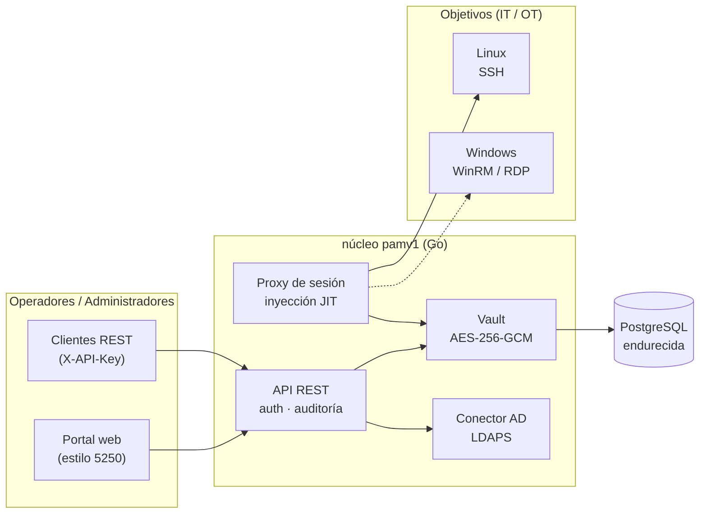

# pamv1

> ⚠️ **Alpha · con fines educativos.** Este es un proyecto educativo en fase temprana
> (**alpha**) creado para explorar cómo funciona de principio a fin un sistema de Gestión de
> Acceso Privilegiado (PAM). **No** ha sido auditado en seguridad y **no** está listo para
> producción — no lo uses para custodiar credenciales privilegiadas reales. Úsalo para
> aprender, experimentar y contribuir.

[](https://github.com/morandeirachema/pamv1/actions/workflows/ci.yml)
[](LICENSE)

**Gestión de Acceso Privilegiado** (PAM) de código abierto en Go: un almacén de credenciales
(vault) cifrado, inventario de objetivos Linux/Windows, un **proxy de sesión con inyección de
credenciales just-in-time**, registro de auditoría de solo adición, acceso de emergencia
*break-glass* y un **portal de administración estilo AS/400** sin concesiones — porque tocar un
PAM debe *sentirse* serio.

Construido fase a fase con una regla: **cada fase es funcional de principio a fin** — arranca,
pasa los tests y se despliega como IaC. Ya han entregado las **[diez fases del roadmap](ROADMAP.md)**,
desde el proxy SSH JIT y el RBAC hasta el login AD/OIDC, los objetivos Windows, el quórum de
break-glass, la adaptación OT/industrial y las herramientas NIS2. Sigue siendo un proyecto
**alpha y educativo** — léelo, ejecútalo, aprende de él, pero no le confíes secretos reales.

🔎 **Resumen interactivo:** [página del proyecto](https://claude.ai/code/artifact/b9f19443-5ad1-42d2-955f-e43ca17ac542) — qué funciona, arquitectura y hoja de ruta de un vistazo.

📖 **[Read it in English →](README.md)**

## Arquitectura



Todos los componentes anteriores están implementados. Las líneas discontinuas marcan rutas
opcionales o de back-end (el conector AD/OIDC solo se usa con SSO configurado; los objetivos
Windows se intermedian por WinRM/RDP).

## Qué funciona hoy

Ya han entregado las diez fases del roadmap. Agrupado por área:

### Identidad y acceso

- **Control de acceso basado en roles** — cuatro perfiles (`admin`, `user`, `auditor`,
  `approver`) con una única matriz rol→capacidad aplicada tanto por la API REST como por el
  proxy SSH. Los administradores emiten tokens por usuario (almacenados solo como SHA-256);
  cada denegación se audita y el registro atribuye nombres de usuario reales.
- **Inicio de sesión con AD, Entra ID y SSO OIDC** — autentícate con usuario + contraseña de
  AD por **LDAPS**, con **Microsoft Entra ID**, o mediante **SSO OIDC (Authorization Code +
  PKCE)** (el IdP hace el login y su MFA; pamv1 valida la firma RS256 del ID token contra el
  JWKS del IdP). Los grupos / app roles se mapean a los cuatro roles y el login emite un token
  de sesión que sirve en el portal y el proxy. Las fuentes se combinan; los tokens locales y el
  break-glass quedan como vía de emergencia.
- **MFA por TOTP** — alta autoservicio ([RFC 6238](https://datatracker.ietf.org/doc/html/rfc6238),
  compatible con cualquier app de autenticación); el secreto se guarda cifrado en el vault y,
  una vez dado de alta, el inicio de sesión exige el código de 6 dígitos. Incluye **códigos de
  recuperación** de un solo uso y una política opcional de **MFA obligatoria** (con primer
  inicio de sesión solo para el alta).

### Sesiones y proxy JIT

- **Proxy de sesión con inyección JIT** — los operadores conectan a través de una pasarela
  SSH; el proxy los autentica, obtiene la credencial del vault, **la descifra solo en el
  momento de la conexión** (y solo tras pasar todas las comprobaciones de autorización), la
  inyecta en la sesión de destino y lo graba todo. Probado de extremo a extremo con un test
  donde el servidor destino acepta *solo* la contraseña del vault que el cliente nunca tuvo.
  Las claves de host del destino pueden fijarse (`PAM_SSH_KNOWN_HOSTS`); hay ruta por
  jump-host/bastión y sesiones observador de solo lectura.
- **Objetivos Windows (WinRM + RDP)** — ejecuta comandos en hosts Windows con `POST
  /api/targets/{id}/winrm` (auth basic o NTLM) o un bucle WinRM interactivo por el proxy, o
  intermedia un escritorio **RDP** completo mediante Apache Guacamole (`GET
  /api/targets/{id}/rdp`, túnel WebSocket, con verificación de certificado por defecto). En
  ambos casos la credencial se inyecta just-in-time (funcionan cuentas de dominio de AD), las
  sesiones se auditan y el operador nunca ve el secreto.
- **Grabación de sesiones** — cada sesión (stdout **y** stderr) en formato [asciicast v2](https://docs.asciinema.org/manual/asciicast/v2/),
  con hash SHA-256 encadenado (anti-manipulación) y escrito en la auditoría. Los fallos de
  grabación se auditan y `PAM_REQUIRE_RECORDING` puede rechazar una sesión no grabable.

### Vault y ciclo de vida de credenciales

- **Vault endurecido (cifrado en sobre)** — cada secreto se sella con una clave de datos
  [AES-256-GCM](https://pkg.go.dev/crypto/cipher) por secreto, envuelta por una **KEK
  intercambiable**: una clave `local` para desarrollo/pruebas, o en producción **[HashiCorp Vault Transit](https://developer.hashicorp.com/vault/docs/secrets/transit)**,
  **AWS KMS** o un **HSM on-prem vía [PKCS#11](https://en.wikipedia.org/wiki/PKCS_11)** (build con tag `pkcs11`)
  — la clave raíz nunca sale del KMS/HSM. El AAD liga cada token a su objetivo; tokens versionados `v2:`; rotación de KEK en caliente.
- **Inventario de objetivos y API de credenciales** — máquinas Linux/Windows con endpoints ssh/winrm/rdp;
  las credenciales se guardan en el vault, se listan (sin devolver material secreto), se revelan bajo
  demanda (auditado) y se borran. El modelo JSON *no puede* serializar el cifrado (`json:"-"`).
- **Ciclo de vida de credenciales (rotación · reconciliación · checkout · descubrimiento)** —
  `POST /api/credentials/{id}/rotate` genera un secreto fuerte, lo aplica **en el objetivo** (SSH
  `chpasswd` / WinRM `net user` / `ssh_key` nuevo) y lo re-cifra — la nueva contraseña nunca se muestra.
  `/reconcile` verifica que el secreto siga autenticando y detecta **drift** (`?remediate=true` lo corrige).
  **Checkout/check-in** concede un préstamo exclusivo con caducidad y **rota** el secreto al
  devolverlo. **Descubrimiento** (`/api/discovery/scan`) sondea puertos SSH/WinRM/RDP y puede dar de
  alta objetivos. Un worker en segundo plano rota secretos antiguos y reconcilia según un intervalo;
  opcionalmente el secreto se rota en cuanto termina una sesión proxied.

### Auditoría, break-glass y alertas

- **Registro de auditoría** — de solo adición, para cada acción sensible, con atribución de actor,
  más una exportación anti-manipulación (`GET /api/audit/export`, JSON/CSV + SHA-256).
- **Registros operativos (logs)** — [slog](https://pkg.go.dev/log/slog) estructurado a stdout,
  una línea por petición HTTP y por sesión del proxy, etiquetado por servicio
  (`server`/`api`/`proxy`/`store`); JSON para un SIEM o texto para humanos (`PAM_LOG_LEVEL`,
  `PAM_LOG_FORMAT`). Separado de la auditoría; los secretos nunca se registran.
- **Break-glass (v2)** — una clave de emergencia sellada, o apertura por **quórum M-de-N**
  ([shares de Shamir](https://en.wikipedia.org/wiki/Shamir%27s_secret_sharing) repartidos con
  `-split-key`; los custodios envían shares para reconstruirla). En ambos casos obtienes una sesión
  de admin **de corta duración con autoexpiración**, y cada acceso/apertura se audita y se **alerta
  en tiempo real** (webhook, syslog o email).

### OT / industrial y cumplimiento

- **Aprobación de sesión OT (4 ojos)** — protege un objetivo tras una **solicitud de acceso
  aprobada**: un usuario crea la solicitud, un aprobador *distinto* la aprueba (se rechaza la
  auto-aprobación) y solo entonces puede conectar — aplicado en el proxy SSH, WinRM **y** RDP, con
  break-glass como bypass. Por objetivo (`require_approval`) o global (`PAM_REQUIRE_APPROVAL`), con
  ventana temporal.
- **Endurecimiento OT** — **listas de protocolos permitidos** por zona (`PAM_ALLOWED_PROTOCOLS`),
  sesiones **observador** de solo lectura y un **modo air-gap** (`PAM_OT_AIRGAP`) sin llamadas
  salientes. Ver la [Guía de despliegue OT](docs/OT-DEPLOYMENT.md) y el [Pack de cumplimiento NIS2](docs/NIS2-COMPLIANCE.md).

### Portal, almacenamiento y operación

- **Portal AS/400** — interfaz de terminal 5250 en fósforo verde (Sign On, pantallas por menú,
  teclas F), deliberatamente austera para que los administradores sientan el peso del sistema.
- **Almacenamiento PostgreSQL** vía [pgx](https://github.com/jackc/pgx) con migraciones embebidas;
  almacén en memoria para pruebas y demos; **HA opcional con [CloudNativePG](https://cloudnative-pg.io/)**.
- **Observabilidad** — endpoint [Prometheus](https://prometheus.io/) `/metrics` sin dependencias
  (peticiones por estado, volumen de auditoría, uso de break-glass, rotaciones, gauge de sesiones
  activas), más división liveness/readiness (`/healthz` y `/readyz`, que comprueba la base de datos).
- **Despliegue como IaC** — [Docker](https://docs.docker.com/) (distroless, sin root),
  [docker-compose](https://docs.docker.com/compose/) con PostgreSQL endurecida,
  manifiestos de [Kubernetes](https://kubernetes.io/) bajo el Pod Security Standard restringido,
  un **[chart de Helm](deploy/helm/pamv1)** y un módulo de [Terraform](https://developer.hashicorp.com/terraform).
  Las releases se construyen por digest con **[SBOM](https://www.cisa.gov/sbom), firma
  [cosign](https://docs.sigstore.dev/) sin claves y procedencia SLSA**.

## Documentación

Todos son documentos vivos, actualizados junto con el código (existen en inglés):

- **[Guía de usuario](docs/USER-GUIDE.md)** — para operadores/auditores/aprobadores.
- **[Guía de administrador](docs/ADMIN-GUIDE.md)** — despliegue, configuración, gestión, break-glass, logs y auditoría.
- **[Arquitectura](docs/ARCHITECTURE-HIGH-LEVEL.md)** ([bajo nivel](docs/ARCHITECTURE-LOW-LEVEL.md)) y la **[matriz de puertos y flujos](docs/PORTS-AND-FLOWS.md)** para cortafuegos y segmentación.

## Inicio rápido

> **Especificaciones de ejecución** (puertos, requests/limits de recursos, versiones de Docker/Kubernetes, PostgreSQL, almacenamiento, dimensionamiento) en **[docs/REQUIREMENTS.md](docs/REQUIREMENTS.md)**.

### Demo local (sin base de datos)

```bash
go build ./cmd/pam-server
export PAM_MASTER_KEY=$(./pam-server -genkey)
export PAM_API_KEY=$(openssl rand -hex 24)
export PAM_DATABASE_URL=memory
./pam-server
# → portal en http://localhost:8080 (Sign On con tu PAM_API_KEY) · proxy SSH en :2222
```

### docker-compose (con PostgreSQL endurecida)

```bash
cp .env.example .env      # rellena PAM_MASTER_KEY, PAM_API_KEY, POSTGRES_PASSWORD
docker compose up --build
```

## Roles y usuarios

Cuatro perfiles, aplicados de forma idéntica por la API y el proxy:

| Rol | Puede | No puede |
|---|---|---|
| `admin` | gestionar objetivos/credenciales/usuarios, revelar secretos, conectar, leer auditoría | — |
| `user` | conectar a objetivos por el proxy, leer el inventario | gestionar, revelar, leer auditoría |
| `auditor` | leer el inventario y la auditoría | gestionar, revelar, conectar |
| `approver` | leer inventario + auditoría, aprobar solicitudes de acceso | gestionar, revelar, conectar |

Un administrador crea un usuario y recibe su token de acceso **una sola vez**. Como alternativa,
los usuarios pueden iniciar sesión con su **usuario + contraseña de AD** por LDAPS (los grupos de
AD determinan el rol) y obtener un token de sesión.

## Conectar por el proxy (inyección JIT)

```bash
# el usuario selecciona el objetivo; la contraseña SSH es tu token PAM (o de sesión)
ssh -p 2222 web-01@pam-host                 # primera credencial del objetivo "web-01"
ssh -p 2222 root@web-01@pam-host            # una credencial concreta (usuario "root")
```

El proxy te autentica, obtiene la contraseña de `root` del vault, la inyecta en la conexión SSH
de destino, graba la sesión (asciicast v2) con un SHA-256 en la auditoría y hace de intermediario.
Nunca ves la credencial.

## Procedimiento break-glass

1. Genera una clave de emergencia fuerte y su hash — el texto plano **nunca** se configura ni se
   almacena:
   ```bash
   openssl rand -base64 30                        # la clave de emergencia
   echo -n "<esa-clave>" | ./pam-server -hashkey  # → PAM_BREAK_GLASS_KEY_HASH
   ```
2. Sella la clave en texto plano en un sobre / caja fuerte (se recomienda control dual). Configura
   solo el hash.
3. **En una emergencia** usa la clave sellada como `X-API-Key`. Funciona al instante — y cada
   petición se audita como actor `break-glass` y se registra ruidosamente.
4. **Tras el incidente**: rota la clave de emergencia, rota las credenciales reveladas y revisa la
   auditoría.

**Break-glass v2:** apertura por **quórum M-de-N** (reparte la clave en N shares con `-split-key`;
los custodios envían sus shares para reconstruirla). En ambos casos obtienes una sesión de admin
**de corta duración con autoexpiración**, y cada acceso/apertura break-glass se audita y se
**alerta en tiempo real** a un webhook.

## Protocolos seguros y OT

Usa siempre protocolos seguros: **HTTPS** para el portal/API, **LDAPS** para AD, **TLS** para
PostgreSQL. pamv1 encaja en arquitecturas [IEC 62443](https://www.isa.org/standards-and-publications/isa-standards/isa-iec-62443-series-of-standards)
(modelo Purdue): el proxy de sesión se ubica en la DMZ industrial (nivel 3.5) como **única** vía
IT→OT, con listas de protocolos por zona, ventanas de aprobación y acceso de proveedor grabado.
Detalles en la [Guía de despliegue OT](docs/OT-DEPLOYMENT.md).

## NIS2

Para entidades bajo la [Directiva (UE) 2022/2555 (NIS2)](https://eur-lex.europa.eu/eli/dir/2022/2555/oj),
pamv1 apunta a las medidas de gestión de riesgos del Art. 21 (control de acceso, criptografía, MFA,
registro/gestión de incidentes). El mapeo completo está en el
**[Pack de cumplimiento NIS2](docs/NIS2-COMPLIANCE.md)**: incluye la **exportación de auditoría con
evidencia anti-manipulación** (`GET /api/audit/export`, JSON/CSV + SHA-256) para las notificaciones de
24h/72h del Art. 23. Para despliegues **OT/industriales** (IEC 62443 / Purdue), consulta la
**[Guía de despliegue OT](docs/OT-DEPLOYMENT.md)**.

## Desarrollo

```bash
go build ./...            # compila todo
go test -race ./...       # tests unitarios + API + proxy (almacén en memoria) — lo que corre CI
go vet ./... && gofmt -l . # gofmt no debe imprimir nada
```

CI añade un contrato de store contra PostgreSQL real, un build con tag `pkcs11` contra SoftHSM2 y
la construcción de la imagen Docker.

Las contribuciones son bienvenidas — el [ROADMAP](ROADMAP.md) es el mejor sitio para elegir una tarea.

## Licencia

[Apache-2.0](LICENSE)
