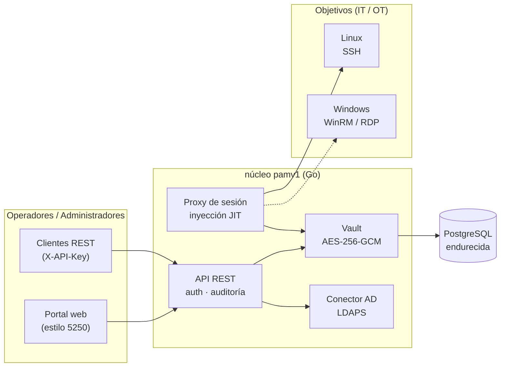

# pamv1

> ⚠️ **Alpha · con fines educativos.** Este es un proyecto educativo en fase temprana
> (**alpha**) creado para explorar cómo funciona de principio a fin un sistema de Gestión de
> Acceso Privilegiado (PAM). **No** ha sido auditado en seguridad y **no** está listo para
> producción — no lo uses para custodiar credenciales privilegiadas reales. Úsalo para
> aprender, experimentar y contribuir.

[](https://github.com/morandeirachema/pamv1/actions/workflows/ci.yml)
[](LICENSE)

**Gestión de Acceso Privilegiado** (PAM) de código abierto en Go: un almacén de credenciales
(vault) cifrado, inventario de objetivos Linux/Windows, registro de auditoría de solo
adición, acceso de emergencia *break-glass* y un **portal de administración estilo AS/400**
sin concesiones — porque tocar un PAM debe *sentirse* serio.

Construido paso a paso, **funcional en cada paso**. Ya funcionan el **proxy de sesión SSH con
inyección de credenciales just-in-time** ([Fase 2](ROADMAP.md#phase-2--session-proxy-with-jit-credential-injection-linuxssh-)),
el **control de acceso basado en roles (RBAC)** con cuatro perfiles ([Fase 3a](ROADMAP.md#3a--rbac-with-four-profiles-))
y el **inicio de sesión con Active Directory** por LDAPS ([Fase 3b](ROADMAP.md#3b--active-directory-connector-));
consulta el [ROADMAP](ROADMAP.md) para lo siguiente: objetivos Windows, adaptación OT/industrial
y cumplimiento de NIS2.

🔎 **Resumen interactivo:** [página del proyecto](https://claude.ai/code/artifact/b9f19443-5ad1-42d2-955f-e43ca17ac542) — qué funciona, arquitectura y hoja de ruta de un vistazo.

📖 **[Read it in English →](README.md)**

## Arquitectura



Los componentes con línea discontinua (objetivos Windows) llegan en la [Fase 4](ROADMAP.md).

## Qué funciona hoy (Fases 1–3b)

- **Inicio de sesión con Active Directory y Entra ID** — autentícate con usuario + contraseña
  de AD por **LDAPS**, o con **Microsoft Entra ID (Azure AD)**; los grupos / app roles del
  directorio se mapean a los cuatro roles (gana el de mayor privilegio) y `POST /api/login`
  emite un token de sesión de corta duración que sirve en el portal y en el proxy. Ambas
  fuentes pueden habilitarse a la vez; los tokens locales y el break-glass quedan como vía de
  emergencia.
- **Control de acceso basado en roles** — cuatro perfiles (`admin`, `user`, `auditor`,
  `approver`) con una única matriz rol→capacidad aplicada tanto por la API REST como por el
  proxy SSH. Los administradores emiten tokens por usuario (almacenados solo como SHA-256);
  cada denegación se audita y el registro atribuye nombres de usuario reales.
- **MFA por TOTP** — alta autoservicio ([RFC 6238](https://datatracker.ietf.org/doc/html/rfc6238),
  compatible con cualquier app de autenticación); el secreto se guarda cifrado en el vault y,
  una vez dado de alta, el inicio de sesión exige el código de 6 dígitos.
- **Proxy de sesión con inyección JIT** — los operadores conectan a través de una pasarela
  SSH; el proxy los autentica, obtiene la credencial del vault, **la descifra solo en el
  momento de la conexión**, la inyecta en la sesión SSH de destino y lo graba todo. Probado
  de extremo a extremo con un test donde el servidor destino acepta *solo* la contraseña del
  vault que el cliente nunca tuvo.
- **Grabación de sesiones** — cada sesión en formato [asciicast v2](https://docs.asciinema.org/manual/asciicast/v2/),
  con hash SHA-256 escrito en la auditoría (evidencia anti-manipulación).
- **Vault endurecido (cifrado en sobre)** — cada secreto se sella con una clave de datos
  [AES-256-GCM](https://pkg.go.dev/crypto/cipher) por secreto, envuelta por una **KEK
  intercambiable**: una clave `local` para desarrollo/pruebas, o **[HashiCorp Vault Transit](https://developer.hashicorp.com/vault/docs/secrets/transit)**
  en producción para que la clave raíz nunca salga del KMS. El AAD liga cada token a su
  objetivo; tokens versionados `v2:`.
- **Registro de auditoría** — de solo adición, para cada acción sensible, con atribución de actor.
- **Registros operativos (logs)** — [slog](https://pkg.go.dev/log/slog) estructurado a stdout,
  una línea por petición HTTP y por sesión del proxy, etiquetado por servicio
  (`server`/`api`/`proxy`/`store`); JSON para un SIEM o texto para humanos (`PAM_LOG_LEVEL`,
  `PAM_LOG_FORMAT`). Separado de la auditoría; los secretos nunca se registran.
- **Break-glass** — una clave de emergencia sellada de la que solo su SHA-256 vive en la
  configuración. Funciona al instante pero grita: actor `break-glass` en cada fila de auditoría.
- **Portal AS/400** — interfaz de terminal 5250 en fósforo verde (Sign On, pantallas por menú,
  teclas F), deliberatamente austera para que los administradores sientan el peso del sistema.
- **Almacenamiento PostgreSQL** vía [pgx](https://github.com/jackc/pgx); almacén en memoria
  para pruebas y demos.
- **Despliegue como IaC** — [Docker](https://docs.docker.com/) (distroless, sin root),
  [docker-compose](https://docs.docker.com/compose/) con PostgreSQL endurecida,
  manifiestos de [Kubernetes](https://kubernetes.io/) bajo el Pod Security Standard restringido,
  y un módulo de [Terraform](https://developer.hashicorp.com/terraform).

## Documentación

Todos son documentos vivos, actualizados junto con el código (existen en inglés):

- **[Guía de usuario](docs/USER-GUIDE.md)** — para operadores/auditores/aprobadores.
- **[Guía de administrador](docs/ADMIN-GUIDE.md)** — despliegue, configuración, gestión, break-glass, logs y auditoría.
- **[Arquitectura](docs/ARCHITECTURE-HIGH-LEVEL.md)** ([bajo nivel](docs/ARCHITECTURE-LOW-LEVEL.md)) y la **[matriz de puertos y flujos](docs/PORTS-AND-FLOWS.md)** para cortafuegos y segmentación.

## Inicio rápido

### Demo local (sin base de datos)

```bash
go build ./cmd/pam-server
export PAM_MASTER_KEY=$(./pam-server -genkey)
export PAM_API_KEY=$(openssl rand -hex 24)
export PAM_DATABASE_URL=memory
./pam-server
# → portal en http://localhost:8080 (Sign On con tu PAM_API_KEY) · proxy SSH en :2222
```

### docker-compose (con PostgreSQL endurecida)

```bash
cp .env.example .env      # rellena PAM_MASTER_KEY, PAM_API_KEY, POSTGRES_PASSWORD
docker compose up --build
```

## Roles y usuarios

Cuatro perfiles, aplicados de forma idéntica por la API y el proxy:

| Rol | Puede | No puede |
|---|---|---|
| `admin` | gestionar objetivos/credenciales/usuarios, revelar secretos, conectar, leer auditoría | — |
| `user` | conectar a objetivos por el proxy, leer el inventario | gestionar, revelar, leer auditoría |
| `auditor` | leer el inventario y la auditoría | gestionar, revelar, conectar |
| `approver` | leer inventario + auditoría, aprobar solicitudes de acceso* | gestionar, revelar, conectar |

`*` los endpoints de aprobación llegan en una fase posterior; el rol y su capacidad ya existen.

Un administrador crea un usuario y recibe su token de acceso **una sola vez**. Como alternativa,
los usuarios pueden iniciar sesión con su **usuario + contraseña de AD** por LDAPS (los grupos de
AD determinan el rol) y obtener un token de sesión.

## Conectar por el proxy (inyección JIT)

```bash
# el usuario selecciona el objetivo; la contraseña SSH es tu token PAM (o de sesión)
ssh -p 2222 web-01@pam-host                 # primera credencial del objetivo "web-01"
ssh -p 2222 root@web-01@pam-host            # una credencial concreta (usuario "root")
```

El proxy te autentica, obtiene la contraseña de `root` del vault, la inyecta en la conexión SSH
de destino, graba la sesión (asciicast v2) con un SHA-256 en la auditoría y hace de intermediario.
Nunca ves la credencial.

## Procedimiento break-glass

1. Genera una clave de emergencia fuerte y su hash — el texto plano **nunca** se configura ni se
   almacena:
   ```bash
   openssl rand -base64 30                        # la clave de emergencia
   echo -n "<esa-clave>" | ./pam-server -hashkey  # → PAM_BREAK_GLASS_KEY_HASH
   ```
2. Sella la clave en texto plano en un sobre / caja fuerte (se recomienda control dual). Configura
   solo el hash.
3. **En una emergencia** usa la clave sellada como `X-API-Key`. Funciona al instante — y cada
   petición se audita como actor `break-glass` y se registra ruidosamente.
4. **Tras el incidente**: rota la clave de emergencia, rota las credenciales reveladas y revisa la
   auditoría.

## Protocolos seguros y OT

Usa siempre protocolos seguros: **HTTPS** para el portal/API, **LDAPS** para AD, **TLS** para
PostgreSQL. pamv1 se diseña para encajar en arquitecturas [IEC 62443](https://www.isa.org/standards-and-publications/isa-standards/isa-iec-62443-series-of-standards)
(modelo Purdue): el proxy de sesión se ubica en la DMZ industrial (nivel 3.5) como **única** vía
IT→OT. Detalles en la [Fase 8](ROADMAP.md#phase-8--ot-adaptation-).

## NIS2

Para entidades bajo la [Directiva (UE) 2022/2555 (NIS2)](https://eur-lex.europa.eu/eli/dir/2022/2555/oj),
pamv1 apunta a las medidas de gestión de riesgos del Art. 21 (control de acceso, criptografía, MFA,
registro/gestión de incidentes). Consulta la tabla de mapeo en el [README en inglés](README.md#nis2).

## Desarrollo

```bash
go test ./...        # tests unitarios + de API (almacén en memoria)
go vet ./... && gofmt -l .
```

Las contribuciones son bienvenidas — el [ROADMAP](ROADMAP.md) es el mejor sitio para elegir una tarea.

## Licencia

[Apache-2.0](LICENSE)
