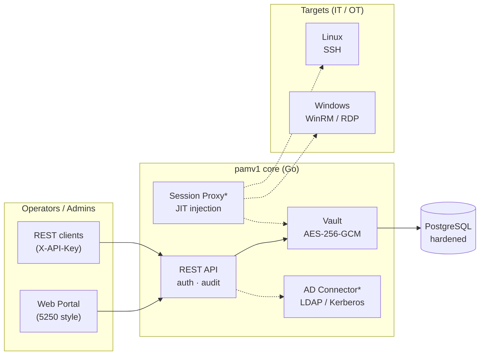

# pamv1

[](https://github.com/morandeirachema/pamv1/actions/workflows/ci.yml)
[](LICENSE)

Open-source **Privileged Access Management** (PAM) in Go: a hardened credential vault, target inventory for Linux/Windows, append-only audit trail, break-glass emergency access, and an unapologetically **AS/400-style admin portal** — because touching a PAM should *feel* serious.

Built step by step, **fully functional at every step**. See the [ROADMAP](ROADMAP.md) for where this is going: JIT credential-injection session proxy, Active Directory connector, OT/industrial adaptation and NIS2 compliance.

## Architecture



\* dashed components land in [Phase 2–4](ROADMAP.md).

## What works today (Phase 1)

- **Hardened vault** — secrets encrypted with [AES-256-GCM](https://pkg.go.dev/crypto/cipher) before they touch the database; random nonce per secret; AAD binds each ciphertext to its owning target (a copied token fails to decrypt); versioned `v1:` token format keeps the door open for key rotation.
- **Target inventory** — Linux/Windows machines with ssh/winrm/rdp endpoints.
- **Credentials API** — vault, list (never returns secret material), audited on-demand `reveal`, delete. The JSON model *cannot* serialize the ciphertext (`json:"-"`).
- **Audit trail** — append-only record of every sensitive action, with actor attribution.
- **Break-glass** — a sealed emergency key whose SHA-256 hash (never the key) lives in config; using it works instantly but screams: `break-glass` actor on every audit row plus a server warning log.
- **AS/400 portal** — Sign On screen, menu-driven `Work with…` screens, numeric options (`4=Delete`, `5=Display`), F3/F5/F6/F12 keys, green phosphor and scanlines.
- **PostgreSQL storage** via [pgx](https://github.com/jackc/pgx); in-memory store for tests and demos.
- **IaC deployment** — [Docker](https://docs.docker.com/) (distroless, non-root), [docker-compose](https://docs.docker.com/compose/) with hardened Postgres, [Kubernetes](https://kubernetes.io/) manifests under the restricted Pod Security Standard, and a [Terraform](https://developer.hashicorp.com/terraform) module.

## Quickstart

### Local demo (no database)

```bash
go build ./cmd/pam-server
export PAM_MASTER_KEY=$(./pam-server -genkey)
export PAM_API_KEY=$(openssl rand -hex 24)
export PAM_DATABASE_URL=memory
./pam-server
# → portal at http://localhost:8080 (Sign On with your PAM_API_KEY)
```

### docker-compose (with hardened PostgreSQL)

```bash
cp .env.example .env      # fill PAM_MASTER_KEY, PAM_API_KEY, POSTGRES_PASSWORD
docker compose up --build
# → http://localhost:8080
```

### Kubernetes

```bash
kubectl apply -f deploy/k8s/namespace.yaml
kubectl -n pamv1 create secret generic pam-secrets \
  --from-literal=PAM_MASTER_KEY=... \
  --from-literal=PAM_API_KEY=... \
  --from-literal=PAM_BREAK_GLASS_KEY_HASH=... \
  --from-literal=PAM_DATABASE_URL=postgres://...
kubectl apply -f deploy/k8s/
```

### Terraform (IaC)

```bash
cd deploy/terraform
terraform init
terraform apply \
  -var master_key=... -var api_key=... -var database_url=postgres://...
```

## Configuration

| Variable | Required | Description |
|---|---|---|
| `PAM_MASTER_KEY` | yes | Vault master key (32 bytes urlsafe-base64). Generate: `pam-server -genkey` |
| `PAM_API_KEY` | yes | Admin API key (header `X-API-Key`, portal Sign On) |
| `PAM_DATABASE_URL` | yes | `postgres://…` or `memory` (ephemeral demo) |
| `PAM_BREAK_GLASS_KEY_HASH` | no | Hex SHA-256 of the sealed emergency key; empty disables break-glass |
| `PAM_LISTEN_ADDR` | no | Listen address, default `:8080` |

## Break-glass procedure

1. Generate a strong emergency key and hash it — the plaintext is **never** configured or stored:
   ```bash
   openssl rand -base64 30                     # the emergency key
   echo -n "<that-key>" | ./pam-server -hashkey  # → PAM_BREAK_GLASS_KEY_HASH
   ```
2. Seal the plaintext key in an envelope / physical safe (dual control recommended). Configure only the hash.
3. **In an emergency** (normal auth path down): use the sealed key as `X-API-Key`. Access works immediately — and every request is audited as actor `break-glass` and logged loudly, blinking red in the portal's audit screen.
4. **After the incident**: rotate the emergency key (new hash), rotate any revealed credentials, review the audit trail.

Quorum unseal, auto-expiry and alerting are planned in [Phase 6](ROADMAP.md#phase-6--break-glass-v2-).

## Security model & hardening

- Secrets are encrypted at the application layer, so a DB dump alone is useless without `PAM_MASTER_KEY` (defense in depth on top of Postgres hardening: `scram-sha-256` auth, TLS and [pgAudit](https://www.pgaudit.org/) in [Phase 5](ROADMAP.md#phase-5--hardening-database-vault-transport-)).
- Constant-time key comparison ([`crypto/subtle`](https://pkg.go.dev/crypto/subtle)), body-size limits, strict CSP on the portal, distroless non-root container, read-only root FS and dropped capabilities in K8s.
- Found a vulnerability? Please open a private security advisory on GitHub rather than a public issue.

## OT / industrial environments

pamv1 is being designed to drop into [IEC 62443](https://www.isa.org/standards-and-publications/isa-standards/isa-iec-62443-series-of-standards)-oriented architectures: the session proxy is intended to live in the industrial DMZ (Purdue level 3.5) as the **only** IT→OT path, with air-gap friendly operation, per-cell protocol allowlists, approval windows and recorded vendor access. Details in [Phase 8](ROADMAP.md#phase-8--ot-adaptation-).

## NIS2

For entities under [Directive (EU) 2022/2555 (NIS2)](https://eur-lex.europa.eu/eli/dir/2022/2555/oj), pamv1 targets the Art. 21 risk-management measures:

| NIS2 Art. 21(2) | pamv1 |
|---|---|
| (i) access control & asset management | Target inventory, RBAC via AD groups (Phase 3) |
| (h) cryptography & encryption policies | AES-256-GCM vault, TLS everywhere (Phase 5) |
| (j) MFA & secured communications | TOTP MFA (Phase 3), proxied recorded sessions (Phase 2) |
| (b)(c) incident handling & business continuity | Audit trail, break-glass procedure, backup runbook (Phase 5) |
| Art. 23 reporting | Audit export hooks for 24h/72h notifications (Phase 9) |

## Development

```bash
go test ./...        # unit + API tests (in-memory store)
go vet ./... && gofmt -l .
```

Contributions are welcome — the [ROADMAP](ROADMAP.md) is the best place to pick something up. Please keep PRs small and covered by tests.

## License

[Apache-2.0](LICENSE)
