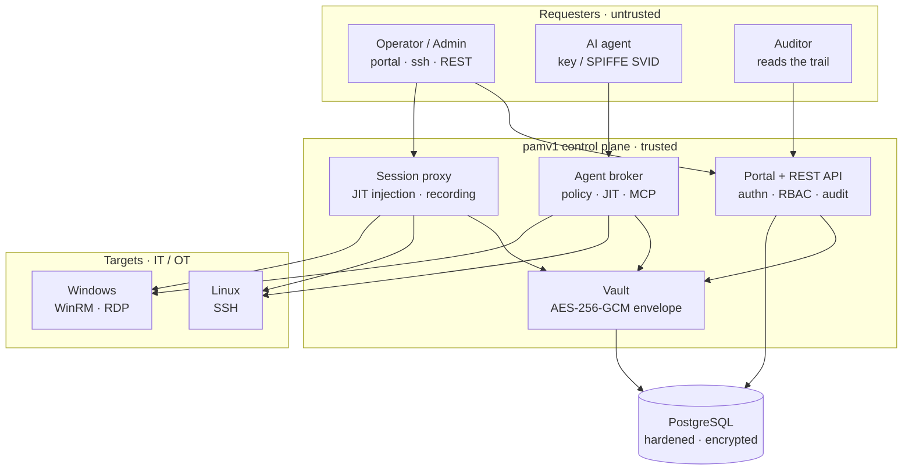
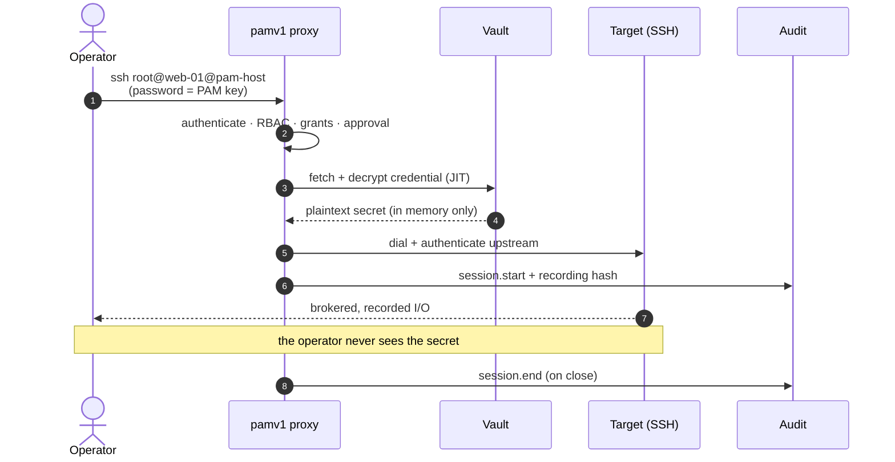

# pamv1

> ⚠️ **Alpha · for learning purposes.** This is an early-stage (**alpha**) educational
> project built to explore how a Privileged Access Management system works end to end. It has
> **not** been security-audited and is **not** production-ready — do not use it to guard real
> privileged credentials. Use it to learn, experiment and contribute.

[](https://github.com/morandeirachema/pamv1/actions/workflows/ci.yml)
[](LICENSE)
[](https://go.dev/)
[](https://www.postgresql.org/)

Open-source **Privileged Access Management** (PAM) in Go. pamv1 keeps privileged
credentials in a hardened vault and then puts a **broker** between the requester and the
machine: it authenticates the requester, decrypts the secret **just-in-time**, injects it
into the connection itself, and records everything. The password reaches the target — it
never reaches the person (or, now, the **AI agent**) who asked. On top sits an
unapologetically **AS/400 / IBM 5250 green-screen console**, because touching a PAM should
*feel* serious.

> **The one idea.** *Trust the chokepoint, not the requester.* Every privileged action —
> a human SSH session, a Windows command, an AI agent's tool call — flows through one
> audited control plane that holds the secret and hands back only the result. Take away the
> credential from the requester and most of the attack surface goes with it.

Built phase by phase with a single rule: **every phase is functional end to end** — it
runs, passes tests, and deploys as Infrastructure-as-Code. The **[roadmap](ROADMAP.md)** runs
0–21 and **all twenty-two phases have shipped** — from the JIT SSH proxy and RBAC, through
AD/Entra/OIDC login, Windows targets, break-glass quorum, OT/industrial adaptation, NIS2
tooling, scale/HA and the full 5250 console, to a hot-swappable configuration subsystem with
custom-profile RBAC, an **AI-agent access broker** (policy engine, JIT tool execution,
verifiable audit, MCP transport and SPIFFE identity), **SOPS-encrypted Kubernetes secrets**,
a **PostgreSQL database session proxy** (JIT injection + per-statement query audit),
**supervised sessions** (live monitoring + command control), **safes + dependent-account
propagation** — which closes all four Tier-1 gaps against the commercial leaders — and optional
**CyberArk Conjur** sourcing of pamv1's own bootstrap secrets (alongside SOPS), and
**access-governance** depth — certification campaigns, an ITSM/ticketing gate, and richer
approval workflows (Tier-2). It remains an **alpha, educational** codebase — read it, run it,
learn from it, but don't trust it with real secrets.

🔎 **Live overview:** [interactive project page](https://claude.ai/code/artifact/a1b34e5b-cd84-4fc7-8389-ebb1897495f7) — what works, architecture and roadmap at a glance &nbsp;·&nbsp; 📖 **[Léelo en español →](README.es.md)**

**Documentation** — living docs, kept in step with the code:

- **[User Guide](docs/USER-GUIDE.md)** — for operators / auditors / approvers: signing in, connecting through the proxy, per-role abilities.
- **[Administrator Guide](docs/ADMIN-GUIDE.md)** — deploy, configure, manage targets / credentials / users / roles, break-glass, logging & audit.
- **[Architecture — high level](docs/ARCHITECTURE-HIGH-LEVEL.md)** and **[low level](docs/ARCHITECTURE-LOW-LEVEL.md)** (the fullest map — read it first), plus **[code-derived diagrams](docs/ARCHITECTURE-DIAGRAMS.md)** (package graph, data model, REST surface — generated from source and CI-enforced current).
- **[Ports & network-flow matrix](docs/PORTS-AND-FLOWS.md)** · **[backup & restore runbook](docs/BACKUP-AND-RESTORE.md)** · **[OT deployment guide](docs/OT-DEPLOYMENT.md)** · **[NIS2 compliance pack](docs/NIS2-COMPLIANCE.md)**.

## Architecture

Requesters — human or machine — never touch the data zone or the targets directly. The
control plane brokers everything; the vault is the only thing that can turn ciphertext back
into a usable secret, and only for the length of a dial.



## How just-in-time injection works

Four moves, one guarantee: the requester is authenticated but never learns the target's
credential. The secret exists in plaintext only inside the control plane, only after every
authorization gate has passed, and only for the upstream dial.



The AI-agent broker makes the same move for a tool call: policy decides `allow / deny /
require-approval` on the tool **and its arguments**, an approved call runs server-side with a
JIT credential, and the agent receives only the result.

## What works today

Phases 0–14, grouped by area. Every capability is exercised by tests and deploys as code.

### Identity & access

- **Role-based access control + custom profiles** — four built-in roles (`admin`, `user`, `auditor`, `approver`) plus **custom permission profiles**: name any capability set (`read_inventory`, `manage_credentials`, `connect`, `reveal_secret`, `read_audit`, `approve`, …) and assign it to a user like a role. A single role/profile→capability matrix is enforced by *both* the REST API and the SSH proxy; admins mint per-user access tokens (stored only as SHA-256); every denial is audited under the real username.
- **AD, Entra ID & OIDC single sign-on** — sign in with an AD username + password over **LDAPS**, with **Microsoft Entra ID**, or via **OIDC Authorization Code + PKCE SSO** (the IdP does the login and its MFA; pamv1 validates the ID token's RS256 signature against the IdP's [JWKS](https://datatracker.ietf.org/doc/html/rfc7517)). Directory groups / app roles map to the roles, and login issues a short-lived session token that works in the portal and the proxy. Sources compose; local tokens and break-glass remain the emergency path.
- **TOTP multi-factor auth** — self-service enrollment ([RFC 6238](https://datatracker.ietf.org/doc/html/rfc6238), any authenticator app); the secret is stored vault-encrypted and login requires the 6-digit code once enrolled. Single-use **recovery codes** and an optional **require-MFA-for-all** policy (with enrollment-only first sign-in).
- **Safes (delegated-access containers)** — group targets into a named **safe** with its own members; a member may connect to **every target in the safe** (an authorization path alongside per-target grants), and a `can_manage` member is a **delegated safe administrator**. Placing a target in a safe restricts it to the safe's members. `POST /api/safes`, `/api/safes/{id}/members`, `PUT /api/targets/{id}/safe`.

### Sessions & the JIT proxy

- **Session proxy with JIT injection** — operators connect through an SSH gateway; the proxy authenticates them, pulls the credential from the vault, **decrypts it only at connection time** (and only after every authorization gate passes), injects it into the upstream session and records everything. Proven end to end by an integration test where the upstream accepts *only* the vaulted password the client never possessed. Upstream host keys can be pinned (`PAM_SSH_KNOWN_HOSTS`); a jump-host/bastion path and read-only **observer** sessions are supported.
- **Windows targets (WinRM + RDP)** — run commands on Windows hosts via `POST /api/targets/{id}/winrm` (basic or NTLM) or an interactive WinRM loop through the proxy, or broker a full **RDP** desktop through [Apache Guacamole](https://guacamole.apache.org/) (`GET /api/targets/{id}/rdp` WebSocket tunnel, cert-verified by default). Either way the credential is injected just-in-time (AD-joined accounts work), sessions are audited, and the operator never sees the secret.
- **Database session proxy (PostgreSQL)** — point `psql` at pamv1 (`PAM_DB_ADDR`, e.g. `:5433`) with `user=<dbcred>@<target>` and your PAM key as the password; the proxy runs the same authorization gates as the SSH proxy, injects the vaulted DB credential just-in-time (upstream auth via cleartext / MD5 / **SCRAM-SHA-256**), and brokers the wire protocol — **auditing every SQL statement** (`db.query`) and recording the session. The operator never learns the database password. Proven end to end by a fake upstream that accepts *only* the vaulted secret.
- **Session recording** — every session (stdout **and** stderr, or each SQL statement) captured in [asciicast v2](https://docs.asciinema.org/manual/asciicast/v2/), hashed with SHA-256 into a tamper-evident chain, and the hash written to the audit trail. Recording failures are audited, and `PAM_REQUIRE_RECORDING` can refuse an unrecordable session outright.
- **Supervised sessions (live monitoring + command control)** — a supervisor can **watch an SSH or PostgreSQL session live** over `GET /api/sessions/{id}/stream` (Server-Sent Events, `CapReadAudit`), and a regex denylist (`PAM_COMMAND_DENY_FILE`) **blocks a dangerous command before it reaches the target** on the exec, WinRM and SQL paths — refused and audited (`command.blocked`). Interactive SSH shells use read-only observer mode instead.

### Vault & credential lifecycle

- **Hardened vault (envelope encryption)** — each secret is sealed with a per-secret [AES-256-GCM](https://pkg.go.dev/crypto/cipher) data key that is wrapped by a **pluggable Key Encryption Key (KEK)**: a `local` key for dev/test, or in production **[HashiCorp Vault Transit](https://developer.hashicorp.com/vault/docs/secrets/transit)**, **[AWS KMS](https://aws.amazon.com/kms/)**, or an on-prem **HSM via [PKCS#11](https://en.wikipedia.org/wiki/PKCS_11)** (`pkcs11`-tagged build) — the root key never leaves the KMS/HSM. Additional Authenticated Data binds each ciphertext to its owning target (a copied token fails to decrypt); versioned `v2:` tokens enable online KEK rotation.
- **Target inventory & credentials API** — Linux/Windows machines with ssh/winrm/rdp endpoints; credentials are vaulted, listed (never returning secret material), revealed on demand (audited), and deleted. The JSON model *cannot* serialize the ciphertext (`json:"-"`).
- **Credential lifecycle (rotation · reconciliation · checkout · discovery)** — `POST /api/credentials/{id}/rotate` generates a strong secret, sets it **on the target** (SSH `chpasswd` / WinRM `net user` / fresh `ssh_key`), and re-vaults it — the new password is never shown. `/reconcile` verifies the vaulted secret still authenticates and flags **out-of-sync drift** (`?remediate=true` heals it). **Checkout/check-in** grants an exclusive time-boxed lease and rotates the secret on return. **Discovery** (`/api/discovery/scan`) probes hosts for SSH/WinRM/RDP ports and can auto-onboard targets. A background worker rotates aged secrets and reconciles on a schedule; secrets can be rotated the moment a proxied session ends. **Dependent accounts** — declare a credential's consumers (Windows Services / Scheduled Tasks / IIS App Pools) and rotation updates each over WinRM, so rotating a service account doesn't break production.

### Audit, break-glass & alerting

- **Audit trail** — an append-only record of every sensitive action, with actor attribution, plus a tamper-evident export (`GET /api/audit/export`, JSON/CSV + SHA-256 digest) for incident reporting.
- **Operational logs** — structured [slog](https://pkg.go.dev/log/slog) to stdout, one line per HTTP request and per proxy session, tagged by service (`server`/`api`/`proxy`/`store`); JSON for a SIEM or text for humans (`PAM_LOG_LEVEL`, `PAM_LOG_FORMAT`). Separate from the audit trail; secrets are never logged.
- **Break-glass (v2)** — a sealed emergency key, or **M-of-N quorum unseal** ([Shamir shares](https://en.wikipedia.org/wiki/Shamir%27s_secret_sharing) split with `-split-key`; custodians POST shares to reconstruct it). Either way you get a **short-lived, auto-expiring** admin session, and every break-glass access/unseal is loudly audited and **alerted in real time** (webhook, syslog or email).

### Configuration & the management console

- **AS/400 management console** — a full role-aware console in green phosphor: Sign On, a numbered main menu, and menu-driven `Work with…` screens for targets & grants, credentials (reveal/check-out/rotate/reconcile), active sessions (live monitor + kill), 4-eyes access requests, users & profiles, MFA, discovery, reconciliation, audit (filter + CSV export), break-glass, **permission profiles**, **system configuration** and **effective config + IaC export** — numeric options (`4=Delete`, `5=Display`), F-keys, scanlines. The menu shows only what your role permits.
- **Hot-swappable configuration** — the identity, SSO and operational-policy settings become editable settings **persisted in the database** and **applied live without a restart** (secrets vault-encrypted at rest, a rejected change rolled back). A read-only effective-config + backend-health screen and an **IaC export** (`env` / Helm / Terraform) round-trip console changes back into code. Bootstrap and networking/TLS deliberately stay environment-only.

### The AI-agent access broker

PAM for AI agents — the same chokepoint, extended to autonomous tools. Opt-in via
`PAM_BROKER_POLICY_FILE`.

- **Policy over tool + arguments** — a sudoers-style [YAML](https://yaml.org/) engine decides `allow / deny / require-approval` on the tool **and its arguments** (first match wins, implicit deny); an approved call runs **server-side with a just-in-time credential** and the agent gets only the result. Tools: `winrm_exec`, `ssh_exec`, `list_targets`, `list_credentials`, `rotate_credential`, and `reveal_credential` (shipped **default-deny**). Agents obey the same target grants and four-eyes gate as humans.
- **Human approval + single-use resume** — a `require_approval` call parks for a human decision (`/v1/approvals`); on approval it executes and the agent collects the result **exactly once** with a single-use token.
- **Verifiable audit** — every step is a keyed-**HMAC hash-chained** event (`GET /v1/audit/verify`, plus an ed25519-signed head checkpoint for truncation detection) kept separate from the general trail.
- **MCP transport + SPIFFE identity** — the broker speaks **[MCP](https://modelcontextprotocol.io/)** (JSON-RPC 2.0 at `POST /mcp`) at parity with REST, and agents authenticate with a static key or a **[SPIFFE](https://spiffe.io/) JWT-SVID** (RS256/ES256/EdDSA, trust-domain JWKS) with [RFC 8693](https://datatracker.ietf.org/doc/html/rfc8693) delegation chains bounded by a depth cap.

### OT / industrial & compliance

- **OT session approval (4-eyes)** — gate a target behind an **approved access request**: a user files it, a *different* approver approves (self-approval refused), and only then may the user connect — enforced on the SSH proxy, WinRM **and** RDP, with break-glass as the bypass. Per-target (`require_approval`) or global (`PAM_REQUIRE_APPROVAL`), time-boxed for maintenance windows.
- **OT hardening** — per-zone **protocol allowlists** (`PAM_ALLOWED_PROTOCOLS`), read-only **observer** sessions, and an **air-gap mode** (`PAM_OT_AIRGAP`) that makes zero outbound calls. See the [OT Deployment Guide](docs/OT-DEPLOYMENT.md) and the [NIS2 Compliance Pack](docs/NIS2-COMPLIANCE.md).

### Storage & operations

- **PostgreSQL storage** via [pgx](https://github.com/jackc/pgx) with embedded, versioned migrations; an in-memory store for tests and demos; optional **[CloudNativePG](https://cloudnative-pg.io/) HA**.
- **Observability** — a dependency-free [Prometheus](https://prometheus.io/) `/metrics` endpoint (request counts by status, audit volume, break-glass use, rotations, active-sessions gauge), plus a health/readiness split (`/healthz` liveness, `/readyz` checks the database).
- **IaC deployment** — [Docker](https://docs.docker.com/) (distroless, non-root), [docker-compose](https://docs.docker.com/compose/) with hardened Postgres, [Kubernetes](https://kubernetes.io/) manifests under the restricted Pod Security Standard, a **[Helm chart](deploy/helm/pamv1)**, and a [Terraform](https://developer.hashicorp.com/terraform) module. Releases are built by digest with an **[SBOM](https://www.cisa.gov/sbom), [cosign](https://docs.sigstore.dev/) keyless signature and SLSA provenance**.
- **Encrypted secrets in git** — the Kubernetes secret manifest can be sealed with **[SOPS](https://github.com/getsops/sops) + [age](https://age-encryption.org/)**: values are encrypted while `kind`/`metadata` stay reviewable, decrypted at deploy time (`sops -d \| kubectl apply -f -`, plaintext never on disk) or natively by Flux / Argo / helm-secrets — so secrets live in the **same IaC repo** without leaking. See **[deploy/k8s/sops/](deploy/k8s/sops/)**.
- **Or source secrets from CyberArk Conjur** — as a runtime alternative to SOPS, set `PAM_CONJUR_URL` and pamv1 fetches its own bootstrap secrets (master key, API key, DB URL, …) from **[Conjur](https://www.conjur.org/)** at startup, authenticating with a host API key or a **Kubernetes `authn-jwt`** projected token — so no bootstrap secret lives in Git at all. Both mechanisms ship; SOPS stays the zero-dependency default. See **[deploy/k8s/conjur/](deploy/k8s/conjur/)**.

## Roles, users & profiles

Four built-in roles, enforced identically by the API and the proxy, plus custom profiles:

| Role | Can | Cannot |
|---|---|---|
| `admin` | manage targets/credentials/users, reveal secrets, connect, read audit, manage config/profiles | — |
| `user` | connect to targets through the proxy, read the inventory | manage, reveal, read audit |
| `auditor` | read the inventory and the audit trail | manage, reveal, connect |
| `approver` | read inventory + audit, approve access requests | manage, reveal, connect |

Need something in between? Define a **custom profile** — a named capability set — and assign
it like a role (menu 12, or `POST /api/profiles`). The four built-ins stay unchanged.

An admin creates a user and receives that user's access token **once**:

```bash
curl -H "X-API-Key: $PAM_API_KEY" -X POST http://localhost:8080/api/users \
  -d '{"username":"alice","role":"user"}'
# → {"id":1,"username":"alice","role":"user","token":"pamt_…"}   (store it now)
```

The user then presents that token as `X-API-Key` (portal Sign On) or as the SSH proxy
password. The bootstrap `PAM_API_KEY` is the `admin` identity; the break-glass key is also
`admin` (audited loudly). For directory-backed sign-in, AD/Entra/OIDC map directory groups to
these same roles.

## Connect through the proxy (JIT injection)

Once a target and its credential are vaulted, operators reach the target **through** pamv1 —
the secret is decrypted only for the upstream dial and is never shown:

```bash
# username selects the target; SSH password is your PAM API key (or per-user token)
ssh -p 2222 web-01@pam-host                 # first credential of target "web-01"
ssh -p 2222 root@web-01@pam-host            # a specific credential (user "root")
```

The proxy authenticates you, pulls `root`'s password from the vault, injects it into the
upstream SSH connection, records the session (asciicast v2) with a SHA-256 in the audit trail,
and proxies your I/O. You never see the credential. Recordings go to `PAM_RECORDING_DIR`;
disable the proxy with `PAM_SSH_ADDR=off`.

## Roadmap

All twenty-two phases have shipped — full per-phase detail in **[ROADMAP.md](ROADMAP.md)**:

| Phase | Theme | Status |
|---|---|---|
| 0 | Project foundation | ✅ shipped |
| 1 | Core: vault, inventory, audit, portal | ✅ shipped |
| 2 | SSH session proxy with JIT injection | ✅ shipped |
| 3 | Identity & access control (RBAC, AD/Entra/OIDC, MFA) | ✅ shipped |
| 4 | Windows targets (WinRM + RDP via Guacamole) | ✅ shipped |
| 5 | Hardening: database, vault, transport | ✅ shipped |
| 6 | Break-glass v2 (M-of-N quorum) | ✅ shipped |
| 7 | Credential lifecycle (rotation, reconciliation) | ✅ shipped |
| 8 | OT adaptation (4-eyes approvals, air-gap) | ✅ shipped |
| 9 | NIS2 compliance pack | ✅ shipped |
| 10 | Scale & operations (metrics, Helm, HA, signed releases) | ✅ shipped |
| 11 | Full 5250 management console | ✅ shipped |
| 12 | Configuration subsystem + custom-profile RBAC + hot-swap | ✅ shipped |
| 13 | AI-agent access broker (policy, JIT tools, verifiable audit, MCP, SPIFFE) | ✅ shipped |
| 14 | SOPS-encrypted Kubernetes secrets (age; Flux/Argo/helm-secrets) | ✅ shipped |
| 15 | PostgreSQL database session proxy (JIT injection + query audit) | ✅ shipped |
| 16 | Live session monitoring (SSE) + command control | ✅ shipped |
| 17 | Safes (delegated-access containers) + dependent-account propagation | ✅ shipped |
| 18 | CyberArk Conjur secret sourcing (optional, alongside SOPS) | ✅ shipped |
| 19 | Access certification / attestation campaigns | ✅ shipped |
| 20 | ITSM / ticketing gate on access requests | ✅ shipped |
| 21 | Richer approval workflows (N-of-M, scheduled windows, reason codes) | ✅ shipped |

## Coverage vs. commercial PAM (CyberArk, Wallix, …)

pamv1 is an **educational, alpha** project — not a drop-in replacement for
[CyberArk](https://www.cyberark.com/products/privileged-access-manager/),
[Wallix Bastion](https://www.wallix.com/privileged-access-management/),
[BeyondTrust](https://www.beyondtrust.com/),
[Delinea](https://delinea.com/products/secret-server),
[Teleport](https://goteleport.com/) or [StrongDM](https://www.strongdm.com/). On the
**core session/credential loop** it is already at parity — a JIT-injection proxy
(SSH/WinRM/RDP), tamper-evident hash-chained recordings, rotation + reconciliation +
checkout leases, M-of-N break-glass, RBAC + AD/Entra/OIDC + MFA, and a verifiable
audit chain — and its **AI-agent access broker** (policy over the tool *and its
arguments*, MCP transport, SPIFFE identity) is ahead of most incumbents.

The gaps below are about **breadth and governance**. Each notes how it fits pamv1's
existing chokepoint architecture, and they map to candidate future phases.

### Tier 1 — structural / connector gaps

| Gap | What the leaders do | pamv1 today | Fit |
|---|---|---|---|
| ~~**Safe / vault containers** with delegated ownership~~ **✅ shipped (Phase 17)** | CyberArk's whole authorization model is [Safes](https://docs.cyberark.com/pam-self-hosted/latest/en/content/pasref/safes-and-safe-members.htm) — credential containers with their own members, workflows & delegated admin; Wallix uses target domains | **safes** group targets with delegated `can_manage` members; a member reaches every target in the safe (`EffectiveTargetGrants`) | done — per-safe approval workflows are a follow-on |
| ~~**Database session proxy** with query-level audit~~ **✅ shipped (Phase 15, PostgreSQL)** | [Teleport](https://goteleport.com/docs/enroll-resources/database-access/), [StrongDM](https://www.strongdm.com/), CyberArk & Wallix broker native Postgres/MySQL/MSSQL/Oracle with per-query audit + JIT injection | **PostgreSQL brokered** (`PAM_DB_ADDR`): JIT injection, SCRAM/MD5/cleartext upstream auth, `db.query` audit per statement. MySQL/MSSQL/Oracle still to come | done for Postgres — the same listener pattern generalizes to the other wire protocols |
| ~~**Live monitoring + command control**~~ **✅ shipped (Phase 16)** | [CyberArk PSM](https://www.cyberark.com/products/privileged-session-manager/) & Wallix let a supervisor watch a live session, block a dangerous command mid-stream (`rm -rf /`, `DROP TABLE`) and terminate it interactively | **live SSE stream** (`GET /api/sessions/{id}/stream`) + **command control** (regex denylist blocks exec/WinRM/SQL, `command.blocked`); interactive kill already existed | done — interactive-shell filtering + in-portal viewer are follow-ons |
| ~~**Dependent-account propagation** on rotation~~ **✅ shipped (Phase 17)** | CyberArk CPM updates every [consumer](https://docs.cyberark.com/pam-self-hosted/latest/en/content/pasimp/managing-service-accounts-service.htm) of a rotated service account (Windows Services, Scheduled Tasks, IIS App Pools, COM+) | rotation now updates declared **Windows Services / Scheduled Tasks / IIS App Pools** over WinRM with the new secret | done — COM+ and a per-consumer management credential are follow-ons |

### Tier 2 — access-governance depth

- ~~**Access certification / attestation campaigns**~~ **✅ shipped (Phase 19)** — a campaign snapshots current access (target grants + safe members); a reviewer certifies or revokes each item, and a revoke deletes the underlying grant (`POST /api/campaigns`). The SOX / ISO 27001 / NIS2 access-review control.
- ~~**ITSM / ticketing gate**~~ **✅ shipped (Phase 20)** — an access request can require a change/incident ticket, validated by a format regex and/or a webhook the ITSM answers `2xx` for a valid ticket (`PAM_REQUIRE_TICKET`), then stamped into the audit trail.
- ~~**Richer approval workflows**~~ **✅ shipped (Phase 21)** — multi-tier **N-of-M** chains (`PAM_APPROVALS_REQUIRED`), **scheduled** access windows (`not_before`/`not_after`), and mandatory reason codes. *(One-time single-use access is the one documented follow-on.)*

**All three Tier-2 access-governance gaps are now closed.**

### Tier 3 — where the market is moving

| Gap | Leaders | pamv1 today |
|---|---|---|
| **Zero Standing Privilege** — ephemeral accounts / short-lived SSH certs instead of a stored standing secret | [CyberArk ZSP](https://www.cyberark.com/what-is/zero-standing-privileges/), Teleport | vaulted standing credential + JIT injection |
| **Connector / plugin breadth** — network devices (Cisco/Juniper/F5/Palo Alto), database accounts, cloud IAM, VMware/SAP/mainframe | CyberArk's core moat | SSH / WinRM / ssh_key rotation only |
| **Cloud privileged access (CIEM-lite)** — federated console + short-lived cloud credentials, entitlement right-sizing | CyberArk, Wallix | AWS KMS for the KEK only |
| **Privileged threat analytics** — behavioural anomaly detection, risk scoring, automated response | CyberArk PTA, Wallix | raw audited stream + syslog/SIEM export (detect downstream) |
| **Web / SaaS session proxying** — record + inject into web admin consoles | CyberArk Secure Web Sessions, Wallix | SSH/WinRM/RDP only (the heaviest lift) |

### Tier 4 — ecosystem

A [Terraform **provider**](https://developer.hashicorp.com/terraform) for pamv1 objects
(targets / credentials / policies-as-code — strongly aligned with the IaC ethos) ·
[Secrets Hub](https://www.cyberark.com/products/secrets-hub/)-style sync-out to AWS
Secrets Manager / Azure Key Vault · a [Conjur](https://www.conjur.org/)-style
application-secrets API for non-agent apps · SSH-key fleet discovery · thick-app
connection components (auto-login into SSMS / Toad / vSphere via RDP RemoteApp).

### Deliberate non-goal

[Endpoint Privilege Management](https://www.beyondtrust.com/privilege-management) —
removing local admin rights and elevating sudo/apps via an **endpoint agent**
(BeyondTrust / Delinea's core) — is a different product category that doesn't fit a
vault + proxy chokepoint, and is **out of scope** by design.

### Candidate next phases

1. ~~**Phase 15 — Database session proxy**~~ ✅ **shipped** (PostgreSQL; MySQL/MSSQL/Oracle are follow-on connectors on the same pattern).
2. ~~**Phase 16 — Live monitoring + command control**~~ ✅ **shipped** (SSE live stream + regex command control on exec/WinRM/SQL).
3. ~~**Phase 17 — Safes / containers + dependent-account propagation**~~ ✅ **shipped** — the authorization upgrade for multi-team use and *safe* service-account rotation.

**All four Tier-1 gaps are now closed.** The remaining tiers (governance depth, ZSP, connector breadth, cloud, analytics, web proxying) are the next frontier.

## Quickstart

> **Run specs** (ports, resource requests/limits, Docker/Kubernetes versions, PostgreSQL, storage, sizing) live in **[docs/REQUIREMENTS.md](docs/REQUIREMENTS.md)**.

### Local demo (no database)

```bash
go build ./cmd/pam-server
export PAM_MASTER_KEY=$(./pam-server -genkey)
export PAM_API_KEY=$(openssl rand -hex 24)
export PAM_DATABASE_URL=memory
./pam-server
# → portal at http://localhost:8080 (Sign On with your PAM_API_KEY)
#   SSH proxy on :2222
```

### docker-compose (with hardened PostgreSQL)

```bash
cp .env.example .env      # fill PAM_MASTER_KEY, PAM_API_KEY, POSTGRES_PASSWORD
docker compose up --build
# → http://localhost:8080
```

### Kubernetes

```bash
kubectl apply -f deploy/k8s/namespace.yaml
kubectl -n pamv1 create secret generic pam-secrets \
  --from-literal=PAM_MASTER_KEY=... \
  --from-literal=PAM_API_KEY=... \
  --from-literal=PAM_BREAK_GLASS_KEY_HASH=... \
  --from-literal=PAM_DATABASE_URL=postgres://...
kubectl apply -f deploy/k8s/
```

Or with Helm (readiness/metrics wired, configurable replicas, optional ServiceMonitor):

```bash
helm install pamv1 deploy/helm/pamv1 \
  --set secret.data.PAM_MASTER_KEY=... \
  --set secret.data.PAM_API_KEY=... \
  --set secret.data.PAM_DATABASE_URL=postgres://...
```

### Terraform (IaC)

```bash
cd deploy/terraform
terraform init
terraform apply \
  -var master_key=... -var api_key=... -var database_url=postgres://...
```

## Configuration

The essentials — the full set of `PAM_*` variables (KEK providers, AD/Entra/OIDC, WinRM/RDP,
OT, rotation, alerting, the agent broker) is tabulated in
**[docs/ARCHITECTURE-LOW-LEVEL.md](docs/ARCHITECTURE-LOW-LEVEL.md#4-configuration-env-pam_)**.
Identity/SSO/policy keys are additionally editable at runtime from the console (Phase 12);
bootstrap and transport keys below stay environment-only.

| Variable | Required | Description |
|---|---|---|
| `PAM_MASTER_KEY` | yes | Vault master key (32 bytes urlsafe-base64). Generate: `pam-server -genkey` |
| `PAM_API_KEY` | yes | Admin API key (header `X-API-Key`, portal Sign On) |
| `PAM_DATABASE_URL` | yes | `postgres://…` or `memory` (ephemeral demo) |
| `PAM_BREAK_GLASS_KEY_HASH` | no | Hex SHA-256 of the sealed emergency key; empty disables break-glass |
| `PAM_LISTEN_ADDR` | no | HTTP listen address, default `:8080` |
| `PAM_SSH_ADDR` | no | SSH proxy address, default `:2222`; `off` disables it |
| `PAM_SSH_HOST_KEY` | no | Path to persist the proxy host key (PEM); empty = ephemeral |
| `PAM_SSH_KNOWN_HOSTS` | no | Pin upstream target host keys (known_hosts file); empty = trust-any (logged) |
| `PAM_RECORDING_DIR` | no | Where session recordings are written, default `recordings` |
| `PAM_BROKER_POLICY_FILE` | no | YAML agent-broker policy; set to enable the AI-agent broker |

## Break-glass procedure

1. Generate a strong emergency key and hash it — the plaintext is **never** configured or stored:
   ```bash
   openssl rand -base64 30                       # the emergency key
   echo -n "<that-key>" | ./pam-server -hashkey  # → PAM_BREAK_GLASS_KEY_HASH
   ```
2. Seal the plaintext key in an envelope / physical safe (dual control recommended). Configure only the hash.
3. **In an emergency** (normal auth path down): use the sealed key as `X-API-Key`. Access works immediately — and every request is audited as actor `break-glass` and logged loudly, blinking red in the portal's audit screen.
4. **After the incident**: rotate the emergency key (new hash), rotate any revealed credentials, review the audit trail.

For higher assurance, split the emergency key into **M-of-N [Shamir shares](https://en.wikipedia.org/wiki/Shamir%27s_secret_sharing)** (`pam-server -split-key`) held by separate custodians who POST their shares to `/api/breakglass/unseal`; the reconstructed session auto-expires and every unseal is alerted.

## Security model & hardening

- **Secrets never leave as data.** Ciphertext is decrypted **only after every authorization gate passes**, held transiently in memory for the upstream dial, and never serialized to a client or written to a log. `Credential.SecretEnc` is `json:"-"`; the deliberate reveal paths (human reveal endpoint, agent `reveal_credential`) are audited and shipped restricted.
- **Encrypted at the application layer**, so a DB dump alone is useless without `PAM_MASTER_KEY` — defense in depth on top of Postgres hardening (`scram-sha-256` auth, TLS, [pgAudit](https://www.pgaudit.org/)).
- **Trust the chokepoint.** Upstream SSH host keys can be pinned so the proxy won't inject a credential into a spoofed target; the agent broker fails **closed** (an unavailable audit chain refuses the call); graceful shutdown drains active sessions so recordings and audit events are flushed.
- **Tamper-evidence.** Session recordings and the broker audit are hash-chained; the audit export carries a SHA-256 digest and the broker chain an ed25519-signed head checkpoint.
- **Hardened by construction** — constant-time key comparison ([`crypto/subtle`](https://pkg.go.dev/crypto/subtle)), body-size limits, per-agent rate limits, a strict CSP on the portal, a distroless non-root container, read-only root FS and dropped capabilities in K8s.
- Found a vulnerability? Please open a private security advisory on GitHub rather than a public issue.

## OT / industrial environments

pamv1 drops into [IEC 62443](https://www.isa.org/standards-and-publications/isa-standards/isa-iec-62443-series-of-standards)-oriented architectures: the session proxy lives in the industrial DMZ (Purdue level 3.5) as the **only** IT→OT path, with air-gap-friendly operation, per-cell protocol allowlists, approval windows and recorded vendor access. Details in the [OT Deployment Guide](docs/OT-DEPLOYMENT.md).

## NIS2

For entities under [Directive (EU) 2022/2555 (NIS2)](https://eur-lex.europa.eu/eli/dir/2022/2555/oj), pamv1 targets the Art. 21 risk-management measures — full mapping in the **[NIS2 Compliance Pack](docs/NIS2-COMPLIANCE.md)**:

| NIS2 Art. 21(2) | pamv1 |
|---|---|
| (i) access control & asset management | Target inventory, RBAC + custom profiles + per-target grants, 4-eyes approval |
| (h) cryptography & encryption policies | Envelope encryption (AES-256-GCM + pluggable KEK), TLS everywhere |
| (j) MFA & secured communications | TOTP MFA + OIDC/Entra SSO, proxied recorded sessions |
| (b)(c) incident handling & business continuity | Audit trail, break-glass quorum, backup runbook |
| Art. 23 reporting | Tamper-evident audit export (`GET /api/audit/export`, JSON/CSV + SHA-256) for 24h/72h notifications |

## Development

```bash
go build ./...             # build everything
go test -race ./...        # unit + API + proxy tests (in-memory store) — what CI runs
go vet ./... && gofmt -l . # gofmt must print nothing
```

CI additionally runs a live-PostgreSQL store contract, a `pkcs11`-tagged build against
[SoftHSM2](https://www.opendnssec.org/softhsm/), a Docker image build, and a check that the
**code-derived architecture diagrams** are current. The
[architecture low-level doc](docs/ARCHITECTURE-LOW-LEVEL.md) is the fullest map of the
codebase — read it first.

Contributions are welcome — the [ROADMAP](ROADMAP.md) is the best place to pick something up.
Please keep PRs small and covered by tests.

## License

[Apache-2.0](LICENSE)
