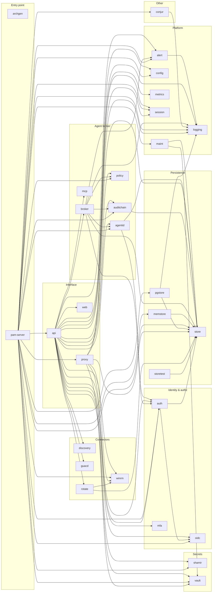
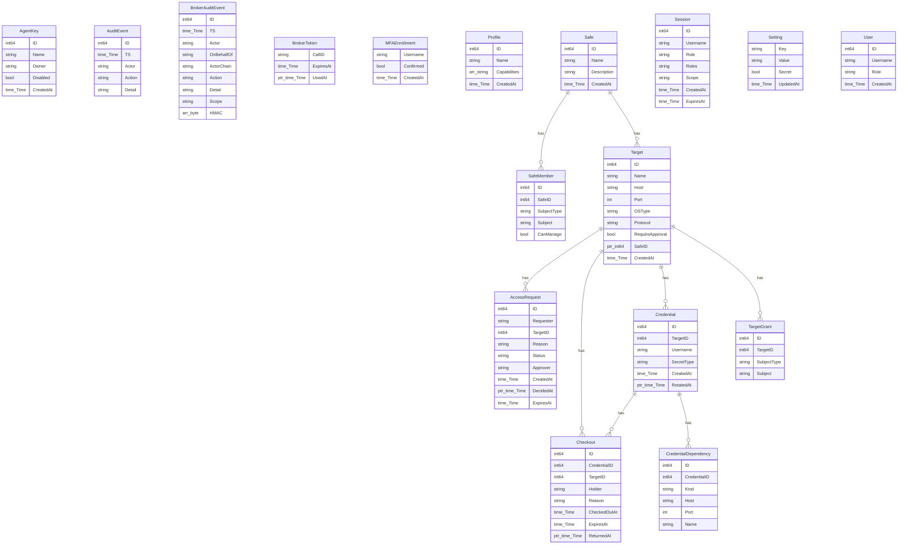

# pamv1 — Architecture Diagrams (generated)

> **Do not edit by hand.** This file is regenerated from the source by
> `go run ./cmd/archgen` (or `go generate ./...`). CI runs the
> generator and fails if the committed copy is stale, so these diagrams stay in
> step with the code on every change. Conceptual flows (trust zones, the JIT
> proxy sequence, deployment) live in the hand-authored
> [High-Level Architecture](ARCHITECTURE-HIGH-LEVEL.md) and
> [Low-Level Architecture](ARCHITECTURE-LOW-LEVEL.md).

Rendering: these are [Mermaid](https://mermaid.js.org/) diagrams; GitHub renders
them inline.

## 1. Package dependency graph

Every Go package in the module and the imports between them. Arrows point from a package to the packages it imports.

## 2. Domain data model

Entities are the exported structs in `internal/store/store.go` (never-serialized fields such as `SecretEnc`/`TokenHash` are omitted). Relationships are inferred from `<Entity>ID` foreign keys.

## 3. REST API surface

The 78 routes registered on the API mux, with the capability or guard each enforces (see `internal/auth` for the role → capability matrix).

| Method | Path | Guard |
|---|---|---|
| GET | `/api/access-requests` | CapApprove |
| POST | `/api/access-requests` | CapConnect |
| POST | `/api/access-requests/{id}/approve` | CapApprove |
| POST | `/api/access-requests/{id}/deny` | CapApprove |
| GET | `/api/audit` | CapReadAudit |
| GET | `/api/audit/export` | CapReadAudit |
| GET | `/api/auth/oidc/callback` | public (rate-limited) |
| GET | `/api/auth/oidc/start` | public (rate-limited) |
| POST | `/api/breakglass/unseal` | public (rate-limited) |
| GET | `/api/checkouts` | CapReadAudit |
| GET | `/api/config` | CapManageUsers |
| PUT | `/api/config` | CapManageUsers |
| GET | `/api/config/effective` | CapManageUsers |
| GET | `/api/config/iac` | CapManageUsers |
| DELETE | `/api/config/{key}` | CapManageUsers |
| GET | `/api/credentials` | CapReadInventory |
| POST | `/api/credentials` | CapManageCredentials |
| DELETE | `/api/credentials/{id}` | CapManageCredentials |
| POST | `/api/credentials/{id}/checkin` | CapRevealSecret |
| POST | `/api/credentials/{id}/checkout` | CapRevealSecret |
| GET | `/api/credentials/{id}/dependencies` | CapReadInventory |
| POST | `/api/credentials/{id}/dependencies` | CapManageCredentials |
| DELETE | `/api/credentials/{id}/dependencies/{did}` | CapManageCredentials |
| POST | `/api/credentials/{id}/reconcile` | CapManageCredentials |
| POST | `/api/credentials/{id}/reveal` | CapRevealSecret |
| POST | `/api/credentials/{id}/rotate` | CapManageCredentials |
| POST | `/api/discovery/scan` | CapManageTargets |
| POST | `/api/identity/reconcile` | CapManageUsers |
| POST | `/api/login` | public (rate-limited) |
| POST | `/api/logout` | authenticated |
| GET | `/api/me` | authenticated |
| DELETE | `/api/mfa` | authenticated |
| GET | `/api/mfa` | authenticated |
| POST | `/api/mfa/enroll` | authenticated |
| POST | `/api/mfa/recovery-codes` | authenticated |
| POST | `/api/mfa/verify` | authenticated |
| GET | `/api/profiles` | CapManageUsers |
| POST | `/api/profiles` | CapManageUsers |
| DELETE | `/api/profiles/{id}` | CapManageUsers |
| GET | `/api/reconcile` | CapManageCredentials |
| GET | `/api/safes` | CapReadInventory |
| POST | `/api/safes` | CapManageTargets |
| DELETE | `/api/safes/{id}` | CapManageTargets |
| GET | `/api/safes/{id}/members` | CapReadInventory |
| POST | `/api/safes/{id}/members` | CapReadInventory |
| DELETE | `/api/safes/{id}/members/{mid}` | CapReadInventory |
| GET | `/api/sessions` | CapReadAudit |
| DELETE | `/api/sessions/{id}` | CapManageTargets |
| GET | `/api/sessions/{id}/stream` | CapReadAudit |
| GET | `/api/targets` | CapReadInventory |
| POST | `/api/targets` | CapManageTargets |
| DELETE | `/api/targets/{id}` | CapManageTargets |
| GET | `/api/targets/{id}` | CapReadInventory |
| GET | `/api/targets/{id}/grants` | CapManageTargets |
| POST | `/api/targets/{id}/grants` | CapManageTargets |
| DELETE | `/api/targets/{id}/grants/{gid}` | CapManageTargets |
| GET | `/api/targets/{id}/rdp` | token (query) |
| PUT | `/api/targets/{id}/safe` | CapManageTargets |
| POST | `/api/targets/{id}/winrm` | CapConnect |
| GET | `/api/users` | CapManageUsers |
| POST | `/api/users` | CapManageUsers |
| DELETE | `/api/users/{id}` | CapManageUsers |
| GET | `/healthz` | public |
| POST | `/mcp` | public |
| GET | `/metrics` | public |
| GET | `/readyz` | public |
| GET | `/v1/agents` | CapManageUsers |
| POST | `/v1/agents` | CapManageUsers |
| DELETE | `/v1/agents/{id}` | CapManageUsers |
| GET | `/v1/approvals` | CapApprove |
| POST | `/v1/approvals/{id}/decision` | CapApprove |
| GET | `/v1/audit` | CapReadAudit |
| GET | `/v1/audit/head` | CapReadAudit |
| GET | `/v1/audit/verify` | CapReadAudit |
| POST | `/v1/tool-calls` | public |
| GET | `/v1/tool-calls/{id}` | public |
| POST | `/v1/tool-calls/{id}/resume` | public |
| GET | `/{$}` | public |

