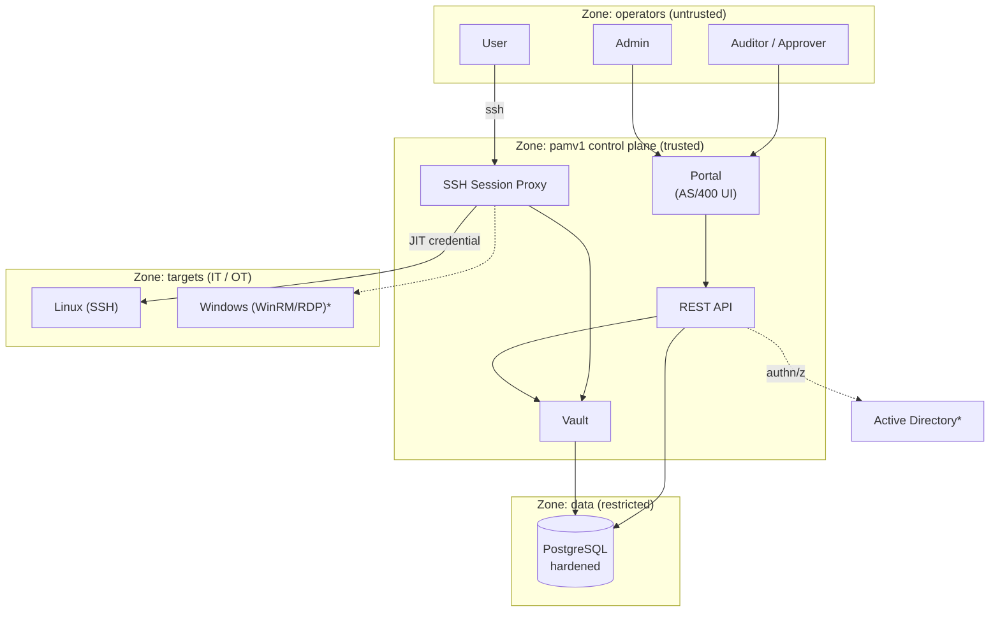
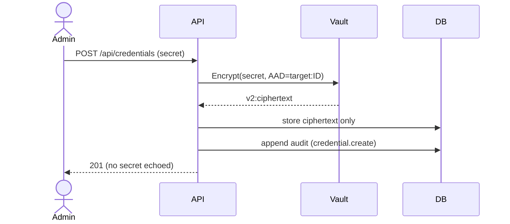
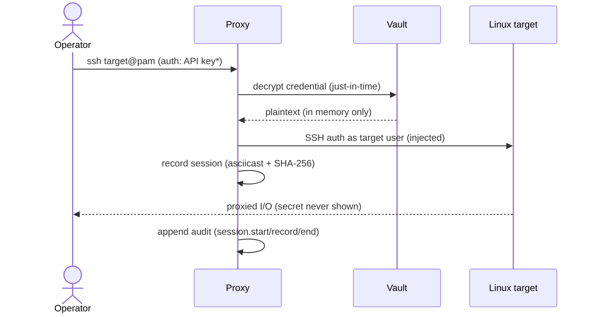
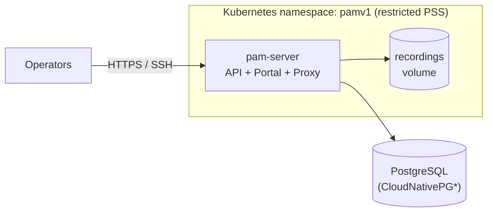

# pamv1 — High-Level Architecture (living document)

> **Living document.** Update this on every change that alters components,
> boundaries, data flows or trust zones. Keep it conceptual — implementation
> detail belongs in [ARCHITECTURE-LOW-LEVEL.md](ARCHITECTURE-LOW-LEVEL.md).
>
> **Code-derived diagrams** (package graph, data model, REST surface) are
> generated from the source and CI-enforced current — see
> [ARCHITECTURE-DIAGRAMS.md](ARCHITECTURE-DIAGRAMS.md). This file holds the
> hand-authored conceptual diagrams below.
>
> Last updated: 2026-07-21 · Reflects: **Phases 0–19 shipped** — the PostgreSQL database session proxy (15), live session monitoring + command control (16), safes + dependent-account propagation (17), optional CyberArk Conjur secret sourcing (18), and access certification campaigns (19). All four Tier-1 competitive-coverage gaps are closed and the first Tier-2 (access-governance) gap is landing. See the [ROADMAP](../ROADMAP.md) for the authoritative per-phase status.

## 1. Purpose

pamv1 is an open-source Privileged Access Management system. It stores privileged
credentials in a hardened vault, brokers access to Linux/Windows targets through a
proxy that injects those credentials just-in-time, and records who did what. It is
designed to fit IT and OT (industrial) environments and to support NIS2 obligations.

> ⚠️ Educational project — see the note at the top of the [README](../README.md).

## 2. Actors & trust zones

`*` planned (see roadmap). Solid = implemented today.

## 3. Components (responsibility view)

| Component | Responsibility | Status |
|---|---|---|
| **Portal** | AS/400-style operator UI; deliberately austere | ✅ Phase 1 |
| **REST API** | CRUD for targets/credentials, audit, authn | ✅ Phase 1 |
| **Vault** | Encrypt/decrypt secrets; key custody | ✅ Phase 1 |
| **Audit** | Append-only trail of every sensitive action | ✅ Phase 1 |
| **Break-glass** | Sealed key + M-of-N quorum unseal, auto-expiring, alerted | ✅ Phase 1/6 |
| **Session Proxy** | Broker SSH; **JIT credential injection**; record sessions | ✅ Phase 2 |
| **Database Proxy** | Broker PostgreSQL; JIT injection; **per-statement query audit** | ✅ Phase 15 |
| **Supervised sessions** | Live watch (SSE) + **command control** (block on exec/WinRM/SQL) | ✅ Phase 16 |
| **Safes & dependent accounts** | Delegated-access containers; rotation updates service/task/app-pool consumers | ✅ Phase 17 |
| **Access certification** | Periodic campaigns to recertify/revoke who has access to what | ✅ Phase 19 |
| **RBAC** | Four profiles (admin/user/auditor/approver), per-user tokens | ✅ Phase 3a |
| **AD / Entra / OIDC login** | LDAPS + Entra ID (ROPC) + OIDC auth-code SSO, groups/app-roles → roles, session tokens | ✅ Phase 3b |
| **MFA** | TOTP (RFC 6238), recovery codes, enforce-MFA policy | ✅ Phase 3b |
| **Windows access** | WinRM (basic/NTLM) command exec + RDP via Guacamole, JIT credentials | 🚧 Phase 4 |
| **Credential lifecycle** | Rotation (SSH/WinRM connectors), reconciliation + drift remediation, scheduled worker | ✅ Phase 7 |
| **OT session approval** | 4-eyes access-request workflow, per-target/global gate, air-gap mode | ✅ Phase 8 |
| **NIS2 incident export** | Tamper-evident audit export (JSON/CSV, SHA-256), Art. 21 control matrix | ✅ Phase 9 |
| **Observability & ops** | Prometheus `/metrics`, `/healthz`+`/readyz`, Helm chart, SBOM + cosign-signed releases | ✅ Phase 10 |

## 3a. Roles (RBAC)

Four profiles, enforced identically by the API and the proxy through a shared
capability matrix:

| Role | Can | Cannot |
|---|---|---|
| **admin** | everything: manage targets/credentials/users, reveal secrets, connect, read audit | — |
| **user** | connect to targets through the proxy, read the inventory | manage, reveal, read audit |
| **auditor** | read the inventory and the audit trail | manage, reveal, connect |
| **approver** | read inventory + audit, approve/deny access requests (`/api/access-requests`, 4-eyes) | manage, reveal, connect |

Beyond the four built-in roles, admins define **custom permission profiles** — named
capability sets assignable to users (Phase 12) — and AI agents authenticate as a
non-human `agent` role that can only call broker tools (Phase 13).

Identity is a per-user access token, the bootstrap admin key, the break-glass key,
or a directory login (AD/LDAP, Entra ID, OIDC — Phase 3b). A directory user in
several mapped groups carries **all** the roles they map to and is granted the
**union** of those capabilities (not just the single highest role).

## 4. Key flows

### 4.1 Vault a credential (control plane)

### 4.2 Access a target via the proxy with JIT injection

`*` API key today; AD user + MFA in Phase 3.

## 5. Cross-cutting concerns

- **Confidentiality**: secrets encrypted at the application layer (AES-256-GCM) on top of a hardened DB; plaintext exists only transiently inside the proxy during a dial.
- **Attribution**: every sensitive action is an append-only audit event with an actor.
- **Availability / emergency**: break-glass path (Phase 1) → quorum + auto-expiry (Phase 6).
- **Deployability (IaC)**: Docker, docker-compose, Kubernetes manifests, Terraform module — no hand-applied infrastructure.
- **Compliance**: NIS2 Art. 21 mapping (README); IEC 62443 / Purdue positioning for OT (Phase 8).

## 6. Deployment topology (target state)

`*` HA Postgres is Phase 10; single instance today.

## 7. Change log

| Date | Change |
|---|---|
| 2026-07-21 | Phase 19: **access certification campaigns** — a manager creates a campaign that snapshots who currently has access to what (target grants + safe members), then certifies or revokes each item; a revoke removes the underlying grant. The SOX/ISO/NIS2 access-review control, and the first Tier-2 competitive-coverage gap |
| 2026-07-21 | Phase 18: **Conjur secret sourcing** — pamv1 can fetch its own bootstrap secrets (master key, API key, DB URL, …) from CyberArk Conjur at startup (`PAM_CONJUR_URL`, authn-api-key or Kubernetes authn-jwt), as a runtime-broker alternative to the SOPS GitOps sealing (Phase 14). Both ship; SOPS stays the zero-dependency default. Hand-rolled client, no new dependency; fail-loud when configured but unreachable |
| 2026-07-21 | Phase 17: **safes + dependent-account propagation** — named containers group targets and delegate who may connect (a safe member reaches every target in the safe; delegated `can_manage` administration), and rotating a credential now updates its declared consumers (Windows Services / Scheduled Tasks / IIS App Pools) over WinRM so auto-rotation doesn't break production. Closes the last two Tier-1 competitive-coverage gaps |
| 2026-07-21 | Phase 16: **supervised sessions** — a supervisor can watch an in-progress SSH or PostgreSQL session live over `GET /api/sessions/{id}/stream` (Server-Sent Events, `CapReadAudit`), and **command control** blocks a dangerous command before it reaches the target on the exec, WinRM and SQL paths (regex denylist, `PAM_COMMAND_DENY_FILE`, audited `command.blocked`). Third Tier-1 competitive-coverage gap |
| 2026-07-20 | Phase 15: **database session proxy** — a second listener (`PAM_DB_ADDR`) brokers PostgreSQL with the same JIT chokepoint as SSH. An operator points `psql` at pamv1 with their PAM key; the proxy runs every authorization gate, injects the vaulted DB credential just-in-time, authenticates upstream (cleartext/MD5/**SCRAM-SHA-256**), and audits **every SQL statement** (`db.query`) — the operator never sees the database password. First of the Tier-1 competitive-coverage gaps (database access management) |
| 2026-07-20 | Post-review hardening: a directory user now gets the **union** of every mapped group's role (not the single highest); a parked agent approval is **re-validated at decision time** (revoked key / expired SVID refused); broker-audit append serializes across processes under a **Postgres advisory lock** so a rolling-deploy/HA overlap can't fork the hash chain; numeric policy args match in plain decimal |
| 2026-07-20 | Phase 14: **SOPS-encrypted secrets** — the Kubernetes Secret manifest is sealed with [SOPS](https://github.com/getsops/sops)+[age](https://age-encryption.org/) (`encrypted_regex` over `data`/`stringData`) so it lives in the IaC repo without leaking; `apply.sh` streams decrypt→`kubectl apply` (plaintext never on disk); a CI `sops` job proves the committed example is encrypted and round-trips |
| 2026-07-20 | Phase 13: **AI-agent access broker** — a policy engine decides allow/deny/require-approval on a tool call **and its arguments**; approved calls execute server-side with a just-in-time credential (the agent never holds one); keyed-HMAC **verifiable audit chain** + signed head. Opt-in via `PAM_BROKER_POLICY_FILE`. Ships with approval/resume + single-use tokens, an **MCP** JSON-RPC transport (`POST /mcp`), and **SPIFFE JWT-SVID + RFC 8693 delegation** identity |
| 2026-07-20 | Phase 12: **configuration subsystem + custom-profile RBAC** — directory/SSO/policy bindings become editable (hybrid: DB-persisted overrides vs IaC-only transport/TLS), hot-swapped without a restart; named permission profiles assignable to users; 5250 console screens for profiles, config, and effective-config/IaC export |
| 2026-07-20 | Phase 11: **full 5250 management console** — role-aware menu (`GET /api/me`) surfacing every operation (targets+grants, credentials, active sessions + kill, 4-eyes approvals, check-out, users, MFA, discovery, reconcile, audit export, break-glass) |
| 2026-07-19 | Phase 10: scale & operations — Prometheus `/metrics`, health/readiness split (`/readyz`), Helm chart, SBOM + cosign-signed release pipeline |
| 2026-07-19 | Phase 9: NIS2 compliance pack — tamper-evident audit export for Art. 23 incident reporting, Art. 21 control matrix, retention/SIEM guidance |
| 2026-07-19 | Phase 8: OT adaptation — 4-eyes session-approval workflow (enforced on proxy/WinRM/RDP), air-gap mode, industrial-DMZ deployment guide (Purdue / IEC 62443) |
| 2026-07-19 | Phase 7: credential lifecycle — automatic rotation (SSH `chpasswd` / WinRM `net user` connectors), account reconciliation with drift detection + remediation, scheduled lifecycle worker |
| 2026-07-19 | Phase 6: break-glass v2 (M-of-N quorum unseal, auto-expiring emergency sessions, real-time alerting); AWS KMS KEK |
| 2026-07-19 | Phase 5: transport hardening (HTTPS/headers/rate-limit), vault key rotation, backup runbook; Phase 2 completed (per-target grants, live sessions + kill, hash-chained recordings, reveal lockdown) |
| 2026-07-18 | Phase 3b hardening: OIDC Authorization Code SSO (PKCE + JWKS signature validation) |
| 2026-07-18 | Phase 4: Windows targets — WinRM (basic/NTLM) command execution + RDP brokering via Guacamole guacd, JIT credential injection |
| 2026-07-18 | Phase 3b: AD (LDAPS) **+ Entra ID (Azure AD)** login, groups/app-roles → roles, session tokens; **TOTP MFA**; envelope-encrypted vault + operational logging |
| 2026-07-18 | Phase 3a: RBAC with four profiles (admin/user/auditor/approver), per-user tokens, enforced in API + proxy |
| 2026-07-18 | Phase 2: SSH session proxy with JIT injection + recording added |
| 2026-07-17 | Phase 1: vault, inventory, audit, break-glass, portal, IaC |
