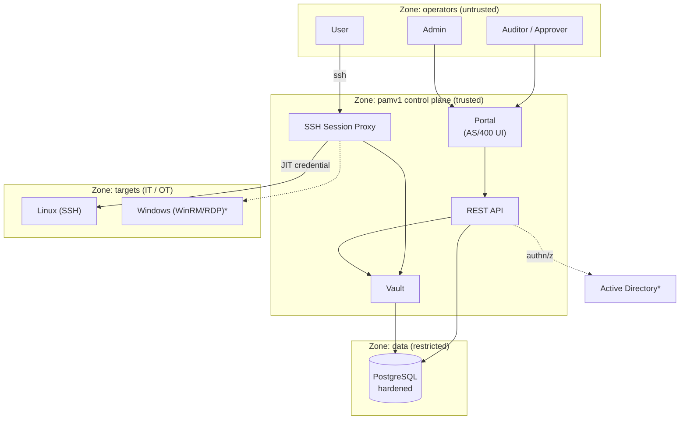
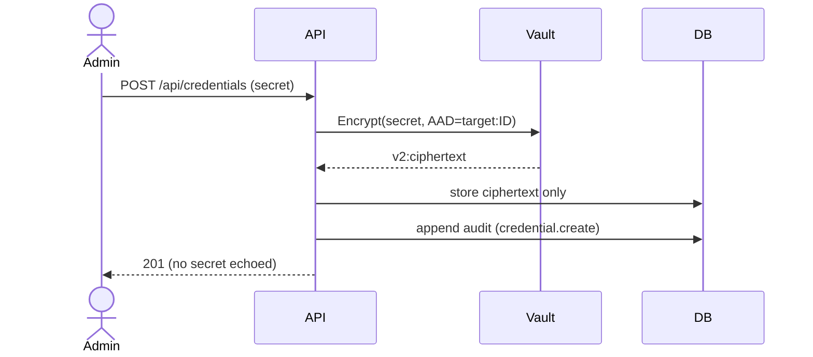
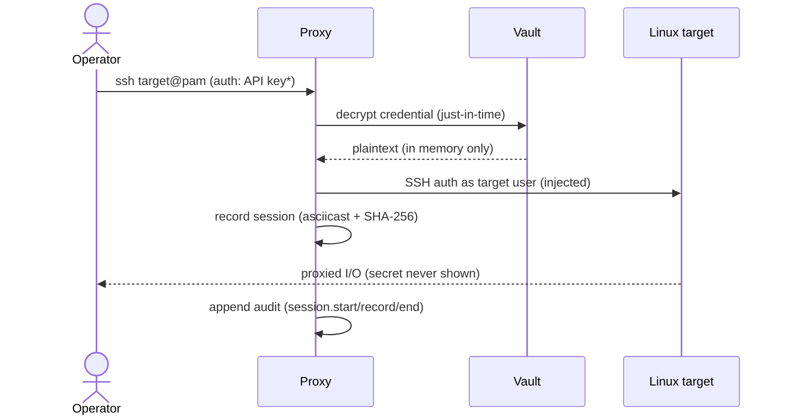
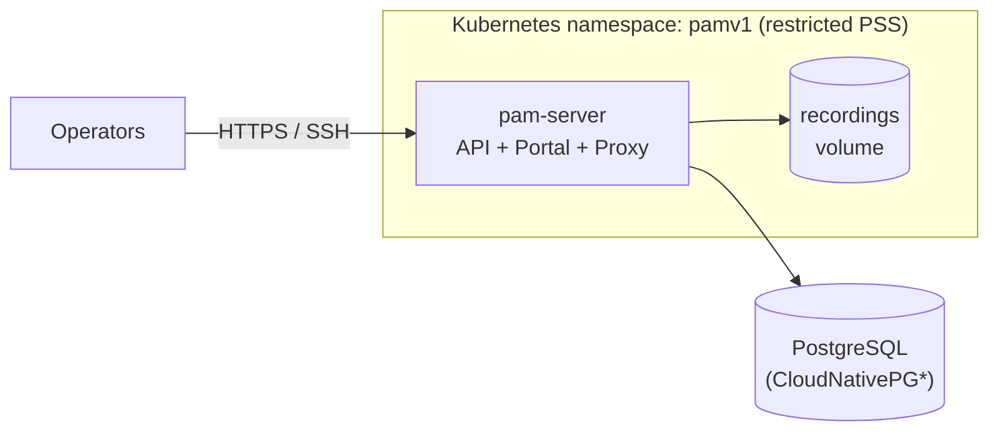

# pamv1 — High-Level Architecture (living document)

> **Living document.** Update this on every change that alters components,
> boundaries, data flows or trust zones. Keep it conceptual — implementation
> detail belongs in [ARCHITECTURE-LOW-LEVEL.md](ARCHITECTURE-LOW-LEVEL.md).
>
> Last updated: 2026-07-18 · Reflects: **Phase 3a** (RBAC + four profiles) on top of Phase 2 (session proxy + JIT injection). See [ROADMAP](../ROADMAP.md).

## 1. Purpose

pamv1 is an open-source Privileged Access Management system. It stores privileged
credentials in a hardened vault, brokers access to Linux/Windows targets through a
proxy that injects those credentials just-in-time, and records who did what. It is
designed to fit IT and OT (industrial) environments and to support NIS2 obligations.

> ⚠️ Educational project — see the note at the top of the [README](../README.md).

## 2. Actors & trust zones

`*` planned (see roadmap). Solid = implemented today.

## 3. Components (responsibility view)

| Component | Responsibility | Status |
|---|---|---|
| **Portal** | AS/400-style operator UI; deliberately austere | ✅ Phase 1 |
| **REST API** | CRUD for targets/credentials, audit, authn | ✅ Phase 1 |
| **Vault** | Encrypt/decrypt secrets; key custody | ✅ Phase 1 |
| **Audit** | Append-only trail of every sensitive action | ✅ Phase 1 |
| **Break-glass** | Sealed key + M-of-N quorum unseal, auto-expiring, alerted | ✅ Phase 1/6 |
| **Session Proxy** | Broker SSH; **JIT credential injection**; record sessions | ✅ Phase 2 |
| **RBAC** | Four profiles (admin/user/auditor/approver), per-user tokens | ✅ Phase 3a |
| **AD / Entra / OIDC login** | LDAPS + Entra ID (ROPC) + OIDC auth-code SSO, groups/app-roles → roles, session tokens | ✅ Phase 3b |
| **MFA** | TOTP (RFC 6238), recovery codes, enforce-MFA policy | ✅ Phase 3b |
| **Windows access** | WinRM (basic/NTLM) command exec + RDP via Guacamole, JIT credentials | 🚧 Phase 4 |
| **Credential lifecycle** | Rotation (SSH/WinRM connectors), reconciliation + drift remediation, scheduled worker | ✅ Phase 7 |
| **OT session approval** | 4-eyes access-request workflow, per-target/global gate, air-gap mode | ✅ Phase 8 |
| **NIS2 incident export** | Tamper-evident audit export (JSON/CSV, SHA-256), Art. 21 control matrix | ✅ Phase 9 |
| **Observability & ops** | Prometheus `/metrics`, `/healthz`+`/readyz`, Helm chart, SBOM + cosign-signed releases | ✅ Phase 10 |

## 3a. Roles (RBAC)

Four profiles, enforced identically by the API and the proxy through a shared
capability matrix:

| Role | Can | Cannot |
|---|---|---|
| **admin** | everything: manage targets/credentials/users, reveal secrets, connect, read audit | — |
| **user** | connect to targets through the proxy, read the inventory | manage, reveal, read audit |
| **auditor** | read the inventory and the audit trail | manage, reveal, connect |
| **approver** | read inventory + audit, approve/deny access requests (endpoints: later phase) | manage, reveal, connect |

Identity today is a per-user access token (or the bootstrap admin key / break-glass key); AD-backed login with group→role mapping arrives in Phase 3b.

## 4. Key flows

### 4.1 Vault a credential (control plane)

### 4.2 Access a target via the proxy with JIT injection

`*` API key today; AD user + MFA in Phase 3.

## 5. Cross-cutting concerns

- **Confidentiality**: secrets encrypted at the application layer (AES-256-GCM) on top of a hardened DB; plaintext exists only transiently inside the proxy during a dial.
- **Attribution**: every sensitive action is an append-only audit event with an actor.
- **Availability / emergency**: break-glass path (Phase 1) → quorum + auto-expiry (Phase 6).
- **Deployability (IaC)**: Docker, docker-compose, Kubernetes manifests, Terraform module — no hand-applied infrastructure.
- **Compliance**: NIS2 Art. 21 mapping (README); IEC 62443 / Purdue positioning for OT (Phase 8).

## 6. Deployment topology (target state)

`*` HA Postgres is Phase 10; single instance today.

## 7. Change log

| Date | Change |
|---|---|
| 2026-07-19 | Phase 10: scale & operations — Prometheus `/metrics`, health/readiness split (`/readyz`), Helm chart, SBOM + cosign-signed release pipeline |
| 2026-07-19 | Phase 9: NIS2 compliance pack — tamper-evident audit export for Art. 23 incident reporting, Art. 21 control matrix, retention/SIEM guidance |
| 2026-07-19 | Phase 8: OT adaptation — 4-eyes session-approval workflow (enforced on proxy/WinRM/RDP), air-gap mode, industrial-DMZ deployment guide (Purdue / IEC 62443) |
| 2026-07-19 | Phase 7: credential lifecycle — automatic rotation (SSH `chpasswd` / WinRM `net user` connectors), account reconciliation with drift detection + remediation, scheduled lifecycle worker |
| 2026-07-19 | Phase 6: break-glass v2 (M-of-N quorum unseal, auto-expiring emergency sessions, real-time alerting); AWS KMS KEK |
| 2026-07-19 | Phase 5: transport hardening (HTTPS/headers/rate-limit), vault key rotation, backup runbook; Phase 2 completed (per-target grants, live sessions + kill, hash-chained recordings, reveal lockdown) |
| 2026-07-18 | Phase 3b hardening: OIDC Authorization Code SSO (PKCE + JWKS signature validation) |
| 2026-07-18 | Phase 4: Windows targets — WinRM (basic/NTLM) command execution + RDP brokering via Guacamole guacd, JIT credential injection |
| 2026-07-18 | Phase 3b: AD (LDAPS) **+ Entra ID (Azure AD)** login, groups/app-roles → roles, session tokens; **TOTP MFA**; envelope-encrypted vault + operational logging |
| 2026-07-18 | Phase 3a: RBAC with four profiles (admin/user/auditor/approver), per-user tokens, enforced in API + proxy |
| 2026-07-18 | Phase 2: SSH session proxy with JIT injection + recording added |
| 2026-07-17 | Phase 1: vault, inventory, audit, break-glass, portal, IaC |
