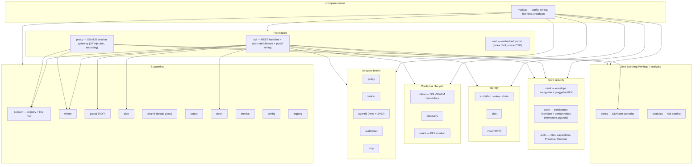
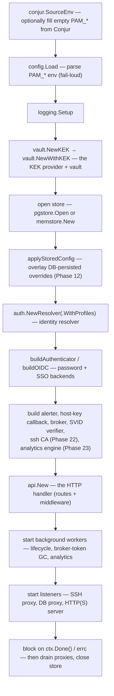
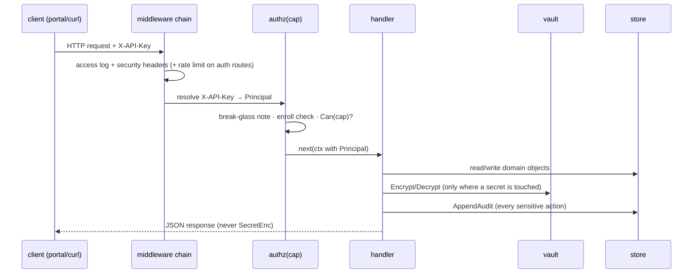
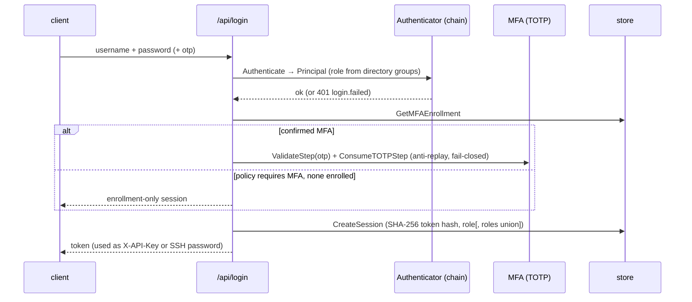
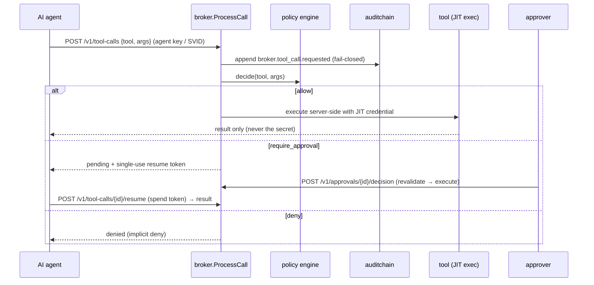

# pamv1 — Code Guide (how it all works)

> **Living document.** This is the developer's narrative walkthrough of the whole
> codebase: what each package does, how the load-bearing flows work end to end,
> and the invariants that hold it together. It complements the two architecture
> docs — [ARCHITECTURE-HIGH-LEVEL.md](ARCHITECTURE-HIGH-LEVEL.md) (the conceptual
> view) and [ARCHITECTURE-LOW-LEVEL.md](ARCHITECTURE-LOW-LEVEL.md) (the reference
> map) — by explaining *how the code actually runs*. Keep it current: when you
> change a subsystem, update its section here in the same change.
>
> Last updated: 2026-07-21 · Reflects Phases 0–23.

---

## 0. How to read this guide

If you are new to the codebase, read §1 (the big picture) and §2 (bootstrapping),
then §5 (the session proxy — the heart of the system). Everything else is a
subsystem you can read on demand. Each section names the real files and the key
functions so you can jump straight to the source.

Prerequisites: Go 1.26 on `PATH` (this environment installs it under
`~/.local/go/bin`). Build with `go build ./...`, test with `go test ./...` (CI
runs `go test -race ./...`), format with `gofmt -l .` (must print nothing).

---

## 1. The big picture

pamv1 is a **Privileged Access Management** system: it holds privileged
credentials encrypted at rest, and it puts itself *in the middle* of every
privileged connection so that operators reach targets **through** pamv1 without
ever seeing the credential. The one idea the whole system is built around:

> **Trust the chokepoint, not the client.** The secret is decrypted just-in-time
> inside pamv1, injected into the upstream connection, and never handed to the
> operator. Every use is recorded and audited.

It is a **single Go binary** (`cmd/pam-server`) that runs several listeners:

- an **HTTP server** (`:8080`) serving the REST API and the embedded 5250-style portal,
- an **SSH proxy** (`:2222`) — the session gateway,
- optionally a **PostgreSQL proxy** (`:5433`) for database sessions.

Everything under `internal/` is a focused package the binary wires together.

### Package map



The two most load-bearing cross-package couplings — memorize these:

1. **Vault AAD parity.** `store.CredentialAAD(targetID, credentialID)` produces the
   additional-authenticated-data string used to *encrypt* a secret in `api` and to
   *decrypt* it in `proxy`. If the two sides ever compute it differently,
   decryption silently fails. Never inline the AAD string.
2. **Secrets never leave as data.** `Credential.SecretEnc` is `json:"-"` — it must
   never be serialized to any client. Plaintext exists only transiently inside the
   proxy's `resolve → dialUpstream` path and the audited `reveal` path.

---

## 2. Bootstrapping — `cmd/pam-server/main.go`

`main()` is a small dispatcher over utility flags (`-genkey`, `-hashkey`,
`-rotate-kek`, `-split-key`, `-healthcheck`); the default path is `run()`, which
builds and starts the server. The startup order matters — later steps depend on
earlier ones:



Key points:

- **Fail-loud config.** `config.Load` (`internal/config/config.go`) reads every
  `PAM_*` variable, parses booleans/ints strictly (a garbage value on a security
  toggle is an error, never a silent default), and validates cross-field
  constraints (TLS all-or-nothing, break-glass threshold ≥ 2, business-hours
  window valid, etc.). A bad config aborts startup.
- **The pristine baseline.** `main` keeps `base := *cfg` (the env-only config)
  *before* overlaying DB-persisted overrides, so the hot-swap `reconfigure`
  closure can rebuild identity backends from `env + current overrides` later
  without a restart.
- **Graceful shutdown.** On SIGTERM the run context is cancelled; `drainProxy`
  waits (bounded) for the SSH and DB proxies to flush in-flight sessions' closing
  audit + recordings **before** the deferred `store.Close()` runs. A fatal
  listener error is delivered on `errc` and triggers the same drain.

---

## 3. Cross-cutting foundations

### 3.1 `config` — runtime configuration

All configuration is `PAM_*` environment variables (12-factor). `config.Config`
is a flat struct; `config.Load()` fills it with strict parsing. A subset of
settings (identity backends, SSO, operational policy) is **hot-swappable** at
runtime via `PUT /api/config` — see §4.5. Bootstrap/transport settings (listen
addresses, TLS, DB URL, KEK) stay environment-only and require a restart.

The full env-var table lives in
[ARCHITECTURE-LOW-LEVEL.md §4](ARCHITECTURE-LOW-LEVEL.md#4-configuration-env-pam_)
and [.env.example](../.env.example).

### 3.2 `vault` — envelope encryption

This is the core at-rest crypto. It uses the KMS-vendor **envelope** pattern:
each secret is sealed with its own fresh random **data key** (DEK), and that DEK
is **wrapped by a Key Encryption Key** (KEK). `internal/vault/vault.go`:

- `Encrypt(ctx, plaintext, aad)`:
  1. generate a random 32-byte DEK,
  2. AES-256-GCM `Seal` the plaintext with a random 12-byte nonce, authenticating `aad`,
  3. `kek.Wrap(dek)` — the DEK is encrypted by the KEK,
  4. pack `uint16(len(wrapped)) ‖ wrapped ‖ nonce ‖ ciphertext`, base64url it, prefix `"v2:"`.
- `Decrypt(ctx, token, aad)` reverses it, unwrapping the DEK via the KEK and
  `Open`-ing the GCM ciphertext. Any failure — wrong version, tampered bytes,
  **wrong `aad`**, or a KEK error — returns `ErrInvalidToken` without leaking the
  cause. The DEK is zeroed (`defer zero(dek)`) after use.

The **`aad`** is the load-bearing binding: `store.CredentialAAD(targetID, credID)
= "target:%d/cred:%d"`. Because it names both the target and the specific
credential row, a ciphertext copied onto another credential fails to decrypt —
which is why a new credential is inserted first (to assign its ID) and its secret
encrypted and stored in a second step.

- **`"v2:"` is a versioned token format** for key/format rotation — preserve it.
- The **KEK is pluggable** (`internal/vault/kek.go`, `KEK` interface — `Wrap` /
  `Unwrap` / `ID`), selected by `PAM_KEK_PROVIDER`:
  - `LocalKEK` — an AES-256-GCM key from `PAM_MASTER_KEY` (base64). **Dev/test only.**
  - `TransitKEK` (`transit.go`) — HashiCorp Vault Transit; the KEK never leaves Vault.
  - `AWSKMSKEK` (`awskms.go`) — AWS KMS `Encrypt`/`Decrypt` of the DEK, with an
    `app=pamv1` encryption context; the CMK never leaves KMS.
  - `PKCS11KEK` (`pkcs11.go`, build tag `pkcs11`) — an on-prem HSM wraps the DEK;
    the default static build ships a stub that returns "not built in".

  `maint.RotateVaultKEK` (`pam-server -rotate-kek`) re-wraps every stored secret
  from one master key to another, preserving `aad`.

### 3.3 `store` — persistence

`store.Store` (`internal/store/store.go`) is one interface with two
implementations. Domain types live in the same file (`Target`, `Credential`,
`AuditEvent`, `AccessRequest`, `Safe`, `Campaign`, `AgentKey`, `Session`, …).
Sentinel errors `ErrNotFound` / `ErrConflict` map to HTTP/SSH errors upstream.

- **`memstore`** (`store/memstore`) — an in-memory implementation for tests and
  the `PAM_DATABASE_URL=memory` demo. It mirrors pgstore semantics (cascade
  deletes, checkout exclusivity, the same sentinel errors) so the same
  conformance suite passes against both.
- **`pgstore`** (`store/pgstore`) — PostgreSQL via [pgx](https://github.com/jackc/pgx).
  Schema is applied by an embedded **migration runner** (`migrate.go`): ordered
  `migrations/*.sql` files, each run once inside its own transaction, tracked in a
  `schema_migrations` table, under a session-level `pg_advisory_lock` so concurrent
  replicas booting together don't race. `0001_init.sql` is the idempotent baseline;
  every later change is a new numbered file (through `0016_approval_workflow.sql`).

  Two implementation details are load-bearing:
  - **Error mapping is the contract.** A pgx `PgError` SQLSTATE is translated to
    the sentinels the whole system keys off: `23505` (unique violation) →
    `ErrConflict`, `23503` (foreign-key violation) → `ErrNotFound`, and
    `pgx.ErrNoRows` → `ErrNotFound`. So memstore and pgstore raise the *same*
    errors for the same situations.
  - **The query tracer never logs arguments.** SQL text + rows + duration are
    traced at debug, but arguments are omitted because they carry ciphertext and
    token hashes.
  - **Atomic single-winner operations** avoid check-then-act races: checkout
    exclusivity rests on a partial unique index (`checkouts_one_active_idx`), the
    TOTP anti-replay guard is a conditional `UPDATE … WHERE $step > last_totp_step`,
    and a broker resume token is spent by `UPDATE … SET used_at=now() WHERE jti=$1
    AND used_at IS NULL AND expires_at>now() RETURNING call_id`.
  - **Two distinct advisory locks**: the migration lock and the broker-audit-chain
    append lock (`AppendBrokerAuditLinked`, `pg_advisory_xact_lock`) use different
    keys, so a running append never blocks a migration or vice-versa.

The shared conformance suite `storetest.RunStoreContract` exercises the whole
interface against both implementations (and, in CI, against a live PostgreSQL via
`PAM_TEST_DATABASE_URL`) — so the pgstore SQL is verified, not just assumed.

### 3.4 `auth` — RBAC and identity resolution

`internal/auth` is the **single source of truth for authorization**.

- **Roles**: `admin`, `user`, `auditor`, `approver`, plus the non-human
  `RoleAgent`. Each maps to a `Capability` set via the authoritative `roleCaps`
  matrix. Capabilities: `CapReadInventory`, `CapManageTargets`,
  `CapManageCredentials`, `CapRevealSecret`, `CapConnect`, `CapReadAudit`,
  `CapManageUsers`, `CapApprove`, `CapCallTool`. **Check `principal.Can(cap)` —
  never inline a role string.**
- **`Principal`** is the authenticated identity for a request/session: `Name`,
  `Role` (primary/display), `Roles` (the multi-group union — a directory user in
  several mapped groups gets the **union** of their capabilities), `Caps` (a
  resolved custom-profile capability set), and flags `BreakGlass` / `EnrollOnly`.
  `Can` evaluates the profile set if present, otherwise the union of role
  capabilities.
- **`Resolver.Resolve(ctx, key)`** turns a presented key (the `X-API-Key` header
  or the SSH proxy password) into a Principal, trying in order: the bootstrap
  admin key (`PAM_API_KEY`, compared by SHA-256 in constant time) → admin; the
  break-glass key → admin with `BreakGlass=true`; a per-user token
  (`GetUserByTokenHash`); then a login-session token (`GetSessionByTokenHash`).
  A non-built-in stored role is resolved as a **custom profile**
  (`WithProfiles`). Unresolvable → `ErrUnauthorized` (fail-closed).
- **Custom profiles** (`Profile`) are named capability sets assignable to users as
  an alternative to the four roles. `Covers` enforces "you cannot grant more than
  you hold" when minting users/profiles.
- **Per-target authorization**: `CanConnectTarget(principal, grants)` — a target
  with no grants is open to any connect-capable principal; once it has grants,
  only matching subjects (or admins) may connect. `SubjectMatches` is factored out
  and reused for safe membership.

### 3.5 `logging`, `metrics`, `alert`

- **`logging`** installs the process `slog` logger (json/text, level) and hands
  each component a tagged logger. Distinct from the DB **audit trail** — logs are
  for ops/SIEM, the audit trail is the security record.
- **`metrics`** is a dependency-free Prometheus exposition (`GET /metrics`):
  request counts by status, audit volume, break-glass use, rotations, and an
  active-sessions gauge.
- **`alert`** delivers real-time security alerts (break-glass, analytics) over a
  `Notifier` interface — `Webhook`, `Syslog`, `Email`, and `Multi` (fan-out).
  Delivery is best-effort, non-blocking, and time-bounded. `Noop` drops alerts
  (air-gap mode). One subtle safety property: untrusted fields (an actor name that
  came from a directory claim) have CR/LF stripped before formatting, so a crafted
  name can't inject extra syslog records or forge SMTP headers.

---

## 4. The REST API & portal (`internal/api`, `internal/web`)

### 4.1 Server construction and middleware

`api.New(store, vault, resolver, authn, opts)` builds a `*Server` and its
`http.ServeMux`. The handler chain is `withAccessLog(withSecurityHeaders(mux))`:

- **`withAccessLog`** logs one line per request (method/path/status/bytes/duration/
  actor/remote), skipping health/metrics probes, and increments the request metric.
  It wraps the writer in a `statusWriter` that also delegates `Flush` so the SSE
  streaming endpoints work through the chain.
- **`withSecurityHeaders`** (`middleware.go`) sets `nosniff`, `X-Frame-Options:
  DENY`, `Referrer-Policy: no-referrer`, and HSTS on every response.
- **Rate limiting** (`rateLimiter`, `middleware.go`) is a per-IP fixed-window
  limiter guarding the authentication endpoints (`PAM_AUTH_RATE_LIMIT`); it
  periodically evicts expired windows so the map can't grow unbounded.

### 4.2 The two auth middlewares

Every route is registered in `routes()` (`server.go`) wrapped in one of:

- **`authz(cap, handler)`** — resolves the `X-API-Key` into a Principal, emits the
  loud `breakglass.access` audit + alert if applicable (`noteBreakGlass`), blocks
  an enrollment-only session, then enforces `principal.Can(cap)` (403 +
  `authz.denied` otherwise). The Principal goes into the request context.
- **`authenticated(handler)`** — resolves the Principal without a capability check
  (for endpoints any signed-in identity may call, e.g. `/api/me`, `/api/logout`,
  self-service MFA).

### 4.3 The portal

`internal/web/web.go` serves a single `//go:embed`ed `static/index.html` — the
deliberately austere **AS/400 / IBM 5250 green-terminal** UI. It is vanilla JS
calling the REST API, served under a **per-request nonce-based CSP**: `Index`
mints a random nonce and rewrites the one inline `<script>`'s placeholder, so an
injected inline script cannot execute. If the RNG fails, the nonce is empty and
the page fails closed (blank) rather than downgrading the policy.

The menu is **role-aware**: `GET /api/me` returns the caller's identity + the
stable capability names it holds, and the portal shows only the options the role
may use (panels still tolerate a 403 as a backstop).

### 4.4 Request lifecycle (a typical write)



### 4.5 Handler groups

The handlers are split across files by domain; each validates input, translates
store errors to HTTP codes (`storeError`), and appends an audit event:

- **targets / grants / safes** (`targets.go`, `safes_handlers.go`) — inventory
  CRUD, per-target grants, and Phase 17 safes (delegated-access containers whose
  members reach every target in the safe; `EffectiveTargetGrants` = direct ∪
  safe-derived).
- **credentials** (`credentials.go`, `lifecycle_handlers.go`) — create (vaulted),
  reveal (audited, gated), rotate/reconcile, checkout/check-in, delete,
  dependencies. See §7.
- **users / profiles / config** (`users.go`, `profiles_handlers.go`,
  `config_handlers.go`) — mint one-time tokens, custom profiles, and the
  DB-persisted config overrides that **hot-swap** without a restart (an atomic
  `runtimeConf` snapshot behind `s.rtc`, rebuilt by the `reconfigure` closure and
  installed by `applyReconfigure`; a rejected change rolls back).
- **access requests** (`approval_handlers.go`) — the 4-eyes / N-of-M approval
  workflow. See §13.
- **sessions / analytics / audit** (`handlers.go`, `analytics_handlers.go`,
  `compliance_handlers.go`) — live-session list + kill + SSE stream, threat
  analytics (§9), and the tamper-evident audit export.
- **broker** (`broker_*.go`, `mcp_handlers.go`) — the AI-agent access broker (§10),
  served only when a policy file is configured.

---

## 5. The session proxy — the heart of the system (`internal/proxy`)

This is where pamv1 earns its name. An operator runs
`ssh -p 2222 <creduser>@<target>@pam-host` with their **PAM key/token as the SSH
password**; the proxy authenticates them, resolves the target's credential,
**decrypts the secret just-in-time**, dials the real target injecting that secret,
records the session, and brokers I/O — the operator never sees the credential.

### 5.1 SSH gateway flow (`proxy.go`)

```mermaid
sequenceDiagram
  participant C as ssh client
  participant P as proxy (handleConn)
  participant R as auth.Resolver
  participant S as store
  participant V as vault
  participant U as upstream sshd
  C->>P: SSH handshake; user="root@web-01", password=PAM key
  P->>R: authenticate() resolve password → Principal
  Note over P: username selects the target (splitLogin);<br/>Principal + target stashed in ssh.Permissions
  P->>P: gates: enroll? CapConnect? protocol allowlist?
  P->>S: EffectiveTargetGrants → CanConnectTarget?
  P->>S: approval gate (HasActiveApproval) if required
  P->>V: JIT Decrypt(SecretEnc, CredentialAAD)  %% only after ALL gates
  V-->>P: plaintext (memory only)
  P->>U: ssh.Dial injecting the secret (dialUpstream)
  P->>S: audit session.start · session.record (sha256 + chain)
  loop each session channel
    C-->>U: stdin / requests (pumped)
    U-->>C: stdout/stderr (tee → recording + live hub)
  end
  C->>P: disconnect → audit session.end → optional post-session rotation
```

The critical ordering: **the secret is decrypted only after every authorization
gate passes** (`decryptSecret` is a separate step from `resolveTarget`), so
plaintext never materializes for a session that will be denied.
`dialUpstream` authenticates upstream with a parsed private key (`ssh_key`), a
password (default), or — for Zero Standing Privilege — a freshly minted
certificate (§8). Concurrency: one goroutine per connection (`handleConn`), one
per session channel (`handleSession`), with request pumps and stdin copy in their
own goroutines; teardown is keyed on the connection lifecycle so batch commands'
output and `exit-status` are never truncated. Shutdown is a **bounded drain**
(`Serve` force-closes active connections on ctx-cancel and waits).

### 5.2 Recording + hash chain (`record.go`)

Every session's terminal output is written as **asciicast v2** to
`PAM_RECORDING_DIR` while being SHA-256 hashed as it is written (`Recording`,
concurrency-safe). On close the audit stores the path, byte count, file hash, and
a **chain hash** — `recordChain.append` computes `SHA-256(prevChainHash ‖
fileHash)` and persists the head to a `.chain` file — so recordings are
tamper-evident as a *sequence*, not just individually. `PAM_REQUIRE_RECORDING`
makes a session that can't be recorded fail closed.

### 5.3 Other proxy modes

- **WinRM command loop** (`serveWinRM`/`winrmShellLoop`, `PAM_PROXY_WINRM`) — for
  Windows targets, each operator line runs as a discrete WinRM command (JIT
  credential), output streamed and recorded. Stateless per line.
- **Observer mode** (`<login>+observe`) — a read-only session: output streams and
  records, but operator keystrokes are dropped and exec/subsystem requests refused.
- **Jump host** (`PAM_SSH_JUMP_*`) — reaches targets only accessible via an SSH
  bastion by tunneling a `direct-tcpip` channel (`jumpDial`).
- **Upstream host-key pinning** (`PAM_SSH_KNOWN_HOSTS`) — the proxy verifies the
  target's host key against a known_hosts file (unset ⇒ trust-any + loud warning).

### 5.4 The PostgreSQL proxy (`dbproxy.go`, Phase 15)

A second listener (`PAM_DB_ADDR`, default off) extends the JIT chokepoint to
**databases**. It speaks the Postgres frontend/backend wire protocol via
`pgproto3` (vendored with pgx). An operator connects
`psql "host=pam port=5433 user=<dbcred>@<target> dbname=<db>"` with their PAM key
as the password. It runs the **same authorization gates** as the SSH proxy
(`CapConnect`, `EffectiveTargetGrants`, protocol allowlist, 4-eyes approval), then
JIT-decrypts and authenticates upstream with the vaulted secret (trust / cleartext
/ MD5 / **SCRAM-SHA-256** — the RFC 5802 client that *proves knowledge of the
password without sending it*, best-effort upstream TLS). Every `Query`/`Parse`
becomes a `db.query` audit event and a recorded line. Command control here is
nuanced: a blocked simple `Query` returns an `ERROR` + a fresh `ReadyForQuery` so
the session stays usable, but a blocked extended-protocol `Parse` is fatal
(fail-closed). The shared resolve/decrypt/audit helpers (`lookupTargetCred`,
`jitDecrypt`, `appendAudit`, `recoverPanicLog`) are factored out so both listeners
reuse the security-critical path. It warns loudly at startup if the operator leg
has no TLS (the PAM key would travel cleartext).

### 5.5 Live monitoring + command control (Phase 16)

- **Live monitoring** — `session.Hub` (`session/hub.go`) fans out every recorded
  output byte keyed by session id; `GET /api/sessions/{id}/stream` (`CapReadAudit`)
  streams it as Server-Sent Events so a supervisor watches a session live. The
  proxy tees output via `teeLive`/`liveWriter`; fan-out is non-blocking (a slow
  watcher drops frames, never stalls the session).
- **Command control** — a `CommandGuard` (`cmdguard.go`, regex denylist from
  `PAM_COMMAND_DENY_FILE`) blocks a dangerous command **before it reaches the
  target**: SSH `exec` (the request is vetoed in `pumpRequests`' `onExec`), each
  WinRM line, and each PostgreSQL `Query`/`Parse`. Blocks audit `command.blocked`.

The live-session **registry** (`session/registry.go`) tracks active sessions for
`GET /api/sessions` (list) and `DELETE /api/sessions/{id}` (kill); Phase 23 added
`KillByActor` for automated response.

---

## 6. Identity & authentication

The login flow lives in `internal/api/authn.go`; the backends under
`internal/auth` (`ldap.go`, `entra.go`, `chain.go`) and `internal/oidc`.

`POST /api/login` (`authn.go`) verifies a username + password against the
configured **`Authenticator`** and issues a **session token** (12h TTL, stored as
SHA-256 only), whose role comes from the directory. If the user has a confirmed
TOTP enrollment, a valid `otp` (or a single-use recovery code) is also required;
if policy requires MFA but the user has none, an **enrollment-only** session is
issued so they can set it up and nothing else.



- **Password backends** (`Authenticator` interface, composed by `auth.NewChain` —
  try each, first success wins):
  - **LDAP/AD** (`auth/ldap.go`) — service-account bind → search the user under
    `BaseDN` (the filter is `ldap.EscapeFilter`'d, so a username can't inject) →
    read `memberOf` → **re-bind as the user** to verify the password → map groups
    to roles (`MatchedRoles`, so a multi-group user keeps the union). LDAPS is
    *enforced at construction* (the `URL` must be `ldaps://`, so a bind password
    never travels in the clear); the connection is behind an interface so tests
    inject a fake. A credential failure returns `ErrUnauthorized`; an
    infrastructure failure (dial/misconfig) propagates as a distinct wrapped error
    so a misconfig is never silently masked as "wrong password".
  - **Entra ID** (`auth/entra.go`) — OAuth2 ROPC to the tenant token endpoint,
    requesting `openid`; it **validates the id_token's RS256 signature against the
    tenant JWKS** (plus audience + expiry) *and pins the tenant* (`tid` claim must
    equal `PAM_ENTRA_TENANT_ID`) before trusting `roles`/`groups`. The tenant pin
    is load-bearing: Entra signs with keys shared across all tenants, so signature
    + audience alone would accept a token minted in an attacker-controlled tenant.
    ROPC skips IdP-side Conditional Access/MFA — prefer OIDC for production.
  - **OIDC** (`internal/oidc`) — the production browser flow:
    `GET /api/auth/oidc/start` generates PKCE (S256) + state + nonce (persisted via
    `store.PutOIDCState`, so any replica can complete the login), redirects to the
    IdP; `GET /api/auth/oidc/callback` atomically takes the state, exchanges the
    code, and **verifies the ID token against the IdP JWKS**: the algorithm is
    pinned to RS256 (rejecting `none`/HMAC confusion), then iss/aud/nonce/exp are
    checked. `VerifyRS256` (reused by the Entra path) treats a token with *no*
    expiry as invalid — fail-closed, never "never-expires".
- **MFA** (`internal/mfa`, TOTP RFC 6238) — self-service `/api/mfa/*`: enroll
  (secret returned once, stored vault-encrypted with AAD `mfa:<user>`), confirm,
  recovery codes (10 single-use, stored as hashes), disable. `checkSecondFactor`
  accepts a TOTP code or a recovery code; the TOTP anti-replay guard
  (`ConsumeTOTPStep`) **fails closed** on a store error.

Session tokens, per-user tokens, recovery codes, and the break-glass key are all
stored **only as SHA-256** — the plaintext is shown once and never persisted.

---

## 7. Credential lifecycle (`internal/rotate`, `lifecycle_handlers.go`, `scheduler.go`)

pamv1 can change the password **on the target** and re-vault it, so the account's
secret is one only pamv1 knows and can prove is current.

- **Connectors** (`rotate`): `SSHConnector` rotates over SSH (`chpasswd` fed on
  stdin, so the new password never hits a shell command line) and verifies with an
  SSH handshake; it also rotates `ssh_key` credentials by generating a fresh
  ed25519 keypair and replacing `authorized_keys` (`RotateKey`) and provides the
  broker's one-shot `Exec`. `WinRMConnector` rotates with `net user` and verifies
  with a trivial command. Passwords are generated from a **shell-safe alphabet**
  with guaranteed complexity (`GeneratePassword`), so an injected password can
  never break the command that sets it.
- **Rotate/reconcile** (`lifecycle_handlers.go`): `rotateCredential` records
  `rotate_started` *before* the external change, applies the new secret, then
  re-encrypts + persists on a cancel-detached context; a persist failure after the
  target changed is a **loud, actionable orphan** audit, never a silent lockout.
  Reconciliation verifies the vaulted secret still authenticates and can remediate
  drift by rotating.
- **Checkout/check-in** — an exclusive time-boxed lease (`PAM_CHECKOUT_TTL_MIN`)
  hands the secret to one holder; check-in **rotates** so the seen password dies.
  Enforced single-holder; an expired lease is invalidated (rotated) before re-issue.
- **Discovery** (`internal/discovery`) — TCP-probes hosts for reachable management
  ports and optionally onboards them (reachability only, no credentials tried).
- **Dependent-account propagation** (Phase 17) — after rotation,
  `propagateDependencies` updates each declared consumer (Windows Services /
  Scheduled Tasks / IIS App Pools) over WinRM so rotation doesn't break production.
- **Background worker** (`scheduler.go`, `RunLifecycleWorker`) — reconciles every
  credential each tick and rotates password credentials older than a max age
  (actor `system-scheduler`); it also sweeps expired checkouts.

---

## 8. Zero Standing Privilege (Phase 22 — `internal/sshca`)

Instead of storing a secret for an account, pamv1 signs a **short-lived SSH
certificate just-in-time** per session — the account has *no standing credential*;
the target trusts only the pamv1 CA. This is the Teleport / CyberArk ZSP model
built on the existing proxy chokepoint.

- **The CA** (`sshca.CertAuthority`) — `LoadOrCreate(PAM_SSH_CA_KEY)` persists an
  ed25519 CA key (generated on first use, like the host key). `IssueUser(principal,
  ttl, keyID)` generates a **fresh ephemeral keypair** (used for one dial then
  discarded), builds an `ssh.Certificate` (`UserCert`, `ValidPrincipals=[principal]`,
  a serial for audit, `ValidBefore=now+ttl`, standard interactive extensions),
  signs it with the CA, and returns an `ssh.NewCertSigner`.
- **The credential** — `secret_type: "ssh_ca"` stores **no secret** (`SecretEnc`
  empty; only valid on ssh targets; rejected with a secret attached). In
  `proxy.dialUpstream`, an `ssh_ca` credential branches to mint a certificate
  instead of decrypting; a missing CA fails the session closed (`session.error`).
- **Publishing the trust anchor** — `GET /api/ca/ssh` (`CapReadInventory`) returns
  the CA public key in authorized_keys form + a `TrustedUserCAKeys` install hint.
- **Audit** — `session.cert_issued` (serial · principal · valid-before · key-id —
  never the private key). Reconcile reports `ssh_ca` as `unsupported`; post-session
  rotation and the lifecycle worker skip it (nothing to rotate; the cert expired).

```mermaid
sequenceDiagram
  participant Op as operator
  participant P as proxy
  participant CA as sshca CA
  participant U as target sshd (TrustedUserCAKeys = pamv1 CA)
  Op->>P: ssh root@web-01@pam (PAM key as password)
  Note over P: gates pass; cred.SecretType == "ssh_ca"
  P->>CA: IssueUser("root", 2m, "pamv1:op@web-01")
  CA-->>P: cert signer (fresh ephemeral key, ~2m validity)
  P->>U: dial as root, authenticate with the certificate
  U-->>P: accepts (cert signed by trusted CA, principal matches)
  P->>P: audit session.cert_issued
```

The end-to-end test proves this honestly: the in-process upstream accepts **only**
a CA-signed certificate (no password auth exists), so a passing session proves the
account has no standing secret.

---

## 9. Privileged threat analytics (Phase 23 — `internal/analytics`)

A deterministic, **explainable** behavioral risk scorer over the audit trail — no
opaque model, so every point of a score traces to a named signal.

- **`Engine.Score(events)`** is a pure function (no clock, no I/O): it groups audit
  events by actor and accumulates **signals** — `break_glass`, `command_blocked`,
  `auth_failure`, `off_hours`, `decrypt_failure`, `high_velocity` — each with a
  configurable weight and a per-signal cap. The total maps to a level
  (low/medium/high/critical) via thresholds. `Config` carries the weights,
  thresholds, business hours (for off-hours), and velocity limit; `New` fills zero
  fields from `DefaultConfig` (a single break-glass access alone reaches **high**).
- **Read API** — `GET /api/analytics/risk` (`CapReadAudit`, `?min_level=` /
  `?window_min=`) scores the recent window (`store.ExportAudit`) into per-actor
  findings sorted by score, so an auditor can review risk without changing access.
- **Worker + automated response** — `RunAnalyticsWorker` (`PAM_ANALYTICS_INTERVAL_MIN`)
  scores each tick and, for a **newly elevated** high/critical actor (a per-actor
  high-water mark suppresses steady-state re-alerting), appends
  `analytics.risk_flagged` + fires the alert channel, and — with
  `PAM_ANALYTICS_AUTO_KILL` — terminates a critical actor's live sessions via
  `session.Registry.KillByActor` (audit `analytics.auto_response`).

---

## 10. The AI-agent access broker (Phase 13 — `internal/{policy,broker,agentid,auditchain,mcp}`)

The loop lives in `internal/broker/broker.go`, wired to REST/MCP by
`internal/api/broker_*.go`.

PAM **for AI agents**: an agent holds only an identity key; a policy engine
decides `allow / require_approval / deny` on a **tool call and its arguments**;
approved actions execute **server-side with a JIT credential**; the agent receives
only the result. "Trust the chokepoint, not the agent." Opt-in via
`PAM_BROKER_POLICY_FILE`.

- **Agent identity** (`agentid`) — static bearer keys (`agent_keys`, SHA-256 hash
  lookup) → `RoleAgent` + `CapCallTool`. `SVIDVerifier` also validates **SPIFFE
  JWT-SVIDs** against a file trust-domain JWKS (RS256/ES256/EdDSA), enforcing the
  SPIFFE subject + audience + expiry (fail-closed), with nested RFC 8693 `act`
  delegation capped by `PAM_BROKER_MAX_DELEGATION_DEPTH`. A `MultiVerifier` accepts
  either.
- **Policy engine** (`policy`) — sudoers-style ordered YAML rules; a `Condition`
  is exactly one of `eq`/`not`/`in`/`not_in` over the tool name and each argument
  *value*; `Evaluate` scans top-to-bottom, ANDs all conditions of a rule, and the
  first full match wins; no match is **implicit deny**. The loader is fail-loud
  (`KnownFields(true)`, a required id + valid effect per rule, ≥1 approver on an
  approval rule) — a typo'd operator key fails at load rather than silently
  enforcing only the valid clause. A matched rule whose `scope` template references
  a missing argument still **denies** (never runs with an unfillable scope), and
  numeric args stringify in plain decimal so `10000000` can't miss as `1e+07`.
- **The broker** (`broker.ProcessCall` / `Resume`) — the one loop both REST and MCP
  share. It caps argument size *before* any work, evaluates policy, and then:
  `allow` → a **capability backstop** re-checks `principal.Can(tool.Capability())`
  (policy YAML is never the sole authority), records a tamper-evident
  `broker.tool_call.requested` **before** the side effect and refuses to run if the
  chain append fails (no executed action is ever unaudited), then executes the tool
  JIT and returns the result; `require_approval` → **park** the call (bounded by
  `maxParked`), mint a single-use resume token, and alert an approver; `deny` →
  refuse. A parked call is **re-validated at decision time** (`revalidateAgent` — a
  static key disabled/revoked or an SVID expired since parking is refused). The
  agent collects a post-approval result exactly once via
  `POST /v1/tool-calls/{id}/resume`: `Resume` *peeks* the token, refuses until the
  outcome is terminal, then *atomically consumes* the JTI (replays lose the race).
  Self-approval is refused (`ApprovalOwner` vs approver).
- **Tools** (`broker_tools.go`) — `winrm_exec`, `ssh_exec`, `list_targets`,
  `list_credentials`, `rotate_credential`, and `reveal_credential` (shipped
  **default-deny**). Each honors the same target gates (protocol allowlist, grants,
  four-eyes) and never returns a secret except the deliberate, policy-gated reveal.
- **Verifiable audit** (`auditchain`) — a keyed-HMAC per-event hash chain
  (`broker_audit_events`): each row's HMAC covers the previous row's HMAC, so any
  edit or truncation breaks the chain; an ed25519-signed head checkpoint detects
  truncation. Append is serialized across processes under a Postgres advisory lock
  (`AppendBrokerAuditLinked`) so overlapping pods can't fork the chain.
  `GET /v1/audit/verify` re-checks it.
- **MCP transport** (`mcp`) — a hand-rolled JSON-RPC 2.0 server at `POST /mcp`
  (`initialize`, `tools/list`, `tools/call`, `ping`, `broker/resume`) behind the
  same agent auth and the same `ProcessCall`/`Resume` loop, so an MCP call is
  policy-gated, JIT-injected, single-use-resumed, and audited identically to REST.



---

## 11. Break-glass (Phase 1 + Phase 6)

The sealed emergency path. Config holds **only the SHA-256** of the emergency key
(`PAM_BREAK_GLASS_KEY_HASH`); presenting the key resolves to an admin Principal
with `BreakGlass=true`, and **every** break-glass use is loudly audited
(`breakglass.access`) and alerted (`noteBreakGlass`). Break-glass bypasses the
approval gate but triggers post-session rotation.

- **M-of-N quorum unseal** (`internal/shamir`, `pam-server -split-key`,
  `POST /api/breakglass/unseal`): custodians submit Shamir shares; when M
  reconstruct a key whose SHA-256 matches the configured hash, a short-lived
  (`PAM_BREAK_GLASS_TTL_MIN`) admin session is issued. Shares are produced offline;
  the server holds none. A malformed/duplicate share is rejected without wiping a
  forming quorum. The GF(2⁸) arithmetic is deliberately **branch-free and
  table-free** (masked multiply, fixed-schedule inverse `a²⁵⁴`) so the reconstruction's
  timing and memory-access patterns don't depend on the secret share values.

---

## 12. Secret sourcing & the KEK backends

- **KEK providers** (§3.2) externalize the root of trust for the *vault key*.
- **SOPS + age** (Phase 14, `deploy/k8s/sops/`) keeps the Kubernetes Secret
  manifest in Git, encrypting only the values — the GitOps sealing option.
- **Conjur** (Phase 18, `internal/conjur`) — the runtime alternative:
  `conjur.SourceEnv(ctx)` runs *before* `config.Load` and fills any **empty**
  bootstrap `PAM_*` secret from CyberArk Conjur (authn-api-key or Kubernetes
  authn-jwt), fail-loud if configured but unreachable. An explicit env value wins.

Which secrets need a real external system to *verify* is catalogued in
[EXTERNAL-INFRA-GAPS.md](EXTERNAL-INFRA-GAPS.md).

---

## 13. Compliance & governance

- **NIS2 incident export** (Phase 9) — `GET /api/audit/export` returns a scoped
  audit slice (JSON/CSV) with a **SHA-256 tamper-evidence digest** over the exact
  bytes; the export is itself audited.
- **Access certification campaigns** (Phase 19) — `POST /api/campaigns` snapshots
  current access (target grants + safe members) into reviewable items; a **revoke**
  decision deletes the underlying grant, a certify attests. Management needs
  `CapManageUsers`, reading needs `CapReadAudit`.
- **ITSM ticket gate** (Phase 20, `internal/ticket`) — an access request can
  require a change/incident ticket, validated by a regex and/or a webhook, then
  stamped into the audit trail.
- **Richer approval workflows** (Phase 21) — multi-tier **N-of-M** chains
  (`PAM_APPROVALS_REQUIRED`), scheduled windows (`not_before`/`not_after`), and
  mandatory reason codes; enforced on every connect path via `HasActiveApproval`.

---

## 14. Testing philosophy

Tests exercise **real behavior on the security-critical path**, not mocks of it:

- The flagship proxy test proves JIT injection end-to-end against an in-process
  upstream sshd that accepts **only** the vaulted password — so a pass proves the
  client never had it. The DB proxy and ZSP tests use the same pattern (an upstream
  that accepts only the vaulted secret / only a CA-signed certificate).
- The store conformance suite (`storetest.RunStoreContract`) runs against both
  memstore and, in CI, a live PostgreSQL.
- The analytics engine is a pure function, so its tests are deterministic.
- CI (`.github/workflows/ci.yml`) gates on `gofmt -l`, `go vet`, `go build`,
  `go test -race`, a Docker image build, and the `sops` round-trip. `cmd/archgen`
  regenerates the architecture diagrams and CI fails if they drift.

---

## 15. Security invariants (do not regress)

From [ARCHITECTURE-LOW-LEVEL.md §6](ARCHITECTURE-LOW-LEVEL.md#6-security-relevant-invariants-do-not-regress) — treat these as tests-in-prose:

1. `Credential.SecretEnc` is never serialized to any client (`json:"-"`).
2. All key/secret comparisons use `crypto/subtle.ConstantTimeCompare`.
3. Vault AAD on decrypt must equal AAD on encrypt (`store.CredentialAAD`).
4. Every path that reveals or uses a secret appends an audit event.
5. Break-glass config holds only the SHA-256 hash, never the plaintext key.
6. The proxy's plaintext secret is confined to `resolve → dialUpstream`; never logged.
7. User/session tokens and recovery codes are stored only as SHA-256; the plaintext
   is returned once and never re-derivable.
8. Every protected route/connection declares a capability; the `roleCaps` matrix is
   the single source of truth — don't inline role checks.

---

## 16. Build / run / deploy quick reference

```bash
# Build & test
go build ./...
go test ./...                 # add -race for what CI runs
gofmt -l .                    # must print nothing
go vet ./...

# Local demo (no database)
go build ./cmd/pam-server
export PAM_MASTER_KEY=$(./pam-server -genkey)
export PAM_API_KEY=demo-key PAM_DATABASE_URL=memory
./pam-server                  # portal+API :8080, SSH proxy :2222

# Full stack
cp .env.example .env          # fill the keys
docker compose up --build
```

Deployment manifests are IaC — `deploy/k8s/`, `deploy/helm/pamv1`,
`deploy/terraform/` — do not hand-apply. See [ADMIN-GUIDE.md](ADMIN-GUIDE.md) for
the full deployment and operations reference, and [ROADMAP.md](../ROADMAP.md) for
phase-by-phase status.

---

## 17. Change log

| Date | Change |
|---|---|
| 2026-07-21 | Initial code guide covering Phases 0–23 (vault, store, auth, api, proxy, identity, lifecycle, ZSP, analytics, broker, break-glass, governance). |
