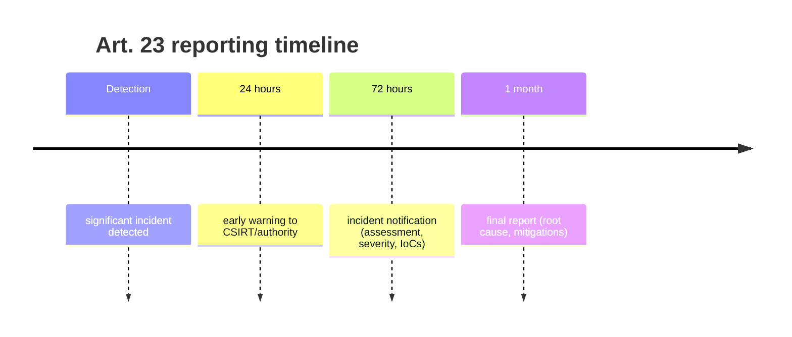

# NIS2 Compliance Pack (Phase 9)

> **Alpha, for learning purposes. Not production, not audited, not legal advice.**
> This maps pamv1 features to [Directive (EU) 2022/2555 (NIS2)](https://eur-lex.europa.eu/eli/dir/2022/2555/oj)
> to show *how a PAM supports* an operator's obligations. Compliance is a
> property of your whole organisation and its national transposition, not of a
> single tool.

NIS2 obliges essential and important entities to take "appropriate and
proportionate" technical measures ([Art. 21](https://eur-lex.europa.eu/eli/dir/2022/2555/oj#art_21))
and to report significant incidents on a strict timeline ([Art. 23](https://eur-lex.europa.eu/eli/dir/2022/2555/oj#art_23)).
Privileged access is where many of those measures are enforced.

## 1. Art. 21(2) control matrix

| # | NIS2 Art. 21(2) measure | How pamv1 supports it | Status |
|---|---|---|---|
| (a) | Risk analysis & information-system security policies | Roles, per-target grants, approval policy are declarative config (IaC); [template](#4-risk-management-documentation-template) below | 🟡 partial (docs) |
| (b) | Incident handling | Append-only audit trail + [tamper-evident export](#2-incident-reporting-art-23) for early-warning/notification | ✅ |
| (c) | Business continuity, backup, crisis mgmt | [Backup & restore runbook](BACKUP-AND-RESTORE.md); break-glass emergency access | ✅ |
| (d) | Supply-chain security | Vendor access is brokered, time-boxed (approval window) and recorded; no standing vendor credentials | 🟡 partial |
| (e) | Security in acquisition/development/maintenance, vuln handling | Versioned DB migrations; CI (build/vet/test/race); SBOM + signed releases on the [roadmap](../ROADMAP.md#phase-10--scale--operations-) | 🟡 partial |
| (f) | Policies to assess effectiveness | Audit trail + reconciliation reports (`GET /api/reconcile`) evidence control operation | ✅ |
| (g) | Basic cyber hygiene & training | AS/400 portal deliberately signals gravity; least-privilege defaults | 🟡 partial |
| (h) | Cryptography & encryption policy | Envelope encryption (AES-256-GCM per-secret data key wrapped by a pluggable KEK — local / Vault Transit / AWS KMS); LDAPS/HTTPS/TLS only | ✅ |
| (i) | Human-resources security, access control, asset mgmt | Four RBAC roles, per-target grants, 4-eyes approval, break-glass quorum, credential lifecycle (rotation/reconciliation) | ✅ |
| (j) | MFA / continuous auth, secured comms, secured emergency comms | TOTP MFA + recovery codes + enforce-MFA policy; OIDC/Entra SSO; all sessions brokered, JIT-injected and recorded | ✅ |

Legend: ✅ implemented · 🟡 partially implemented / documented.

## 2. Incident reporting (Art. 23)

Art. 23 imposes a staged timeline. pamv1 supplies the **privileged-access evidence**
for each stage via a tamper-evident audit export:



Produce a scoped, verifiable slice of the audit trail:

```bash
# All privileged-access events in the incident window (JSON, with a SHA-256 digest)
curl -H "X-API-Key: $PAM_API_KEY" \
  "https://pam.example.com/api/audit/export?since=2026-07-19T00:00:00Z&until=2026-07-19T06:00:00Z" \
  -o incident-export.json

# Scope to one actor or action; export as CSV for a spreadsheet
curl -H "X-API-Key: $PAM_API_KEY" \
  "https://pam.example.com/api/audit/export?since=...&actor=break-glass&format=csv" \
  -o breakglass.csv
```

- **Query params:** `since`, `until` (RFC3339), `actor` (substring), `action`
  (exact), `format` (`json` | `csv`).
- **Tamper evidence:** the response carries a **SHA-256** over the exact event
  list — in the JSON `sha256` field and the `X-PAM-Export-SHA256` header. Record
  the digest when you hand the export to the authority; anyone can recompute it to
  prove the file was not altered. The same closed window always yields the same
  digest.
- **The export is itself audited** (`audit.export` with the digest), so the act of
  producing evidence is on the record too.
- Requires `CapReadAudit` (`admin` or `auditor`).

## 3. Audit retention & SIEM forwarding

- **Retention:** the audit trail lives in PostgreSQL and is **append-only** (pamv1
  never deletes audit rows). Set your database backup/retention policy to satisfy
  the retention period your sector requires; see [Backup & restore](BACKUP-AND-RESTORE.md).
- **Forwarding:** operational logs are structured JSON on stdout, tagged by
  service. Ship them to a SIEM with your platform's collector (e.g. a Kubernetes
  DaemonSet, Vector, Fluent Bit). Audit events are also emitted to the log stream
  (`action=audit`), so security events reach the SIEM in real time in addition to
  the queryable trail.
- **Real-time alerting:** break-glass use and access-request decisions fire a
  webhook (`PAM_ALERT_WEBHOOK`) — wire it to your on-call/SOAR. (Disabled in
  [air-gap mode](OT-DEPLOYMENT.md#3-air-gap--offline-mode).)

## 4. Risk-management documentation template

A minimal record an operator can keep alongside pamv1 (Art. 21(2)(a)):

| Field | Example |
|---|---|
| Asset / scope | Privileged access to OT cell 3 (PLCs, HMI) |
| Data classification | Operational; safety-critical |
| Threats considered | Credential theft, standing access, insider misuse, vendor compromise |
| Controls (pamv1) | RBAC + per-target grants; 4-eyes approval; JIT injection; rotation; MFA; recording |
| Residual risk & owner | \<accepted-by\>, review \<date\> |
| Emergency procedure | Break-glass quorum (M-of-N), auto-expiring, alerted |
| Review cadence | Quarterly + after any significant incident |

---

*See also: [ADMIN-GUIDE.md](ADMIN-GUIDE.md), [OT-DEPLOYMENT.md](OT-DEPLOYMENT.md),
[ARCHITECTURE-HIGH-LEVEL.md](ARCHITECTURE-HIGH-LEVEL.md), [ROADMAP.md](../ROADMAP.md).*
