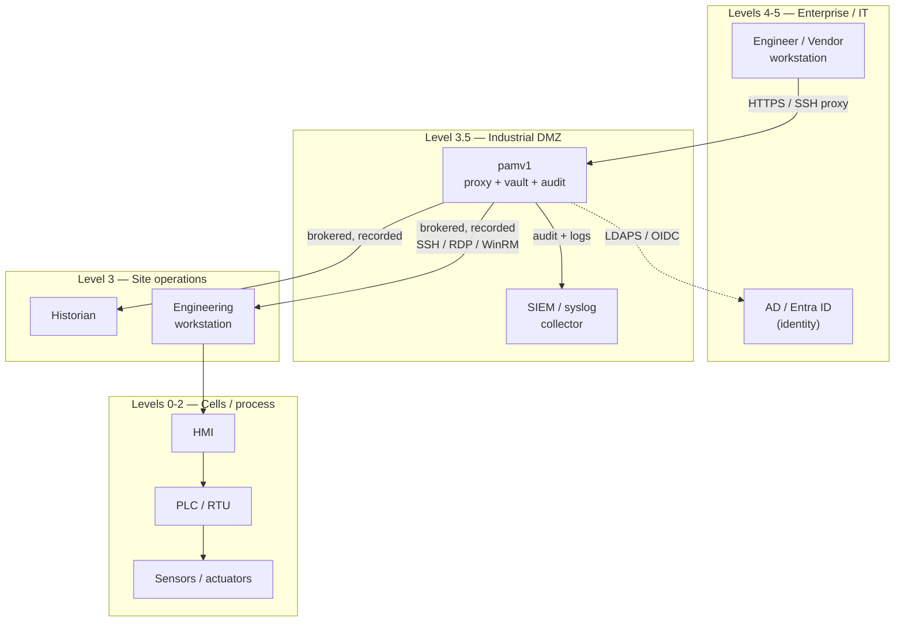

# OT / Industrial Deployment Guide (Phase 8)

> **Alpha, for learning purposes. Not production, not audited.** This guide
> describes how pamv1 is *designed* to fit an OT architecture; validate every
> control against your own risk assessment and [IEC 62443](https://www.isa.org/standards-and-publications/isa-standards/isa-iec-62443-series-of-standards)
> program before relying on it.

pamv1 is meant to be adaptable to Operational Technology (OT) environments —
factory floors, utilities, building management — where availability and safety
outrank confidentiality, change is dangerous, and the network is segmented by the
[Purdue model](https://en.wikipedia.org/wiki/Purdue_Enterprise_Reference_Architecture).
This guide covers the deployment pattern, the OT-specific controls, and how the
Phase 8 approval workflow and air-gap mode support them.

## 1. Where pamv1 sits: the industrial DMZ (Level 3.5)

pamv1 runs in the **industrial DMZ (Level 3.5)** and is the *only* sanctioned path
from IT into the OT cells. No engineer or vendor connects to a PLC, HMI or
historian directly; they go through the pamv1 proxy, which injects the credential
just-in-time and records the session.



**Firewall rule of thumb:** the OT cells accept management connections *only* from
the pamv1 host. See [PORTS-AND-FLOWS.md](PORTS-AND-FLOWS.md) for the exact port
matrix to encode in the L3.5 firewall.

## 2. Session approval (4-eyes / maintenance windows)

In OT, a privileged session is a change event. pamv1 gates connections behind an
**approved access request** so that opening a session is a deliberate, dual-control
act tied to a maintenance window.

```mermaid
sequenceDiagram
    participant E as Engineer (user)
    participant P as pamv1
    participant A as Approver
    participant T as OT target
    E->>P: POST /api/access-requests (target, reason)
    P-->>E: 201 pending
    A->>P: GET /api/access-requests?status=pending
    A->>P: POST /api/access-requests/{id}/approve
    Note over P: four-eyes — approver ≠ requester;<br/>approval valid for PAM_APPROVAL_WINDOW_MIN
    P-->>A: 200 approved (+ real-time alert)
    E->>P: connect (SSH proxy / WinRM / RDP)
    P->>P: HasActiveApproval(engineer, target)?
    P->>T: brokered, recorded session (JIT credential)
```

Enable it per target or globally:

```bash
# Per target (at creation):
curl -H "X-API-Key: $PAM_API_KEY" -X POST .../api/targets \
  -d '{"name":"plc-cell-3","host":"10.20.0.5","port":22,"os_type":"linux","protocol":"ssh","require_approval":true}'

# Or globally (every target requires approval — OT default):
PAM_REQUIRE_APPROVAL=true
PAM_APPROVAL_WINDOW_MIN=60        # an approval is valid for 60 minutes
```

- **Four-eyes:** the approver must be a *different* principal than the requester;
  self-approval is refused (`access.decision_denied`).
- **Roles:** the `approver` role (and `admin`) hold `CapApprove`. Requesters need
  `CapConnect` (`user`/`admin`).
- **Enforced everywhere:** the SSH proxy, WinRM and RDP all check for an active
  approval before brokering. **Break-glass bypasses** it (emergency access is
  already loud and alerted).
- **Audited + alerted:** `access.request`, `access.approve`, `access.deny`,
  `access.denied`; approvals/denials also fire the real-time alert webhook.

## 3. Air-gap / offline mode

Many OT sites forbid outbound connections from the DMZ. Air-gap mode makes pamv1
self-contained:

```bash
PAM_OT_AIRGAP=true
```

- Disables **all outbound calls** — the break-glass/approval alert webhook is
  dropped (alerts still land in the audit trail and local logs).
- Pair it with local identity (local tokens or an on-prem LDAPS DC reachable
  inside the DMZ) rather than a cloud IdP, and collect logs via a **local**
  syslog/SIEM.
- The vault's `local` KEK keeps the root key on-box; there is no call to a cloud
  KMS. (If you use HashiCorp Vault Transit, run it inside the DMZ.)

## 4. Purdue / IEC 62443 alignment

| OT concern | pamv1 control |
|---|---|
| Zones & conduits (SR 5.1) | pamv1 at L3.5 is the sole IT→OT conduit; per-target grants scope who reaches which cell |
| Least privilege (SR 1.1–1.2) | Four RBAC roles + per-target grants + approval gate |
| Use control / approval (SR 2.1) | 4-eyes access-request workflow, maintenance-window validity |
| Monitoring (SR 6.1–6.2) | Append-only audit trail + mandatory session recording (hash-chained) |
| Emergency access | Break-glass (M-of-N quorum, auto-expiring, alerted) |
| Restricted data flow (SR 5.2) | Air-gap mode: no outbound calls |
| Least functionality | Disable the SSH proxy (`PAM_SSH_ADDR=off`) or RDP/WinRM you don't need |

## 5. Roadmap (not yet implemented)

Most OT items have since shipped — a **protocol allowlist** (`PAM_ALLOWED_PROTOCOLS`),
**read-only observer** sessions (a `+observe` login suffix), **jump-host** bastion
connectors, and the 4-eyes **access-request approval** workflow (surfaced in the
portal's "Work with access requests" screen). The one item that remains genuinely
unbuilt (it needs hardware to verify honestly) is:

- **Serial connectors** for legacy equipment (RS-232 / terminal servers).

---

*See also: [ARCHITECTURE-HIGH-LEVEL.md](ARCHITECTURE-HIGH-LEVEL.md),
[PORTS-AND-FLOWS.md](PORTS-AND-FLOWS.md), [ADMIN-GUIDE.md](ADMIN-GUIDE.md),
[ROADMAP.md](../ROADMAP.md).*
