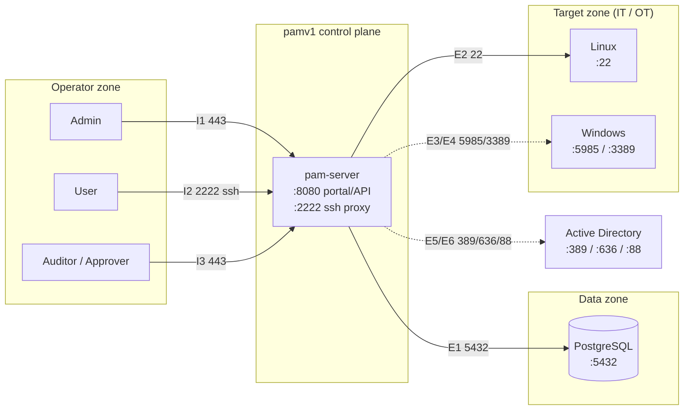

# pamv1 — Ports & Network Flow Matrix (living document)

> **Living document.** Update whenever a listener, an upstream protocol, or a
> deployment flow changes. This is the reference for firewall rules, security
> groups, NetworkPolicies and OT segmentation.
>
> Last updated: 2026-07-18 · Reflects: **Phase 3a**. Ports marked *planned* have
> no listener/dialer yet — do not open them until the phase lands.

Legend: ✅ implemented · 🔷 planned (roadmap phase noted). All ports are TCP
unless stated. `pam-server` is a single binary exposing the portal/API and the
SSH proxy; `db` is PostgreSQL.

## 1. Listening ports (what `pam-server` binds)

| Port | Proto | Service | Env var | Bind guidance | Status |
|-----:|-------|---------|---------|---------------|--------|
| 8080 | HTTP¹ | Portal + REST API | `PAM_LISTEN_ADDR` | Behind TLS in prod; expose to operators only | ✅ |
| 2222 | SSH | Session proxy (JIT injection) | `PAM_SSH_ADDR` (`off` disables) | Expose to operators/users only | ✅ |

¹ Terminate TLS at an ingress/load balancer (HTTPS is Phase 5). The container
listens on plain HTTP internally.

Kubernetes Service (`deploy/k8s/service.yaml`) maps `80 → 8080` and `2222 → 2222`.

## 2. Ingress — who connects **to** pamv1

| # | Source (zone) | → Destination | Port | Proto | Purpose | Status |
|---|---------------|---------------|-----:|-------|---------|--------|
| I1 | Admin (operator zone) | pam-server | 8080/443 | HTTPS | Portal + management API (X-API-Key / token) | ✅ |
| I2 | User (operator zone) | pam-server | 2222 | SSH | Brokered session to a target (role `user`) | ✅ |
| I3 | Auditor / Approver | pam-server | 8080/443 | HTTPS | Read audit trail / (approve requests) | ✅ |
| I4 | Prometheus (mgmt) | pam-server | 8080 | HTTP | Scrape `/metrics` | 🔷 P10 |

## 3. Egress — what pamv1 connects **to**

| # | Source | → Destination (zone) | Port | Proto | Purpose | Status |
|---|--------|----------------------|-----:|-------|---------|--------|
| E1 | pam-server | PostgreSQL (data zone) | 5432 | TCP/TLS | Inventory, vaulted secrets, audit, users | ✅ |
| E2 | pam-server (proxy) | Linux target (target zone) | 22 | SSH | JIT-injected privileged session | ✅ |
| E3 | pam-server (proxy) | Windows target | 5985 / 5986 | WinRM | JIT session (http/https) | 🔷 P4 |
| E4 | pam-server (proxy) | Windows target | 3389 | RDP | Recorded RDP via gateway | 🔷 P4 |
| E5 | pam-server | Active Directory (identity zone) | 389 / 636 | LDAP / LDAPS | Authn + group→role mapping | 🔷 P3b |
| E6 | pam-server | Active Directory (identity zone) | 88 | Kerberos | Optional Kerberos auth | 🔷 P3b |
| E7 | pam-server | AD / target | 636 / 5986 | LDAPS / WinRM | Credential rotation (password change) | 🔷 P7 |
| E8 | pam-server | SIEM / syslog (mgmt zone) | 514 / 6514 | Syslog / TLS | Forward audit for NIS2 retention | 🔷 P9 |
| E9 | pam-server | SMTP / webhook (mgmt zone) | 587 / 443 | SMTP / HTTPS | Break-glass & approval alerts | 🔷 P6 |

## 4. Internal / data-plane

| # | Source | → Destination | Port | Proto | Purpose | Status |
|---|--------|---------------|-----:|-------|---------|--------|
| D1 | db | (local volume) | — | — | Encrypted-at-rest storage (`pgdata`) | ✅ |
| D2 | pam-server | (local/PVC volume) | — | — | SSH host key + session recordings (`/data`) | ✅ |

## 5. Flow diagram



Solid = implemented · dashed = planned.

## 6. Firewall / NetworkPolicy summary

Least-privilege intent (replace `<cidr>` with real ranges):

```
# Ingress to pam-server
allow  <operator-cidr>      -> pam-server:8080   (or :443 at ingress)   # portal/API
allow  <operator-cidr>      -> pam-server:2222   tcp                    # ssh proxy
deny   any                  -> pam-server:*                             # default deny

# Egress from pam-server
allow  pam-server -> db:5432          tcp        # database
allow  pam-server -> <target-cidr>:22 tcp        # linux targets (SSH)
# (phase-gated) 5985/5986, 3389, 389/636/88, 514/6514, 587/443
deny   pam-server -> any                          # default deny

# Database is never reachable from operator or target zones
deny   <operator-cidr>,<target-cidr> -> db:5432
```

Kubernetes: pair a default-deny `NetworkPolicy` in the `pamv1` namespace with
explicit allows mirroring the table above (planned with Phase 10).

## 7. OT / industrial placement (Phase 8)

In an [IEC 62443](https://www.isa.org/standards-and-publications/isa-standards/isa-iec-62443-series-of-standards) / Purdue deployment, `pam-server` (the proxy)
sits in the **industrial DMZ, level 3.5**, and is the **only** node permitted to
open E2–E4 into the OT cell (levels 2–3). Operators never reach targets directly;
the only IT→OT path is operator → proxy:2222 → target. Keep egress to the OT zone
pinned to the specific target hosts and protocols, and default-deny everything
else across the 3.5 boundary.

## 8. Change log

| Date | Change |
|---|---|
| 2026-07-18 | Initial ports & flow matrix (Phase 3a): 8080/2222 listeners, 5432 egress, 22 target SSH; planned WinRM/RDP/LDAP/syslog/alerting flows |
