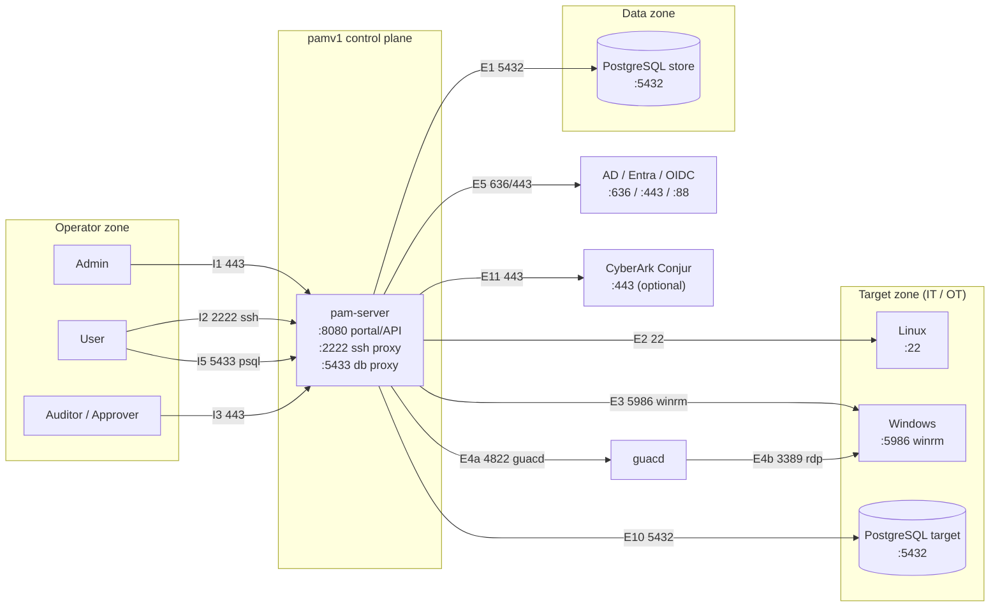

# pamv1 — Ports & Network Flow Matrix

> **Living document.** Update whenever a listener, an upstream protocol, or a
> deployment flow changes. This is the reference for firewall rules, security
> groups, NetworkPolicies and OT segmentation.
>
> Last updated: 2026-07-23 · Reflects: Phases 0–24 + the 2026-07 hardening pass. Ports marked *planned* have
> no listener/dialer yet — do not open them until the phase lands. Phases 19–24 add
> **no new listeners**: certification/ticketing/approvals (19–21), threat analytics
> (23) and the application-secrets API (24) all ride the existing HTTP control plane
> (`:8080`), and Zero Standing Privilege (22) is served over the existing SSH proxy
> (`:2222`) — it only adds an outbound SSH-certificate authentication to targets.

Legend: ✅ implemented · 🔷 planned (roadmap phase noted). All ports are TCP
unless stated. `pam-server` is a single binary exposing the portal/API and the
SSH proxy; `db` is PostgreSQL.

## 1. Listening ports (what `pam-server` binds)

| Port | Proto | Service | Env var | Bind guidance | Status |
|-----:|-------|---------|---------|---------------|--------|
| 8080 | HTTP¹ | Portal + REST API | `PAM_LISTEN_ADDR` | Behind TLS in prod; expose to operators only | ✅ |
| 2222 | SSH | Session proxy (JIT injection) | `PAM_SSH_ADDR` (`off` disables) | Expose to operators/users only | ✅ |
| 5433 | PostgreSQL | Database session proxy (JIT injection) | `PAM_DB_ADDR` (`off` by default) | Expose to operators only; TLS via `PAM_TLS_CERT/KEY` or ingress | ✅ P15 |

¹ **Secure protocols only.** Operators must reach the portal/API over **HTTPS** —
either native (`PAM_TLS_CERT`/`PAM_TLS_KEY`, Phase 5) or terminated at an
ingress/load balancer; the container otherwise listens on plain HTTP internally,
so never expose 8080 directly off-host. The database proxy's operator leg is
likewise TLS when `PAM_TLS_CERT/KEY` are set (else it warns and runs plaintext —
terminate TLS at the ingress). Prefer **LDAPS (636)** over LDAP and **TLS** to
PostgreSQL. Plain-text variants are for isolated local dev only.

Kubernetes Service (`deploy/k8s/service.yaml`) maps `80 → 8080` and `2222 → 2222`;
add `5433 → 5433` when the database proxy is enabled.

## 2. Ingress — who connects **to** pamv1

| # | Source (zone) | → Destination | Port | Proto | Purpose | Status |
|---|---------------|---------------|-----:|-------|---------|--------|
| I1 | Admin (operator zone) | pam-server | 8080/443 | HTTPS | Portal + management API (X-API-Key / token) | ✅ |
| I2 | User (operator zone) | pam-server | 2222 | SSH | Brokered session to a target (role `user`) | ✅ |
| I3 | Auditor / Approver | pam-server | 8080/443 | HTTPS | Read audit trail, live session stream (SSE), approve requests | ✅ |
| I4 | Prometheus (mgmt) | pam-server | 8080 | HTTP | Scrape `/metrics` | ✅ P10 |
| I5 | User (operator zone) | pam-server | 5433 | PostgreSQL | Brokered `psql` session to a `postgres` target | ✅ P15 |

## 3. Egress — what pamv1 connects **to**

| # | Source | → Destination (zone) | Port | Proto | Purpose | Status |
|---|--------|----------------------|-----:|-------|---------|--------|
| E1 | pam-server | PostgreSQL (data zone) | 5432 | TCP/TLS | Inventory, vaulted secrets, audit, users | ✅ |
| E2 | pam-server (proxy) | Linux target (target zone) | 22 | SSH | JIT-injected privileged session | ✅ |
| E3 | pam-server | Windows target | 5985 / **5986** | WinRM / WinRM-TLS | JIT command execution (`/api/targets/{id}/winrm`) | ✅ |
| E4a | pam-server | guacd (control plane) | 4822 | Guacamole | RDP broker handshake (JIT credential) | ✅ |
| E4b | guacd | Windows target | 3389 | RDP | Rendered RDP session | ✅ |
| E5 | pam-server | Active Directory / Entra / OIDC (identity zone) | **636** / 443 | **LDAPS** / HTTPS | Authn + group→role mapping (LDAPS, Entra ROPC, OIDC) | ✅ |
| E6 | pam-server | Active Directory (identity zone) | 88 | Kerberos | Optional Kerberos auth | 🔷 P3b |
| E7 | pam-server | AD / target | 636 / 22 / 5986 | LDAPS / SSH / WinRM | Credential rotation (password change), reconciliation | ✅ P7 |
| E8 | pam-server | SIEM / syslog (mgmt zone) | 514 / 6514 | Syslog / TLS | Forward audit for NIS2 retention | ✅ P9 |
| E9 | pam-server | SMTP / webhook (mgmt zone) | 587 / 443 | SMTP / HTTPS | Break-glass & approval alerts | ✅ P6 |
| E10 | pam-server (DB proxy) | PostgreSQL target (target zone) | 5432 | PostgreSQL/TLS | JIT-injected brokered database session (`:5433` ingress) | ✅ P15 |
| E11 | pam-server | CyberArk Conjur (identity/secrets zone) | 443 | HTTPS | Source bootstrap secrets at startup (optional) | ✅ P18 |
| E12 | pam-server | KMS / HSM (Vault-Transit / AWS-KMS / PKCS#11) | 443 / — | HTTPS / PKCS#11 | Envelope-encryption KEK (wrap/unwrap), when not `local` | ✅ P5 |

## 4. Internal / data-plane

| # | Source | → Destination | Port | Proto | Purpose | Status |
|---|--------|---------------|-----:|-------|---------|--------|
| D1 | db | (local volume) | — | — | Encrypted-at-rest storage (`pgdata`) | ✅ |
| D2 | pam-server | (local/PVC volume) | — | — | SSH host key + session recordings (`/data`) | ✅ |

## 5. Flow diagram



Solid = implemented · dashed = planned.

## 6. Firewall / NetworkPolicy summary

Least-privilege intent (replace `<cidr>` with real ranges):

```
# Ingress to pam-server
allow  <operator-cidr>      -> pam-server:8080   (or :443 at ingress)   # portal/API
allow  <operator-cidr>      -> pam-server:2222   tcp                    # ssh proxy
allow  <operator-cidr>      -> pam-server:5433   tcp                    # db proxy (if enabled)
deny   any                  -> pam-server:*                             # default deny

# Egress from pam-server
allow  pam-server -> db:5432                   tcp   # own store
allow  pam-server -> <target-cidr>:22          tcp   # linux targets (SSH)
allow  pam-server -> <target-cidr>:5985,5986   tcp   # windows targets (WinRM)
allow  pam-server -> <target-cidr>:5432        tcp   # postgres targets (db proxy)
allow  pam-server -> guacd:4822                tcp   # rdp broker
allow  pam-server -> <idp-cidr>:636,443,88     tcp   # AD/Entra/OIDC (+ Conjur:443, if enabled)
allow  pam-server -> <siem>:514,6514           tcp   # syslog (if enabled)
allow  pam-server -> <smtp/webhook>:587,443    tcp   # alerts (if enabled)
deny   pam-server -> any                              # default deny

# Database is never reachable from operator or target zones
deny   <operator-cidr>,<target-cidr> -> db:5432
```

Kubernetes: pamv1 ships the pod-level restrictions (restricted PSS, non-root,
read-only rootfs, dropped capabilities) **and** a default-deny `NetworkPolicy` —
`deploy/k8s/networkpolicy.yaml` (raw manifest, applied by `kubectl apply -f deploy/k8s/`)
and a gated Helm template (`networkPolicy.enabled`, default `false` in `values.yaml`).
Both mirror the allow-list above: ingress only on the app ports, egress only to DNS,
PostgreSQL, and your target networks. Tighten the ingress `from` CIDRs and the
RFC-1918 egress blocks for your topology and CNI before relying on it.

## 7. OT / industrial placement (Phase 8)

In an [IEC 62443](https://www.isa.org/standards-and-publications/isa-standards/isa-iec-62443-series-of-standards) / Purdue deployment, `pam-server` (the proxy)
sits in the **industrial DMZ, level 3.5**, and is the **only** node permitted to
open E2–E4 into the OT cell (levels 2–3). Operators never reach targets directly;
the only IT→OT path is operator → proxy:2222 → target. Keep egress to the OT zone
pinned to the specific target hosts and protocols, and default-deny everything
else across the 3.5 boundary.

## 8. Change log

| Date | Change |
|---|---|
| 2026-07-23 | **In-portal RDP viewer** — the browser now renders RDP over the **existing** `:8080/443` control plane (a WebSocket upgrade of `GET /api/targets/{id}/rdp`, preceded by `POST /api/rdp-token`); no new listener. The guacd egress (E4a `:4822` → E4b `:3389`) is unchanged |
| 2026-07-23 | **guacd** (RDP broker) now ships as a co-deployed **internal** service (docker-compose + `deploy/k8s/guacd.yaml` + gated Helm), reached on `:4822`; `PAM_GUACD_ADDR` is wired for you and its NetworkPolicy admits only pam-server. No new *external* listeners |
| 2026-07-23 | Phases 19–24 add no new listeners (all ride `:8080`); ZSP (22) rides `:2222`. Corrected §6: pamv1 now **ships** a default-deny `NetworkPolicy` (`deploy/k8s/networkpolicy.yaml` + a gated Helm template), not just pod-level restrictions |
| 2026-07-21 | Refreshed for Phases 0–18: added the **`:5433` database-proxy listener** (I5) and its egress to postgres targets (E10, `:5432`); marked the now-shipped flows implemented — Prometheus scrape (I4), rotation/reconciliation (E7), syslog (E8), alerts (E9); added **CyberArk Conjur** (E11, `:443`, optional) and the **KMS/HSM KEK** egress (E12); folded Entra/OIDC into the identity egress; noted native HTTPS + the db-proxy operator-leg TLS. Diagram and firewall summary updated |
| 2026-07-18 | Initial ports & flow matrix (Phase 3a): 8080/2222 listeners, 5432 egress, 22 target SSH; planned WinRM/RDP/LDAP/syslog/alerting flows |
