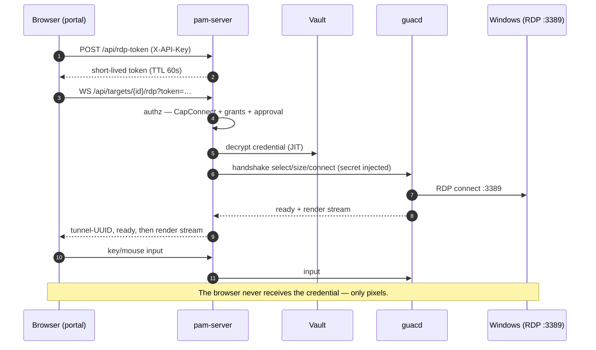

# pamv1 — RDP viewer: testing procedure

> **Living document.** Update whenever the RDP path (guacd handshake, the tunnel
> prelude, the token endpoint, or the in-portal viewer) changes.
>
> Last updated: 2026-07-23 · Reflects: Phases 0–24 + the in-portal RDP viewer.

This is the procedure to verify pamv1's **RDP function** end to end: an operator
opens an RDP target from the 5250 portal, the credential is injected server-side
at the guacd handshake, and the browser only ever receives the rendered screen.

## 1. What the RDP path is



The two facts that make this "the RDP function" and not just a proxy:

1. **JIT injection** — the vaulted secret is decrypted only for the guacd
   handshake and is never sent to the browser.
2. **Tunnel prelude** — `guacamole-common-js` needs an internal tunnel-UUID
   instruction to open the tunnel, then a `ready` to reach the CONNECTED state.
   pam-server's handshake consumes guacd's own `ready` (to learn the connection
   id), so the tunnel handler re-emits both before piping the render stream. If
   this prelude is wrong, the browser viewer hangs silently. See
   `internal/api/rdp_handlers.go` (`guacamolePrelude`).

## 2. Automated tests (no external host needed)

These run in CI and locally with only the Go toolchain — a fake guacd stands in
for the daemon, so **no real Windows host or guacd is required**.

```bash
# The whole RDP surface (prelude wire-format, token endpoint, and a full
# WebSocket round-trip against a fake guacd):
go test ./internal/api -run 'RDP|Guacamole|TunnelUUID' -v

# The guacd protocol client (handshake + credential injection ordering):
go test ./internal/guacd -v

# The portal CSP that the viewer depends on (img-src data:/blob:, script-src 'self'):
go test ./internal/web -run TestIndexNonceCSP -v
```

| Test | Proves |
|---|---|
| `TestGuacamolePrelude` | The exact bytes `0.,<len>.<uuid>;` and `5.ready,<len>.<id>;` are emitted first. |
| `TestTunnelUUID` | The tunnel id is a fresh 16-byte hex value per session. |
| `TestRDPTunnelEndToEnd` | Full path over a real WebSocket: prelude first, the vaulted secret injected into guacd's `connect` (never sent by the browser), **both** piping directions, and that a **>8 KB instruction arrives as one intact WebSocket message** (the bridge never splits a screen paint). |
| `TestRDPTokenRequiresConnect` | `POST /api/rdp-token` is 404 without guacd, 403 for a non-connect role, 200 for a connector. |
| `TestRDPTokenIsTunnelScoped` | A minted RDP token is 403 on `/api/targets` and `/api/me` and cannot re-mint — usable only at the tunnel, so a URL leak grants nothing. |
| `TestRDPAuthAndTargetChecks` | Pre-upgrade auth: missing token → 401, wrong role → 403, non-RDP target → 422. |
| `TestConnectInjectsCredentials` (guacd) | `connect` values are supplied in the order guacd advertised, with the credential injected. |

> **Regression note:** `TestRDPTunnelEndToEnd` was what caught that the
> access-log middleware's `statusWriter` did not forward `http.Hijacker`, which
> had silently broken *every* WebSocket upgrade with `501`. The fix is the
> `statusWriter.Hijack` method in `internal/api/server.go`.

## 3. Manual / local procedure (real guacd, still no Windows host)

This verifies the live server serves the viewer client, sets the right CSP, and
mints tokens correctly. It does **not** need a Windows host — it stops at the
guacd dial.

```bash
# 1. Bring up guacd next to the server (guacd ships in the compose file):
#    from deploy/docker/  ->  docker compose up --build
#    or run guacd alone:   docker run --rm -p 4822:4822 guacamole/guacd:1.5.5

# 2. Run pam-server pointed at it (in-memory demo store):
go build -o pam-server ./cmd/pam-server
export PAM_MASTER_KEY=$(./pam-server -genkey)
export PAM_API_KEY=demo-key
export PAM_DATABASE_URL=memory
export PAM_GUACD_ADDR=127.0.0.1:4822   # enables the RDP endpoints
./pam-server &

# 3. The viewer client is served, same-origin, immutable:
curl -sI http://localhost:8080/static/guacamole-common.min.js | grep -i 'content-type'
#   -> text/javascript; charset=utf-8

# 4. The portal CSP admits the viewer (data: images + same-origin module):
curl -sI http://localhost:8080/ | grep -i content-security-policy
#   -> … script-src 'nonce-…' 'self'; img-src 'self' data: blob: …

# 5. A connector can mint a short-lived WS token; a plain request cannot:
curl -s -X POST -H "X-API-Key: demo-key" http://localhost:8080/api/rdp-token   # -> {"token":"…","expires_at":"…"}
curl -s -o /dev/null -w '%{http_code}\n' -X POST http://localhost:8080/api/rdp-token  # -> 401
```

## 4. Full end-to-end — the rendered pixels

The rendered screen is the only part the automated tests cannot cover. Two ways
to see it:

### 4a. The bundled demo (no Windows host needed)

A compose file ships a real **xrdp Linux desktop** as an RDP target alongside
guacd and pam-server, with the pamv1 target auto-seeded — so you can watch a
desktop paint end to end on any Docker host:

```bash
cd deploy/docker
docker compose -f docker-compose.rdp-demo.yml up --build
# then open http://localhost:8080
#   sign on: leave Password blank, enter the access token  demo-api-key-pamv1
#   Work with Targets → type 7 next to "demo-rdp" → Enter → an XFCE desktop renders
#   Ctrl+Alt+Q disconnects
```

It's **demo-only** (throwaway master key, weak creds, an unhardened root xrdp
target — never deploy it). If the desktop never paints, set
`PAM_GUACD_RDP_SECURITY=rdp` on the `pam` service and re-up. Then run the
verification checklist in §4b against `demo-rdp`.

### 4b. Against your own Windows/xrdp host

See [EXTERNAL-INFRA-GAPS.md](EXTERNAL-INFRA-GAPS.md).

1. Add an **rdp** target (`os_type: windows`, port `3389`) and a credential.
2. Ensure `PAM_GUACD_ADDR` is set and the operator's role has **connect**.
3. In the portal → *Work with Targets*, type option **7** on the target, Enter.
4. **Verify:**
   - the green title bar shows the target, and the Windows desktop renders;
   - **credential secrecy** — open the browser dev-tools Network tab, inspect the
     WebSocket frames: they carry Guacamole drawing/`img` instructions only, never
     the password;
   - **audit** — `GET /api/audit` shows `rdp.token`, then `rdp.connect`, then
     `rdp.end` for the session;
   - **live session** — the session appears in *Work with Active Sessions* and an
     admin can kill it;
   - **disconnect** — `Ctrl+Alt+Q` tears the viewer down and returns to the list;
   - **token expiry** — a token older than 60s is rejected by the tunnel (re-open
     mints a fresh one automatically);
   - **least privilege** — an `auditor` (no connect) never sees option 7 and is
     refused by both `/api/rdp-token` (403) and the tunnel (403).

## 5. Troubleshooting

| Symptom | Likely cause |
|---|---|
| Viewer opens then stays black, no error | guacd reached the RDP host but the handshake failed (cert/security mode). Try `PAM_GUACD_RDP_SECURITY=nla`; for self-signed hosts, `PAM_GUACD_IGNORE_CERT=true` (dev only). |
| `RDP CONNECTION FAILED` immediately | pam-server could not reach guacd (`PAM_GUACD_ADDR`) or guacd could not reach `:3389`. Check the guacd NetworkPolicy/egress. |
| WebSocket closes with `501` | A response-writer wrapper on the path does not forward `http.Hijacker` (see §2 regression note). |
| `RDP VIEWER IS STILL LOADING` | The vendored client module has not finished importing; retry. If it never loads, check the CSP `script-src 'self'` and that `/static/guacamole-common.min.js` is 200. |
| Blank canvas but frames flow | CSP `img-src` is missing `data:` — guacd's PNG instructions are `data:` URIs. |
