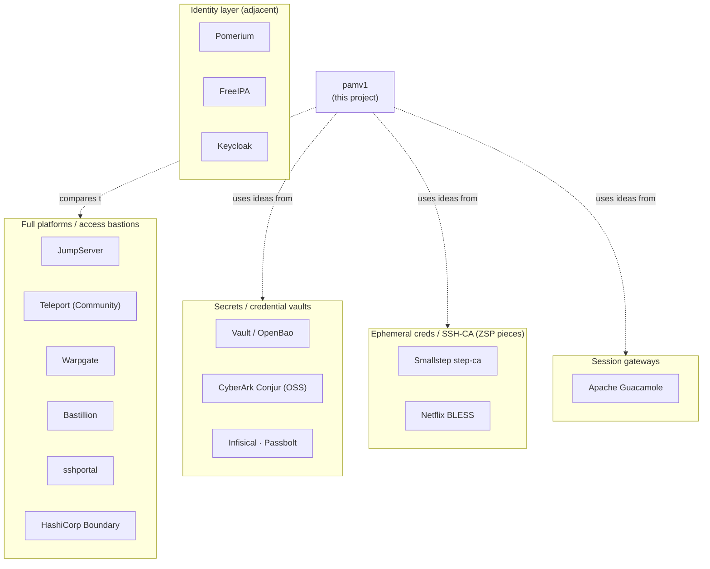

# Related & alternative open-source PAM projects

> How pamv1 sits in the wider landscape. The big all-in-one **PAM** leaders —
> [CyberArk](https://www.cyberark.com/products/privileged-access-manager/),
> [BeyondTrust](https://www.beyondtrust.com/), [Delinea](https://delinea.com/products/secret-server),
> [Wallix](https://www.wallix.com/privileged-access-management/) — are proprietary. The
> open-source world is more **fragmented**: a couple of full platforms, plus many
> projects that each cover one slice of what a PAM does (a session bastion, a secrets
> vault, an SSH certificate authority, a remote-desktop gateway, an identity layer).
>
> Last updated: 2026-07-21. **Licenses change** — verify against each project before you
> adopt it. In particular, several formerly-OSI-open projects have moved to
> *source-available* terms (e.g. HashiCorp **Vault**/**Boundary** → BUSL, **Bastillion** →
> a non-commercial license); "source-available" is not the same as OSI "open source".

## The landscape at a glance

## Full-featured PAM / access bastions (closest to pamv1)

| Project | License | What it is | Relation to pamv1 |
|---|---|---|---|
| [JumpServer](https://github.com/jumpserver/jumpserver) | GPLv3 | Arguably the most complete open-source PAM/bastion: brokered SSH/RDP/VNC/database/Kubernetes access, session recording, command filtering, MFA, RBAC, an audit console | Same problem space; much larger and more mature. pamv1 is deliberately smaller/educational |
| [Teleport](https://goteleport.com/) | Apache-2.0 (Community Edition) | Access to SSH, Kubernetes, databases, web apps and Windows/RDP built on **short-lived certificates**, session recording, RBAC. Governance features are in the paid editions | Its short-lived-cert model is exactly what pamv1's **Zero Standing Privilege** (Phase 22) borrows |
| [Warpgate](https://github.com/warp-tech/warpgate) | Apache-2.0 | A lightweight, agentless SSH/HTTP/MySQL bastion (Rust) with session recording and a web admin UI | The leanest modern analogue of pamv1's proxy |
| [Bastillion](https://github.com/bastillion-io/Bastillion) | source-available (non-commercial; was GPLv3) | Web-based SSH bastion + SSH-key distribution + session auditing | An older SSH-centric take; check the license before use |
| [sshportal](https://github.com/moul/sshportal) | Apache-2.0 | A small single-binary SSH bastion with host/user management, ACLs and recording | PAM-lite; similar "one binary, Postgres/SQLite" spirit |
| [HashiCorp Boundary](https://www.boundaryproject.io/) | BUSL (source-available) | Identity-based session brokering with credential injection, pairs with Vault | Same "broker the session, inject the credential" idea; different licensing posture |

## Secrets / credential management (the vault half of PAM)

| Project | License | What it is | Relation to pamv1 |
|---|---|---|---|
| [HashiCorp Vault](https://www.vaultproject.io/) | BUSL | Dynamic secrets, database credentials, and an **SSH secrets engine that signs certificates** | pamv1's vault + KEK + SSH-CA cover a small, opinionated subset |
| [OpenBao](https://openbao.org/) | MPL-2.0 | The Linux-Foundation, fully-open fork of Vault after its relicensing | The OSI-open alternative if licensing matters |
| [CyberArk Conjur (OSS)](https://www.conjur.org/) | Apache-2.0 | Machine-identity secrets for apps/DevOps | pamv1 can **source its own bootstrap secrets** from Conjur (Phase 18), and its Tier-4 **application-secrets API** (Phase 24) is "Conjur-style" |
| [Infisical](https://github.com/Infisical/infisical) · [Passbolt](https://www.passbolt.com/) | MIT core / AGPL | Secrets & team-password vaulting | Vault-only; no session brokering |

## Ephemeral credentials / SSH certificate authorities (Zero Standing Privilege)

| Project | License | What it is |
|---|---|---|
| [Smallstep `step-ca`](https://smallstep.com/docs/step-ca/) | Apache-2.0 | An open CA that issues short-lived SSH and X.509 certificates |
| [Netflix BLESS](https://github.com/Netflix/bless) | Apache-2.0 | A Lambda-based SSH certificate authority for ephemeral access |

pamv1's Phase 22 (`internal/sshca`) is a small, self-contained version of this idea wired
directly into the proxy — no external CA service required.

## Session gateways / clientless remote access

| Project | License | What it is | Relation to pamv1 |
|---|---|---|---|
| [Apache Guacamole](https://guacamole.apache.org/) | Apache-2.0 | Clientless RDP/VNC/SSH through the browser, with server-side recording | pamv1 **uses `guacd`** for its RDP brokering (Phase 4) |

## Identity layer (adjacent — usually paired with a PAM, not a PAM themselves)

| Project | License | What it is |
|---|---|---|
| [Pomerium](https://www.pomerium.com/) | Apache-2.0 | An identity-aware access proxy (zero-trust access to internal apps) |
| [FreeIPA](https://www.freeipa.org/) | GPLv3 | Linux identity management: host-based access control, sudo rules, SSH keys, a built-in CA |
| [Keycloak](https://www.keycloak.org/) | Apache-2.0 | IAM / SSO — the login and federation side (pamv1 integrates via OIDC) |

## Where pamv1 fits

If you need a production PAM today, **[JumpServer](https://github.com/jumpserver/jumpserver)**
and **[Teleport](https://goteleport.com/)** are the two closest to a complete open-source
platform, with **[Warpgate](https://github.com/warp-tech/warpgate)** as a leaner modern
option and **[Vault](https://www.vaultproject.io/)/[OpenBao](https://openbao.org/) +
[step-ca](https://smallstep.com/docs/step-ca/)** covering the secrets-and-certificates
foundation.

pamv1's niche is different by design: a **single Go + PostgreSQL binary**, built
**phase by phase** where every phase is functional end to end, **educational** rather than
production-hardened, with a deliberately austere **AS/400 / 5250 console** and two more
unusual angles — an **AI-agent access broker** (policy over a tool *and its arguments*, JIT
server-side execution, a verifiable audit chain, MCP transport, SPIFFE identity) and the
same chokepoint extended to **Zero Standing Privilege**, **threat analytics** and a
**Conjur-style application-secrets API**. It is a good place to *read and learn how a PAM
works*; it is explicitly **not** a drop-in replacement for the projects above. See the
[coverage comparison](../README.md#coverage-vs-commercial-pam-cyberark-wallix-) for the
per-capability view.

## Change log

| Date | Change |
|---|---|
| 2026-07-21 | Initial landscape of related open-source PAM / bastion / secrets / SSH-CA / gateway projects and where pamv1 fits. |
