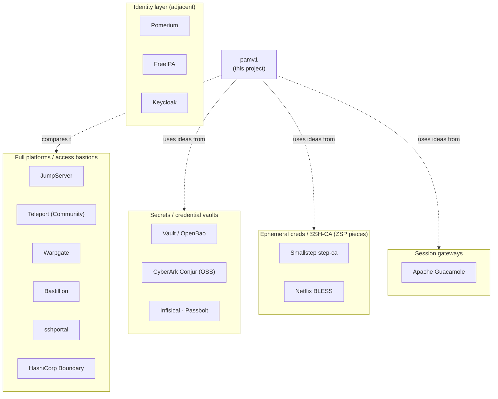
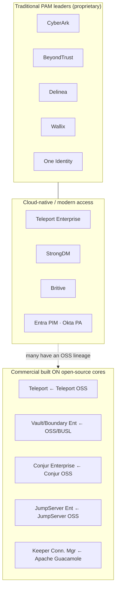

# pamv1 — Related PAM Projects (open-source & commercial landscape)

> 🟢 **Living document** — updated in the same change as the code, without a separate ask (see the [docs hub](README.md)).

> How pamv1 sits in the wider Privileged Access Management landscape — both the
> **open-source** projects and the **commercial** products (including the many
> commercial offerings that are built on, or "follow", open-source cores). pamv1
> is an educational project, not a competitor to any of these; the per-capability
> comparison lives in the README's
> [coverage section](../README.md#coverage-vs-commercial-pam-cyberark-wallix-).
>
> Last updated: 2026-07-23 · Reflects: the PAM landscape as of mid-2026.
>
> **Two caveats.** (1) *Licenses change* — several formerly-OSI-open projects moved
> to *source-available* terms (HashiCorp **Vault**/**Boundary** → BUSL;
> **Bastillion** → a non-commercial license), which is not the same as OSI "open
> source". (2) The **commercial market consolidates constantly** (mergers, renames,
> acquisitions) — verify current ownership and product names against each vendor.

---

## Part 1 — Open source

The big all-in-one PAM leaders are proprietary (see Part 2); the open-source world is
more **fragmented**: a couple of full platforms, plus many projects that each cover one
slice of what a PAM does (a session bastion, a secrets vault, an SSH certificate
authority, a remote-desktop gateway, an identity layer).

### Full-featured PAM / access bastions (closest to pamv1)

| Project | License | What it is | Relation to pamv1 |
|---|---|---|---|
| [JumpServer](https://github.com/jumpserver/jumpserver) | GPLv3 | Arguably the most complete open-source PAM/bastion: brokered SSH/RDP/VNC/database/Kubernetes access, session recording, command filtering, MFA, RBAC, an audit console | Same problem space; much larger and more mature. pamv1 is deliberately smaller/educational |
| [Teleport](https://goteleport.com/) | Apache-2.0 (Community Edition) | Access to SSH, Kubernetes, databases, web apps and Windows/RDP built on **short-lived certificates**, session recording, RBAC. Governance features are in the paid editions | Its short-lived-cert model is exactly what pamv1's **Zero Standing Privilege** (Phase 22) borrows |
| [Warpgate](https://github.com/warp-tech/warpgate) | Apache-2.0 | A lightweight, agentless SSH/HTTP/MySQL bastion (Rust) with session recording and a web admin UI | The leanest modern analogue of pamv1's proxy |
| [Bastillion](https://github.com/bastillion-io/Bastillion) | source-available (non-commercial; was GPLv3) | Web-based SSH bastion + SSH-key distribution + session auditing | An older SSH-centric take; check the license before use |
| [sshportal](https://github.com/moul/sshportal) | Apache-2.0 | A small single-binary SSH bastion with host/user management, ACLs and recording | PAM-lite; similar "one binary, Postgres/SQLite" spirit |
| [HashiCorp Boundary](https://www.boundaryproject.io/) | BUSL (source-available) | Identity-based session brokering with credential injection, pairs with Vault | Same "broker the session, inject the credential" idea; different licensing posture |

### Secrets / credential management (the vault half of PAM)

| Project | License | What it is | Relation to pamv1 |
|---|---|---|---|
| [HashiCorp Vault](https://www.vaultproject.io/) | BUSL | Dynamic secrets, database credentials, and an **SSH secrets engine that signs certificates** | pamv1's vault + KEK + SSH-CA cover a small, opinionated subset |
| [OpenBao](https://openbao.org/) | MPL-2.0 | The Linux-Foundation, fully-open fork of Vault after its relicensing | The OSI-open alternative if licensing matters |
| [CyberArk Conjur (OSS)](https://www.conjur.org/) | Apache-2.0 | Machine-identity secrets for apps/DevOps | pamv1 can **source its own bootstrap secrets** from Conjur (Phase 18), and its Tier-4 **application-secrets API** (Phase 24) is "Conjur-style" |
| [Infisical](https://github.com/Infisical/infisical) · [Passbolt](https://www.passbolt.com/) | MIT core / AGPL | Secrets & team-password vaulting | Vault-only; no session brokering |

### Ephemeral credentials / SSH certificate authorities (Zero Standing Privilege)

| Project | License | What it is |
|---|---|---|
| [Smallstep `step-ca`](https://smallstep.com/docs/step-ca/) | Apache-2.0 | An open CA that issues short-lived SSH and X.509 certificates |
| [Netflix BLESS](https://github.com/Netflix/bless) | Apache-2.0 | A Lambda-based SSH certificate authority for ephemeral access |

pamv1's Phase 22 (`internal/sshca`) is a small, self-contained version of this idea wired
directly into the proxy — no external CA service required.

### Session gateways / clientless remote access

| Project | License | What it is | Relation to pamv1 |
|---|---|---|---|
| [Apache Guacamole](https://guacamole.apache.org/) | Apache-2.0 | Clientless RDP/VNC/SSH through the browser, with server-side recording | pamv1 **uses `guacd`** for its RDP brokering (Phase 4) |

### Identity layer (adjacent — usually paired with a PAM, not a PAM themselves)

| Project | License | What it is |
|---|---|---|
| [Pomerium](https://www.pomerium.com/) | Apache-2.0 | An identity-aware access proxy (zero-trust access to internal apps) |
| [FreeIPA](https://www.freeipa.org/) | GPLv3 | Linux identity management: host-based access control, sudo rules, SSH keys, a built-in CA |
| [Keycloak](https://www.keycloak.org/) | Apache-2.0 | IAM / SSO — the login and federation side (pamv1 integrates via OIDC) |

---

## Part 2 — Commercial

The market leaders are proprietary; but note (Part 2c) how many commercial products are the
paid edition of, or are built directly on, the open-source projects above.

### 2a. Traditional PAM leaders (proprietary; no open-source core)

| Vendor / product | What it is | Notable pieces |
|---|---|---|
| [CyberArk](https://www.cyberark.com/products/privileged-access-manager/) — Privileged Access Manager (self-hosted / Privilege Cloud) | The market leader | Digital Vault, **PSM** (session manager), **CPM** (rotation), **PTA** (threat analytics), **Secrets Manager** + **Secrets Hub**, **Dynamic Privileged Access** (JIT/ZSP). Also owns **[Conjur](https://www.conjur.org/)** (OSS) and machine identity via Venafi |
| [BeyondTrust](https://www.beyondtrust.com/products/privileged-remote-access) | Session/password + endpoint | **Privileged Remote Access**, **Password Safe**, **Endpoint Privilege Management (EPM)**; acquired **Entitle** for cloud JIT |
| [Delinea](https://delinea.com/products/secret-server) | Secrets + session (ex-Thycotic + Centrify) | **Secret Server**, Privileged Access Service, **Privilege Manager** (EPM), DevOps Secrets Vault |
| [Wallix](https://www.wallix.com/privileged-access-management/) | Session-centric bastion (EU) | **WALLIX Bastion** (session mgmt + recording), Access Manager, Password Manager, PEDM |
| [One Identity](https://www.oneidentity.com/products/safeguard/) (Quest) | PAM within IGA | **Safeguard** for Privileged Passwords / Sessions (session mgmt from the acquired Balabit Shell Control Box) |
| [ARCON](https://arconnet.com/) · [Fudo Security](https://fudosecurity.com/) · [ManageEngine PAM360](https://www.manageengine.com/privileged-access-management/) · [Senhasegura](https://senhasegura.com/) · [Netwrix Privilege Secure](https://www.netwrix.com/privileged-access-management.html) | Mid-market / regional / JIT specialists | ARCON & Fudo (session mgmt); ManageEngine (affordable all-in-one); Senhasegura (LATAM); Netwrix Privilege Secure = the acquired **Remediant** JIT/ZSP tech |

### 2b. Cloud-native / modern access & CIEM

| Vendor / product | What it is | Open-source lineage |
|---|---|---|
| [Teleport](https://goteleport.com/) (Enterprise / Cloud) | Identity-native access to SSH/K8s/DB/web/Windows with short-lived certs | **Yes** — built on the Apache-2.0 [Teleport OSS](https://github.com/gravitational/teleport) core |
| [StrongDM](https://www.strongdm.com/) | Infrastructure access proxy (SSH/DB/K8s/web) with audit | Proprietary |
| [Britive](https://www.britive.com/) | Cloud PAM / CIEM — JIT cloud privileges, entitlement right-sizing | Proprietary |
| [Microsoft Entra PIM](https://learn.microsoft.com/en-us/entra/id-governance/privileged-identity-management/pim-configure) · [Okta Privileged Access](https://www.okta.com/products/privileged-access/) | Privileged Identity Management inside the IAM suites (JIT role activation) | Proprietary |

### 2c. Commercial products built ON open-source projects ("following open source")

The most interesting overlap: several commercial offerings are the paid edition of, or are
built directly on top of, one of the open-source projects in Part 1.

| Commercial product | Open-source core | Model |
|---|---|---|
| **Teleport Enterprise / Cloud** | [Teleport OSS](https://github.com/gravitational/teleport) (Apache-2.0) | Open core — governance/compliance features in the paid tier |
| **HashiCorp Vault Enterprise / HCP Vault**, **Boundary Enterprise / HCP** | [Vault](https://www.vaultproject.io/) · [Boundary](https://www.boundaryproject.io/) (BUSL, source-available) | Open(-ish) core; the fully-open fork is [OpenBao](https://openbao.org/) |
| **CyberArk Conjur Enterprise** | [Conjur OSS](https://www.conjur.org/) (Apache-2.0) | Open core (secrets for machines) |
| **JumpServer** commercial edition (FIT2CLOUD) | [JumpServer OSS](https://github.com/jumpserver/jumpserver) (GPLv3) | Open core PAM/bastion |
| **[Keeper Connection Manager](https://www.keepersecurity.com/connection-manager.html)** | [Apache Guacamole](https://guacamole.apache.org/) | Commercial packaging of the clientless RDP/SSH/VNC gateway |
| **Infisical Cloud** | [Infisical OSS](https://github.com/Infisical/infisical) | Open core secrets management |
| **smallstep** (Certificate Manager / SSH) | [`step-ca`](https://smallstep.com/docs/step-ca/) (Apache-2.0) | Open core CA / short-lived certs |

---

## Where pamv1 fits

If you need a PAM today, **[JumpServer](https://github.com/jumpserver/jumpserver)** and
**[Teleport](https://goteleport.com/)** are the two closest to a complete open-source
platform (with commercial editions), **[Warpgate](https://github.com/warp-tech/warpgate)**
is a leaner modern option, and **[Vault](https://www.vaultproject.io/)/[OpenBao](https://openbao.org/)
+ [step-ca](https://smallstep.com/docs/step-ca/)** cover the secrets-and-certificates
foundation. The commercial leaders (CyberArk, BeyondTrust, Delinea, Wallix) go far deeper
on governance, connectors and analytics.

pamv1 does not compete with any of these — it is a **single Go + PostgreSQL binary**, built
**phase by phase** where every phase is functional end to end, **educational** rather than
production-hardened, with a deliberately austere **AS/400 / 5250 console** and two more
unusual angles: an **AI-agent access broker** (policy over a tool *and its arguments*, JIT
server-side execution, a verifiable audit chain, MCP transport, SPIFFE identity) and the
same chokepoint extended to **Zero Standing Privilege**, **threat analytics** and a
**Conjur-style application-secrets API**. It is a good place to *read and learn how a PAM
works*; it is explicitly **not** a drop-in replacement for the products above. See the
[coverage comparison](../README.md#coverage-vs-commercial-pam-cyberark-wallix-) for the
per-capability view, and [EXTERNAL-INFRA-GAPS.md](EXTERNAL-INFRA-GAPS.md) for what genuinely
needs a real account or host to build.

## Change log

| Date | Change |
|---|---|
| 2026-07-22 | Merged the commercial-product landscape (Part 2 — traditional leaders, cloud-native/CIEM, and commercial products built on open-source cores) into this doc alongside the open-source landscape (Part 1). |
| 2026-07-21 | Initial landscape of related open-source PAM / bastion / secrets / SSH-CA / gateway projects and where pamv1 fits. |
