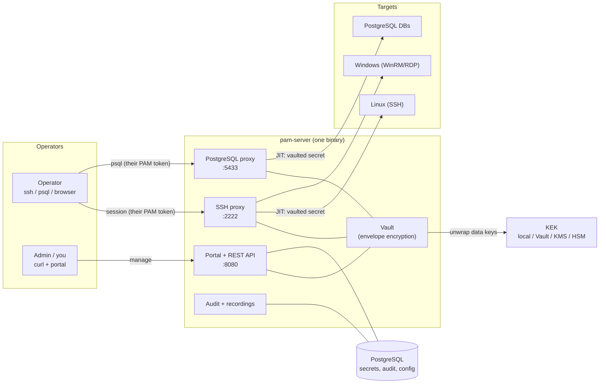
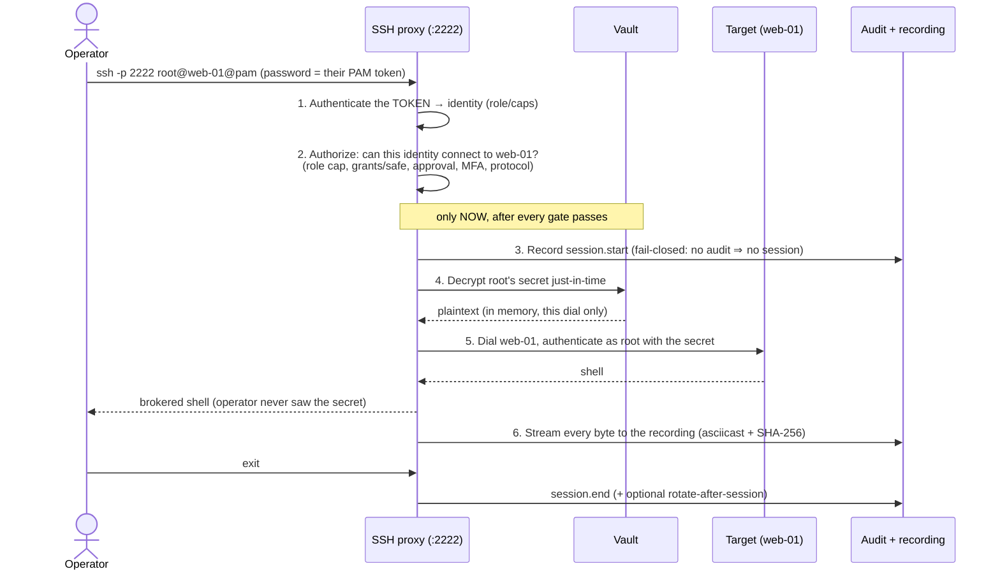
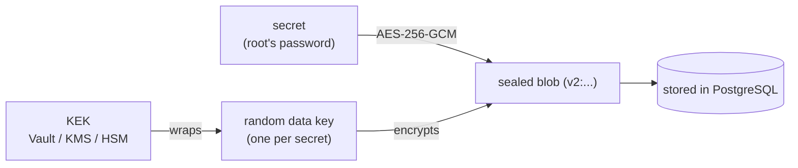

# pamv1 — Sysadmin Guide (how it works)

> **Living document.** Update when the operator-facing behavior or the runbook
> recipes change. See the [change log](#10-change-log).
>
> Last updated: 2026-07-23 · Reflects: Phases 0–24 + the 2026-07 hardening pass.

> ⚠️ **Alpha · for learning purposes.** pamv1 has not been security-audited and is
> not production-ready. See the [main README](../README.md) and [docs hub](README.md).

> **Who this is for.** A system administrator who lives in the shell and writes
> scripts, not Go. This guide explains **what pamv1 does, why, and how the pieces
> fit** — in operational terms — and gives you copy-paste `curl`/`ssh` recipes for
> everything you'll do day to day. It is the "mental model + runbook." For the
> exhaustive config/flag reference see the [Administrator Guide](ADMIN-GUIDE.md);
> for what an operator sees, the [User Guide](USER-GUIDE.md).

Every example uses two shell variables so you can paste as-is:

```bash
PAM=https://pam.example          # your pamv1 API/portal (front it with TLS)
KEY=$PAM_API_KEY                 # your admin key (or a per-user token)
api() { curl -fsS -H "X-API-Key: $KEY" "$@"; }   # tiny helper used below
```

---

## 1. The problem PAM solves

Think about how privileged access usually works without a PAM:

- The **root / Administrator / DB password is shared**. It's in a wiki, a vault
  nobody rotates, three engineers' password managers, and one shell script.
- When something breaks at 03:00, **you can't tell who used it** — the target's
  auth log says "root logged in," not *which human*.
- The password **never changes** (rotating it means updating every script that
  hard-codes it), so a leak is forever.
- A leaver keeps a copy. A contractor keeps a copy. A laptop backup keeps a copy.

Privileged Access Management fixes this with four ideas, and pamv1 implements all
four on top of just **Go + PostgreSQL**:

1. **Vault the secret** so it's encrypted at rest and no human needs to know it.
2. **Force every privileged session through one chokepoint** that injects the
   secret *just in time* — the operator connects, but never sees the password.
3. **Tie every action to an identity** with least-privilege roles.
4. **Record everything** in a tamper-evident audit trail (and a full session
   recording you can replay).

## 2. The one big idea: the operator never holds the credential

This is the sentence to remember:

> An operator authenticates to pamv1 with **their own key**, and pamv1 opens the
> session to the target using the **vaulted credential — which it decrypts only
> after every authorization check passes, and never reveals to the operator.**

Concretely, to SSH into `web-01` as `root`, an operator runs:

```bash
ssh -p 2222 root@web-01@pam.example      # password prompt = their PAM token
```

They type *their* pamv1 token as the SSH password. They land in a `root` shell on
`web-01` — but they were **never told `root`'s actual password**. pamv1 pulled it
from the vault, decrypted it in memory for that one dial, and threw it away. The
operator can't reuse it tomorrow, can't put it in a script, can't leak it.

That single property is the whole product. Everything else — roles, safes,
approvals, recordings — exists to protect, scope, or prove *that* flow.

## 3. The parts of the system

pamv1 is **one binary** (`pam-server`) that opens a few listeners, plus a
PostgreSQL database. There is nothing else to run.



| Part | Port | What it is, operationally |
|---|---|---|
| **Portal + REST API** | `:8080` | The management plane. A deliberately austere green-screen (AS/400 5250) web portal, and the same actions as a REST API you script with `curl`. This is where you onboard targets, vault credentials, grant access, read audit. |
| **SSH proxy** | `:2222` | The session chokepoint for Linux (SSH) and Windows (WinRM) targets. Operators point their SSH client here; pamv1 injects the vaulted secret and brokers the session. |
| **PostgreSQL proxy** | `:5433` | The same chokepoint for database sessions. Operators point `psql` here; every SQL statement is audited. |
| **Vault** | — | Not a separate service — a library inside `pam-server`. It seals each secret with **envelope encryption** (see §5). |
| **PostgreSQL** | `5432` | The single source of truth: encrypted secrets, the audit trail, users, config. Must be unreachable from operator and target networks. |
| **KEK** | — | The root key that protects the vault. In dev it's a local key; in production it's HashiCorp Vault Transit, AWS KMS, or an on-prem HSM (the root key never leaves the KMS/HSM). |

## 4. How a privileged session actually works

Here is the SSH flow end to end — the "chokepoint" from §2, expanded. The DB
proxy (`:5433`) and the WinRM/RDP paths follow the same shape.



The order matters: **decryption happens only after authorization**, and the
plaintext exists only between steps 4 and 5, inside the proxy — never on the wire
to the operator, never in a log.

## 5. Where secrets live, and who can get what

Understanding this tells you exactly how much a given compromise costs.

**Envelope encryption.** Each secret is sealed with its **own random AES-256 data
key**; that data key is then wrapped by the **KEK** (Key Encryption Key). The
database stores only the sealed blob (a `v2:` token). To read a secret you need
*both* the database *and* the KEK.



What that buys you, in plain terms:

| An attacker who has… | …can read your secrets? |
|---|---|
| A **database dump** (only) | **No.** The blobs are useless without the KEK. |
| The **KEK** (only) | **No.** There are no secrets outside the database. |
| Database **and** KEK access | Yes — which is why the KEK lives in a KMS/HSM in production, separate from the DB, with its own access control and audit. |
| An **operator's PAM token** | Only sessions to targets that token is *granted*, all recorded — and never the raw target password. |

Two rules the system never breaks: a stored secret is **never serialized to any
API response**, and plaintext is **never written to a log**. Revealing a secret
on purpose (`/reveal`, break-glass) is a separate, audited, capability-gated path
you can even turn off entirely (`PAM_REVEAL_DISABLED`).

## 6. Day-to-day operations (the runbook)

Everything below is scriptable against the REST API. The portal does the same
things with a keyboard-first green screen if you prefer.

### 6.1 Onboard a target and vault its credential

```bash
# 1. Register the machine
tid=$(api -X POST $PAM/api/targets \
  -d '{"name":"web-01","host":"10.0.0.5","port":22,"os_type":"linux","protocol":"ssh"}' \
  | python3 -c 'import sys,json;print(json.load(sys.stdin)["id"])')

# 2. Vault the account's secret (encrypted before it ever hits disk)
api -X POST $PAM/api/credentials \
  -d "{\"target_id\":$tid,\"username\":\"root\",\"secret\":\"S3cret-P@ss\",\"secret_type\":\"password\"}"
```

`protocol` is `ssh | winrm | rdp | postgres`; `secret_type` is `password`,
`ssh_key` (paste a PEM), or `ssh_ca` (Zero Standing Privilege — no stored secret,
see §7).

### 6.2 Decide who may connect (grants)

A target with **no grants is open to any connect-capable user**; add grants to
lock it down. Admins always have access.

```bash
api -X POST $PAM/api/targets/$tid/grants -d '{"subject_type":"role","subject":"user"}'
api -X POST $PAM/api/targets/$tid/grants -d '{"subject_type":"user","subject":"alice"}'
api $PAM/api/targets/$tid/grants                       # list
```

For estates, group targets into **safes** and grant the safe once (a safe member
reaches every target in it). Note: a target placed in a safe is **deny-by-default**
until it has members — putting it in a safe *restricts* it.

### 6.3 Give a human an identity

```bash
# Mint a local user; the token is shown ONCE (only its hash is stored)
api -X POST $PAM/api/users -d '{"username":"alice","role":"user"}'
# → {"id":1,"username":"alice","role":"user","token":"pamt_…"}
```

Roles: **admin** (everything), **user** (connect + read inventory), **auditor**
(read inventory + audit), **approver** (auditor + approve access requests). You can
also define custom capability profiles, and map Active Directory / Entra / OIDC
groups to roles so people log in with corporate SSO (+ MFA) instead of a token.

### 6.4 Connect (what the operator does)

```bash
ssh -p 2222 web-01@pam.example                  # SSH, default credential; password = alice's PAM token
ssh -p 2222 root@web-01@pam.example             # pick a specific account
ssh -p 2222 root@web-01+observe@pam.example     # read-only supervised session

# Database session: every statement audited
psql "host=pam.example port=5433 user=root@web-01 dbname=orders"   # password = PAM token

# Windows: interactive WinRM command loop (each line is a separate command)
ssh -p 2222 Administrator@win-01@pam.example
```

### 6.5 Rotate and reconcile (make secrets self-managing)

```bash
# Change the password ON the target and re-vault it — nobody, not even you, knows it
api -X POST $PAM/api/credentials/1/rotate

# Does the vaulted secret still authenticate? (drift detection)
api -X POST $PAM/api/credentials/1/reconcile
# Reconcile the whole estate on a schedule (safe, read-only unless you add ?remediate=true)
api -X POST $PAM/api/reconcile
```

Turn on the background worker to age-rotate automatically:
`PAM_ROTATE_INTERVAL_MIN`, `PAM_ROTATE_MAX_AGE_HOURS`, and
`PAM_ROTATE_AFTER_SESSION=true` (rotate the moment a session ends, so a secret is
never reusable across sessions). Across multiple replicas, only one runs the
rotation pass per tick (leader election) — no double-rotation.

### 6.6 Break glass and reveal (the exceptions)

Prefer the recorded proxy path. When you genuinely must read a secret:

```bash
api -X POST $PAM/api/credentials/1/reveal      # audited; disable entirely with PAM_REVEAL_DISABLED
```

For emergencies, configure a **break-glass key** (only its SHA-256 hash is
stored). Using it grants admin and is **loudly audited and alerted** every time.
For higher assurance, split it into **M-of-N Shamir shares** so no single
custodian can invoke it alone.

### 6.7 See who's logged in, and cut them off

```bash
api $PAM/api/login-sessions                                  # active SSO/token logins
api -X POST $PAM/api/login-sessions/revoke -d '{"username":"bob"}'   # kill them now
api $PAM/api/sessions                                        # live target sessions
api -X DELETE $PAM/api/sessions/<id>                         # kill a live session
```

Disabling someone in AD doesn't end their live pamv1 login by itself — run
`POST /api/identity/reconcile` (on a schedule) to revoke disabled directory
sessions, or revoke on demand as above.

### 6.8 Prove what happened (audit + recordings)

```bash
api "$PAM/api/audit?limit=200"                               # recent events
api "$PAM/api/audit/export?since=2026-07-01T00:00:00Z&format=csv" -OJ   # for a spreadsheet/SIEM
```

Every sensitive action appends an event with the **actor**, and every proxied
session is recorded (asciicast v2 with a SHA-256 fingerprint in the audit trail).
Secret-delivery is **fail-closed on the audit**: if pamv1 can't durably record the
event, it refuses to hand out the secret.

## 7. The safety nets (know these exist)

| Control | What it does | Turn on with |
|---|---|---|
| **Tamper-evident audit** | HMAC-chain the whole audit trail + ed25519 signed checkpoints, so edits, reorders, deletions, and tail-truncation are all detectable (`GET /api/audit/verify` and `/head`) | `PAM_AUDIT_HMAC_KEY`, `PAM_AUDIT_SIGN_SEED` (see ADMIN §9.2) |
| **Kill-on-revoke** | Revoking a login, disabling a directory user, or deleting a user's grant terminates their matching live sessions (not just future ones) | on by default when the session registry is wired (see §6.7) |
| **Session recording** | Full replay of every proxied session; hash in the audit trail | on by default; `PAM_REQUIRE_RECORDING=true` refuses an unrecordable session |
| **Command control** | Block dangerous commands on SSH-exec / WinRM / SQL by regex | `PAM_COMMAND_DENY_FILE` |
| **Live monitoring** | Watch a running session over server-sent events; kill it | `GET /api/sessions/{id}/stream` |
| **Approvals (4-eyes)** | Require an approved request before connecting; N-of-M chains; maintenance windows; ITSM ticket | `PAM_REQUIRE_APPROVAL`, `PAM_APPROVALS_REQUIRED`, `PAM_REQUIRE_TICKET` |
| **MFA** | TOTP second factor on login; enroll-only first sign-in until set up | `PAM_MFA_REQUIRED` |
| **Zero Standing Privilege** | `ssh_ca` credentials store **no** secret — pamv1 mints a short-lived SSH certificate per session | `PAM_SSH_CA_KEY` |
| **Brute-force throttling** | Per-IP limits on the login API and the SSH/DB proxies | on by default; `PAM_PROXY_AUTH_RATE_LIMIT` |
| **Break-glass** | Audited/alerted emergency admin access; optional M-of-N unseal | `PAM_BREAK_GLASS_KEY_HASH`, `PAM_BREAK_GLASS_THRESHOLD` |
| **Threat analytics** | Behavioral risk scoring over the audit trail; optional auto-kill of critical actors | `PAM_ANALYTICS_INTERVAL_MIN`, `PAM_ANALYTICS_AUTO_KILL` |

## 8. Running it for real — the short version

pamv1 is 12-factor: **all configuration is `PAM_*` environment variables**, and
all deployment is infrastructure-as-code (do not hand-apply). The essentials:

- **KEK in production.** Never ship the `local` KEK. Use `PAM_KEK_PROVIDER=vault-transit`
  / `aws-kms` / `pkcs11` so the root key lives in a KMS/HSM, separate from the DB.
- **TLS everywhere.** Front `:8080` with HTTPS (or set `PAM_TLS_CERT/KEY`), use
  `sslmode=verify-full` to PostgreSQL, verify upstream DB TLS (`PAM_DB_UPSTREAM_CA`),
  and pin SSH target host keys (`PAM_SSH_KNOWN_HOSTS`). `PAM_REQUIRE_HTTPS=true`
  turns plaintext into a startup error.
- **Isolate the database.** It must be unreachable from operator and target zones.
  Apply the default-deny NetworkPolicy on Kubernetes (`deploy/k8s/networkpolicy.yaml`).
- **Strong bootstrap key.** `PAM_API_KEY` is presented as the proxy password —
  treat it like root, keep it ≥16 chars (enforced on a real database), and rotate it.
- **Back up the KEK out of band.** A database backup without the KEK is inert —
  that's the point — but it also means losing the KEK loses every secret.

Deployment paths (all in `deploy/`): `docker compose` for pre-prod, Kubernetes
manifests + a Helm chart (hardened pod security, optional CloudNativePG for HA
Postgres), and Terraform. Full detail is in the [Administrator Guide](ADMIN-GUIDE.md).

## 9. Mental-model cheat-sheet

- **The chokepoint is the product.** If a privileged session didn't go through
  `:2222`/`:5433`, pamv1 didn't broker it and can't prove it. Make the proxy the
  only path (firewall direct target access off).
- **Operators carry *their* key, never the target's secret.** Revoking a person =
  revoking their token/login; the target passwords are untouched (and rotatable).
- **Two things are needed to read a secret:** the database *and* the KEK. Keep
  them apart.
- **Audit is the system of record.** Sensitive actions fail closed if they can't
  be recorded. Ship the audit to your SIEM and keep the recordings.
- **Least privilege by role/safe.** Ungated target = open to connect-capable
  users; safe-scoped target = deny-by-default. Grant deliberately.

### Where to go next

| You want… | Read |
|---|---|
| Every flag, endpoint, and deploy recipe | [ADMIN-GUIDE.md](ADMIN-GUIDE.md) |
| What an operator sees and does | [USER-GUIDE.md](USER-GUIDE.md) |
| The security posture, guarantees, and known trade-offs | [SECURITY-GAPS.md](SECURITY-GAPS.md) |
| Ports and firewall/NetworkPolicy baseline | [PORTS-AND-FLOWS.md](PORTS-AND-FLOWS.md) |
| Backup & restore of the vault and database | [BACKUP-AND-RESTORE.md](BACKUP-AND-RESTORE.md) |
| How the code is structured (for developers) | [ARCHITECTURE-LOW-LEVEL.md](ARCHITECTURE-LOW-LEVEL.md) |
| Navigation across all docs | [docs hub](README.md) |

## 10. Change log

| Date | Change |
|---|---|
| 2026-07-23 | Aligned with the doc set (standard header, change log); added the tamper-evident-audit and kill-on-revoke safety nets; corrected the default-credential SSH example; standardized on "PAM token" for the per-user secret |
| 2026-07-21 | Initial sysadmin how-it-works guide: the PAM problem, the chokepoint model, the secret/security model, a copy-paste runbook, safety nets, and a production checklist |
