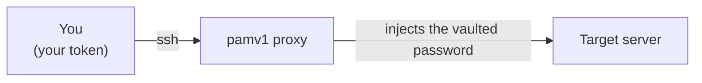

# pamv1 — User Guide

For **operators, auditors and approvers** who use pamv1 to reach systems or to
review activity. If you deploy or administer pamv1, see the
[Administrator Guide](ADMIN-GUIDE.md) instead.

> **Living document.** Kept in step with the product — update it whenever
> user-facing behavior changes (portal, connecting, roles). Add a row to the
> [change log](#8-change-log) with each update.
>
> Last updated: 2026-07-18 · Reflects: **Phase 3a** (RBAC + four roles).

> ⚠️ Educational / pre-production project — see the [README](../README.md).

---

## 1. What pamv1 does for you

pamv1 lets you connect to a server **without ever holding its password**. You
authenticate to pamv1 with your own access token; pamv1 fetches the target's
credential from its encrypted vault and injects it into the connection for you.
Your session is recorded and logged. This is *just-in-time (JIT)* credential
injection.



You never see the target's password — and that's by design.

## 2. Your role decides what you can do

An administrator assigns you one of four roles:

| Your role | You can | You cannot |
|---|---|---|
| **user** | Connect to targets through the proxy; see the list of targets | Manage anything, reveal secrets, read the audit trail |
| **auditor** | Read the inventory and the full audit trail | Connect to targets, change anything |
| **approver** | Read inventory + audit, approve/deny access requests¹ | Connect to targets, change anything |
| **admin** | Everything (see the Admin Guide) | — |

¹ The approval workflow arrives in a later release.

## 3. How you sign in

There are a few ways, depending on how your organization set things up:

- **Single sign-on (SSO)** — click **Single sign-on** on the Sign On screen (or
  open `/api/auth/oidc/start`). You authenticate with your identity provider
  (Entra ID, Okta, etc., including its MFA), then land back in the portal already
  signed in. This is the smoothest option when your org enabled it.


- **Active Directory (AD) login** — you sign in with your **AD username and
  password**. On the portal Sign On screen, fill *User* and *Password*. pamv1
  gives you a **session token** valid for 12 hours; the portal keeps it for you.
  For the SSH proxy, first get a token from the login endpoint (your admin can
  script this) and use it as the SSH password. Your role comes from your AD groups.
- **Access token** — your administrator creates your user and gives you a
  **token** like `pamt_1a2b3c…`, shown only once (store it in your password
  manager). Use it as the *access token* on the Sign On screen (leave Password
  blank), or as the **SSH password** when connecting through the proxy.

If your session expires, just sign in again. If you lose a token, an admin issues
a new one.

### Adding a second factor (MFA)

You can protect your sign-in with a 6-digit code from an authenticator app
(Google Authenticator, Microsoft Authenticator, 1Password…). Once signed in:

1. **Enroll:** `POST /api/mfa/enroll` returns a `secret` and an `otpauth://` URI
   — add either to your authenticator app (scan the URI as a QR or type the secret).
2. **Confirm:** `POST /api/mfa/verify` with `{"otp":"123456"}` from the app.

From then on, when you sign in with User + Password the portal also asks for your
**MFA code** — enter the current 6-digit code. (Bearer access tokens aren't
protected by MFA; MFA covers the username/password login.)

**Recovery codes:** `POST /api/mfa/recovery-codes` gives you 10 single-use backup
codes — save them somewhere safe. If you lose your phone, enter one of them in the
MFA code field to sign in; each works only once.

If your organization **requires MFA**, your first sign-in gives you a limited
session that can *only* set up MFA — enroll and confirm, then sign in again
normally with your code.

## 4. Using the portal

The portal is an intentionally old-school [IBM 5250 / AS-400](https://en.wikipedia.org/wiki/IBM_5250)
green-screen terminal — the austerity is deliberate, to remind you that you're
touching privileged systems.

1. Open the portal URL your admin gave you (over **HTTPS**).
2. On the **Sign On** screen, either fill *User* + *Password* (AD login) or put your
   token in *access token* (leave Password blank), then press **Enter**.
3. Use the numbered menu to move around; the function keys work like a real 5250:

| Key | Action |
|---|---|
| **Enter** | Confirm / submit the screen |
| **F3** | Exit / sign off |
| **F5** | Refresh |
| **F6** | Add (a target or credential — admin) |
| **F12** | Cancel / go back |

On list screens you type an **option number** next to a row (e.g. `5` to display,
`4` to delete) and press Enter.

Panels you're not allowed to see simply stay empty — that's normal for your role,
not an error.

## 5. Connecting to a target (the main event)

You connect with a normal SSH client. The **SSH username selects the target**, and
your **PAM token is the SSH password**.

```bash
# Connect to target "web-01" (uses that target's first credential)
ssh -p 2222 web-01@PAM_HOST

# Choose a specific credential (account "root") on that target
ssh -p 2222 root@web-01@PAM_HOST

# Read-only / observer session: watch the output but cannot type or run commands
ssh -p 2222 root@web-01+observe@PAM_HOST

# Windows target (if the admin enabled it): an interactive WinRM command loop —
# each line you type runs as a separate command (not a stateful PowerShell)
ssh -p 2222 Administrator@win-01@PAM_HOST
```

- `PAM_HOST` is the pamv1 proxy host; `2222` is the proxy port (ask your admin).
- When prompted for a password, paste your **PAM token**.
- You'll land on the target as the vaulted account. You never typed — and never
  learn — that account's real password.

What happens behind the scenes: pamv1 checks your token and role, pulls the
credential from the vault, decrypts it just for this connection, logs you in to
the target, and records the session.

> **Your session is recorded.** Everything on screen is captured (asciicast) and a
> tamper-evident hash is stored. Connect only for authorized work.

### Automating the password prompt

For scripts, an SSH client can read the password non-interactively (e.g. with
`sshpass -e` and `SSHPASS=$PAM_TOKEN`, or an `SSH_ASKPASS` helper). Prefer your
platform's secret store over hard-coding the token.

## 6. Reviewing activity (auditor / approver)

Auditors and approvers can read the audit trail — in the portal's
**Display Audit Trail** screen, or via the API:

```bash
curl -H "X-API-Key: $YOUR_TOKEN" "https://PAM_HOST/api/audit?limit=100"
```

Each entry shows the timestamp, the **actor** (a real username, or `break-glass`),
the **action**, and details. Break-glass entries are highlighted — they mark
emergency access and always deserve a look.

## 7. Troubleshooting

| What you see | What it means / what to do |
|---|---|
| `invalid or missing API key` (401) | Your token is wrong or was deleted. Check it, or ask an admin for a new one. |
| `your role does not permit this action` (403) | Your role can't do that — expected. Ask an admin if you need more access. |
| SSH: `your role may not open sessions` | You're an auditor/approver; only `user`/`admin` can connect. |
| SSH: `unknown target "x"` | The target name in your SSH username doesn't exist — check spelling with your admin. |
| SSH: `upstream connection failed` | pamv1 reached your token fine, but couldn't reach the target (down, or bad vaulted credential). Tell your admin. |
| Portal panels are empty | Normal — your role can't read those panels. |

---

## 8. Change log

| Date | Change |
|---|---|
| 2026-07-18 | Phase 3b: OIDC single sign-on option on Sign On |
| 2026-07-18 | Phase 3b: recovery codes + enforce-MFA (enrollment-only first sign-in) |
| 2026-07-18 | Phase 3b: TOTP MFA (enroll/confirm, MFA code on Sign On) |
| 2026-07-18 | Phase 3b: Active Directory login (username + password → session token) added to Sign On |
| 2026-07-18 | Initial user guide (Phase 3a): roles, tokens, portal Sign On, connecting via the SSH proxy, audit review |

*Questions an admin should answer live in the [Administrator Guide](ADMIN-GUIDE.md).*
